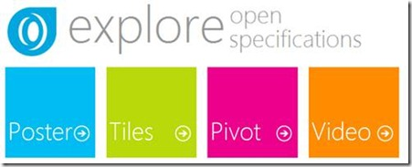
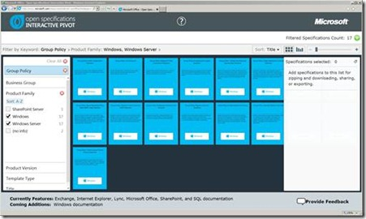
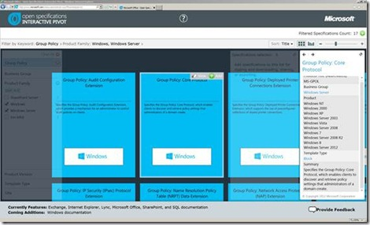

If you’re interested in reading how things really work, the Microsoft Open Specifications are a great resource. Microsoft Open Specifications is primarily intended for software developers but can also be of interest for anyone else who works with Microsoft products. The reason why these documents are little-known is because it isn’t easy to find them on MSDN where they are published. 

  This has changed now. On the Microsoft Open Specifications Developer Center you can now easily find the open specification documents through an intuitive Tiles or Pivot explorer. 

  [http://msdn.microsoft.com/en-us/openspecifications/dd569930.aspx](http://msdn.microsoft.com/en-us/openspecifications/dd569930.aspx)

  

  When opening the Interactive Pivot view, we can search for open specifications using key word search, product family or Product versions. 

  

  When selecting a specification, we get a brief description of the specification document. 

  

  And directly open the selected specification in MSDN

  

  From here, the appropriate specification document can be directly downloaded. 

  

