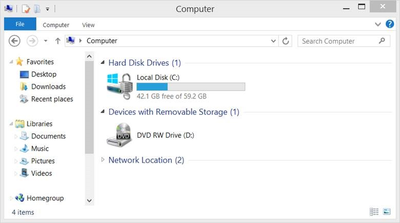
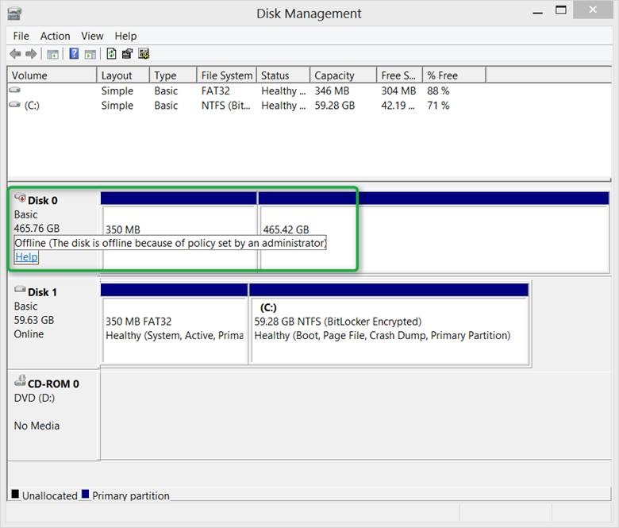
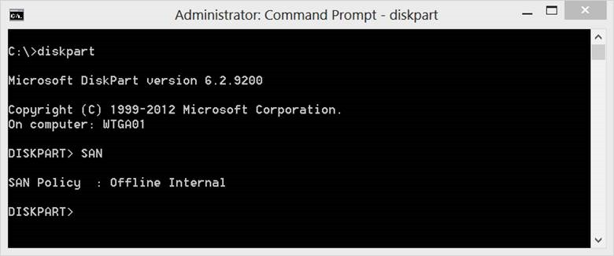
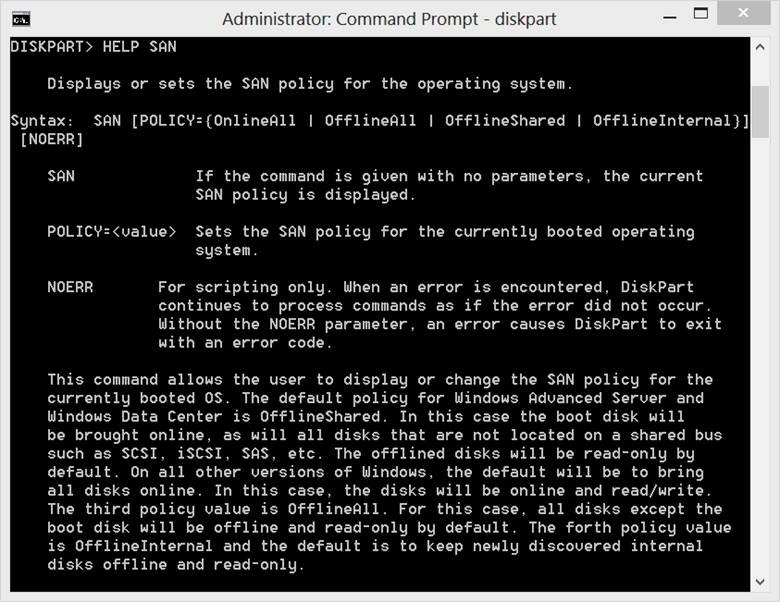
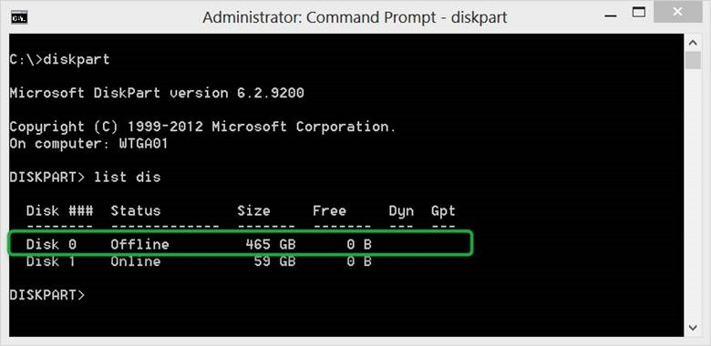
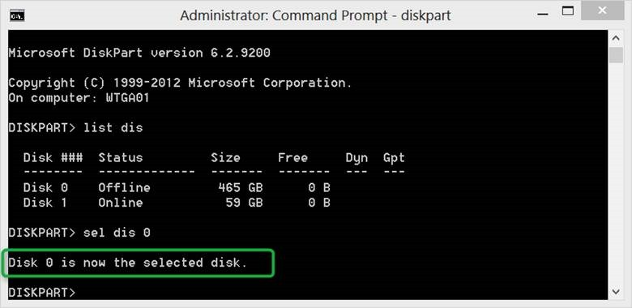
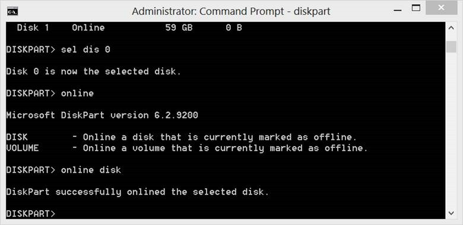
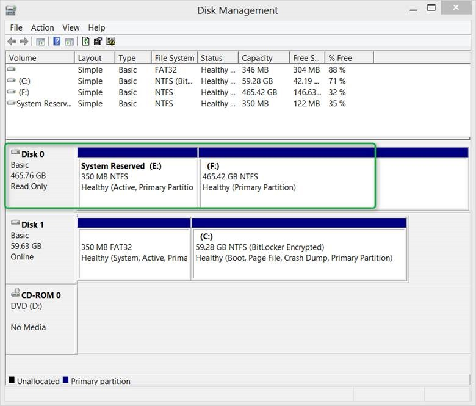
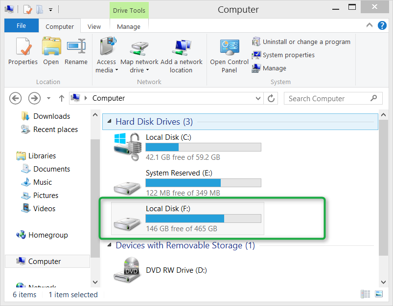

When provisioning a Windows To Go Workspace using the Windows 8 build-in Windows To Go creator or following the [step by step instructions](http://social.technet.microsoft.com/wiki/contents/articles/6991.windows-to-go-step-by-step-en-us.aspx) described within the TechNet Wiki a SAN policy is applied that prevents the Windows To Go Workspace from bringing online any internally connected disks from the host system. The result is that you cannot access any data that is stored there. 

  There are two reasons why this SAN policy should be applied. First it prevents accidental data leakage between Windows To Go and the host system. This makes totally sense because you might run Windows To Go on someone else’s computer and you don’t want your data somehow ending up being stored on their local disk nor does the other person want you to see what they have stored locally. The second reason is that if the internal drive contains a hibernated Windows 8 OS, mounting that drive will lead to loss of the hibernation state which might also result in the loss of any unsaved data there. 

  But there is always an exception right? If you have local administrative rights within the Windows To Go Workspace you can access data that’s stored on the local drive. 

  When opening File Explorer Windows only see’s the local disk , which is what is actually stored on the Windows To Go disk and the DVD-RW drive in this case. 

  

  When opening the Disk Management Console we see that Disk 0 which is the local disk on the host system is Offline. 

  

  The “Policy” mentioned here refers to the SAN policy. When opening an elevated command prompt and running diskpart the current SAN policy configuration can be shown by entering the diskpart command SAN. 

   

   

  

  To find out more about other possible SAN policy settings, simply type HELP SAN 

  

  But let’s get back now to our exception where we want to access data that is stored on the local disk of the host system. We have two options, either simply right click on the Offline Disk within the Disk Management console and select “Online” or launch an elevated command prompt, run diskpart and then execute the following commands:

  List disk

  

  Then select the disk that is the local disk, in this case Disk 0

  sel disk 0

  

   

   

   

  Then enter

  online disk

  

  Now when looking at the Disk Management Console, we see that the disk became online. 

   

  

  And now we can also see the disk within the File Explorer and have access to the data stored on that disk. 

  

  To bring the disk back offline, just right click on the Disk within the Disk Management console and select “Offline” or when the diskpart command prompt is still open, just type

  offline disk

  That was it. Enjoy Windows To Go!

