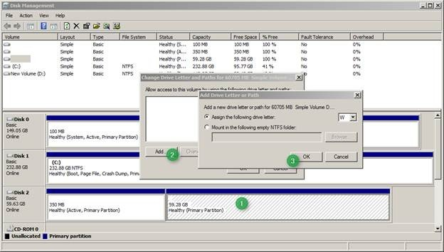
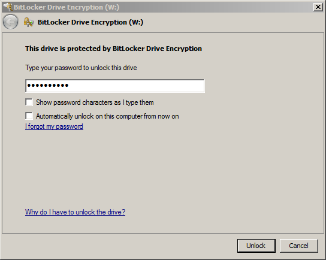
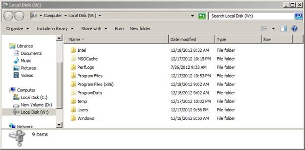

Yesterday we looked at [How to access data from the local disk when running a Windows To Go Workspace](https://www.verboon.info/index.php/2012/12/how-to-access-data-from-the-local-disk-when-running-a-windows-to-go-workspace/) today we’re going to do the opposite. So let’s assume you’ve been working in your Windows To Go Workspace at home and saved a document locally. Now you are back in the office but didn’t start your Windows To Go Workspace but are working on a corporate Windows 7 client and require access to that file. Now you can either boot your Windows To Go Workspace and save the file from there on a shared location or just copy the data directly from the Windows To Go drive right?

  Almost….. when you insert the Windows To Go USB stick into your running Windows 7/8 client Windows will not as usual detect the USB stick as a removable drive and let you access the data. This because when following the recommended process for provisioning a Windows To Go Workspace, the **NoDefaultDriveLetter **attribute was applied when the USB drive was prepared.** **This attribute specifies that the volume does not receive a drive letter by default. Therefore we must first assign a drive letter. 

  This can be done using the Disk Management console. 

  

  But because we have  the Workspace protected with Bitlocker, we must first enter the password before we can access the content. 

  

  

