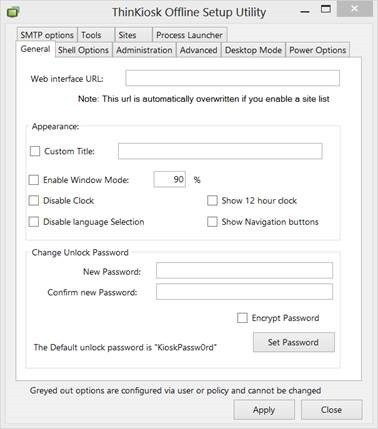
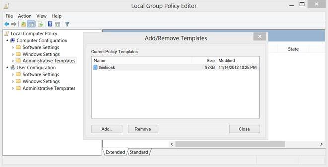
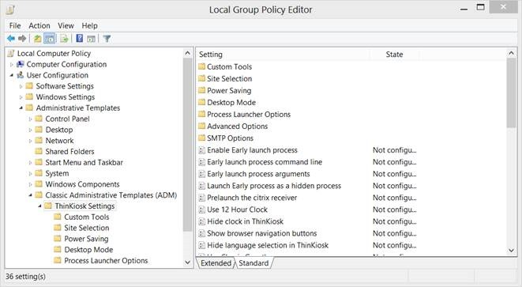
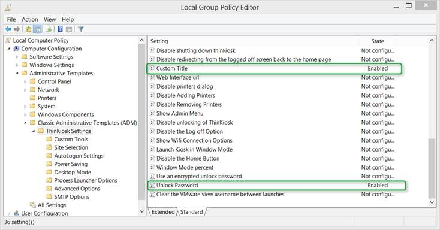
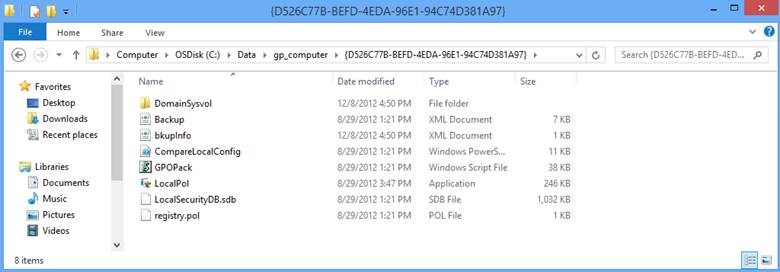
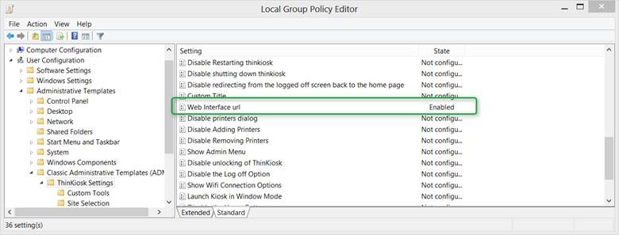
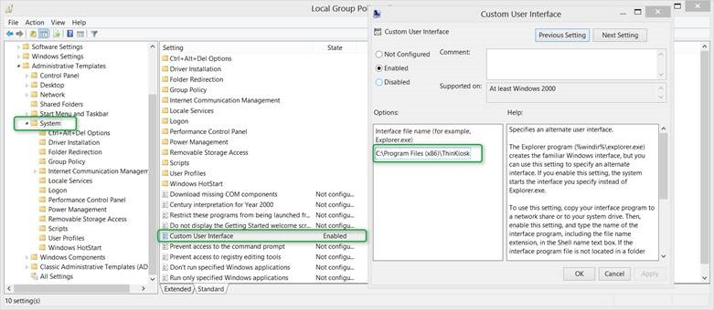
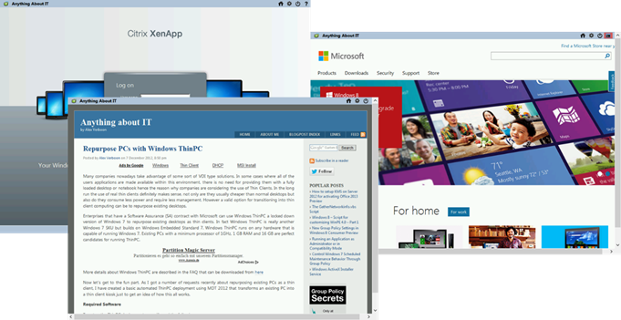

In my previous post [Repurpose PCs with Windows ThinPC](https://www.verboon.info/index.php/2012/12/repurpose-pcs-with-windows-thinpc-2/) I used Andrew Morgan’s ThinKiosk to replace the default Windows Shell to limit the user’s access to the local machine. ThinKiosk can be configured via the command line, the Registry and via Group Policy. Now unless you like to write lengthy registry manipulation scripts, configuring the settings via Group Policy is definitely the way to go. 

  When clients are member of a domain we would of course use domain based group policy settings, but when not joined to a domain must use local Group Policy settings. In this blog post I describe in detail how to prepare and deploy a local GPO Pack. Note that the hereunder described process is not limited to the use of ThinKiosk but can be used for any local Group Policy configuration task for Windows ThinPC (Embedded 7), Windows 7 and Windows 8. (Note that for Windows 8 you’ll have to wait until SCM 3.0 comes out which is currently in beta). 

  **Preparation**

  ·        Download Andrew Morgan’s ThinKiosk [http://andrewmorgan.ie/thinkiosk/download/](http://andrewmorgan.ie/thinkiosk/download/) on a test client. 

  ·        Download the Microsoft Security Compliance Manager [http://www.microsoft.com/en-us/download/details.aspx?id=16776](http://www.microsoft.com/en-us/download/details.aspx?id=16776) on another test system or If you have the latest Microsoft Security Compliance Manager already installed, you’ll find the LocalGPO Pack installation sources under C:\Program Files (x86)\Microsoft Security Compliance Manager\LGPO. 

  ·        On the test client create the following folder. This folder will be used to store the exported local GPO content. 

  o   C:\Data\lgpo

  ·        Create the following local user accounts

  o   Username: Blogreader

  o   Username: CitrixUser

  o   Username: Admin

  **Step 1 – Install ThinKiosk and the LocalGPO Tool**

  On a test client running Windows ThinPC

  1.      Launch the Kiosk-installer.msi and complete the installation       
The tool is installed under C:\Program Files\ThinKiosk 

  2.      Launch the LocalGPO.msi and complete the installation       
The tool is installed under C:\Program Files\LocalGPO 

   

  **Step 2 – Identify Settings to configure**

  If you aren’t familiar with the settings in ThinKiosk yet, I suggest that you launch the Offline Configuration Tool first. C:\Program Files\ThinKiosk\OfflineConfigTool.exe

  

  For this demonstration we will configure the following settings:

  ·        Web Interface URL

  ·        Custom Title

  ·        Change the unlock password

  ·        Replace the Windows Shell with ThinKiosk

  To also demonstrate the capabilities of the LocalGPO tool and multiple local group policy objects we are going to define settings at the Computer, Administrator / Non-Administrator and User level. 

  The below ThinKiosk Settings table lists the settings applied to the Computer / Users. 

                       **Computer / User**

                        **Group Membership**

                        **Setting**

                        **Value**

                                  Computer

           

                        Change the unlock password

                        Enabled

          “Unlock”

                                  Custom Title

                        Anything About IT

                                  Blogreader

           

                        Users

           

                        Web Interface URL

                        Enabled

          http://www.verboon.info

                                  Replace the Windows Shell with ThinKiosk

                        Enabled

          “C:\Program Files \ThinKiosk\iexplore.exe”

                                  CitrixUser

           

                        Users

           

                        Web Interface URL

                        Enabled

          [http://demo.citrixcloud.net](http://demo.citrixcloud.net)

                                  Replace the Windows Shell with ThinKiosk

                        Enabled

          C:\Program Files\ThinKiosk\iexplore.exe

                                  Admin

                        Administrators

                        Web Interface URL

                        Enabled

          [http://microsoft.com](http://microsoft.com)

                                   

                         

                        Change the unlock password

                        Enabled

          “admin”

                 Note that If you are installing ThinKiosk on a x64 system ThinKiosk is installed in C:\Program Files (x86). 

  **Step 3 – Load the ThinKiosk GPO Settings template**

  Open the local Group Policy editor (gpedit.msc) and load the ThinKiosk group policy template that is stored under C:\Program Files\ThinKiosk\Resources\thinkiosk.adm

  

  You should now see the ThinKiosk group policy settings under the Classic Administrative Templates node. 

  

  **Step 4 – Configure and Export the settings**

  Next we are going to configure and export the settings as listed in the ThinKiosk settings table. 

  **Settings for Computer**

  Within the local group policy editor under Computer Settings\Classic Administrative Templates (ADM)\ThinKiosk settings we set the Custom Title to “Anything about IT” and the Unlock Password to “unlock”. ****

  

  When we have applied these settings we launch an elevated command prompt and then export the GPO settings using the following command:

  cscript.exe localgpo.wsf /Path:c:\data\lgpo /Export /GPOPack:gp_computer

  If all worked fine, you should now see something that looks like this. 

  

  **Settings for User Blogreader**

  To get a clean local GPO disable any previously applied configuration under the Computer Configuration node. 

  Next we are going to configure the settings for the User Blogreader. Within the local group policy editor under the User Settings\Classic Administrative Templates (ADM)\ThinKiosk settings node we set the web interface URL to [http://www.verboon.info](https://www.verboon.info)

  

  Under User Configuration\Administrative Templates\System we set configure the Custom User Interface. 

  

  Then export the settings using the following command:

  cscript.exe localgpo.wsf /Pathc:\data\lgpo /Export /GPOPack:gp_blogreader

  Note that the “Path” has changed to c:\data\gp_blogreader. 

  **Settings for User CitrixUser**

  Repeat the same tasks as for user Blogreader, just change the web interface URL to: [http://demo.citrixcloud.net](http://demo.citrixcloud.net)

  Then export the settings using the following command:

  cscript.exe localgpo.wsf /Pathc:\data\lgpo /Export /GPOPack:gp_citrixuser

  Note that the “Path” has changed to c:\data\gp_citrixuser 

  **Settings for User Admin**

  Again cleanout any previously applied settings under the User Configuration and then under User Settings\Classic Administrative Templates (ADM)\ThinKiosk settings node we set the web interface URL to [http://www.microsoft.com](http://www.microsoft.com) and set the Unlock Password to “admin”. 

  Then export the settings using the following command:

  cscript.exe localgpo.wsf /Pathc:\data\lgpo /Export /GPOPack:gp_admin

  Note that the “Path” has changed to c:\data\gp_admin

  **Step 5 – Applying the settings**

  To apply the GPO Packs we can either use the LocalGPO.wsf script if we have the localGPO tool installed on the target machine or simply use the GPOPack.wsf script that’s stored within the GPOPack itself. Let’s assume we’re now on a clean machine where we want to apply these GPO Packs. 

  If we had just configured one group policy back with both Computer and User settings we could just launch the GPOPack.wsf script that would then import the settings, but since we want to apply settings to specific users we must supply the /MLGPO command line option to specify to which users the pack should apply. 

  The below script imports the previously prepared local GPO packs. 

  @echo off

  cscript C:\DATA\lgpo\gp_computer\gpopack.wsf /Path:c:\data\lgpo\gp_computer 

  cscript C:\DATA\lgpo\gp_blogreader\gpopack.wsf /Path:c:\data\lgpo\gp_blogreader /MLGPO:Blogreader

  cscript C:\DATA\lgpo\gp_admin\gpopack.wsf /Path:c:\data\lgpo\gp_admin /MLGPO:Admin

  cscript C:\DATA\lgpo\gp_citrixuser\gpopack.wsf /Path:c:\data\lgpo\gp_citrixuser /MLGPO:CitrixUser

  pause

  If you want to suppress console output, just add the /Silent command line option.  If you wanted to apply certain settings to all users that have Administrative rights, you can use /MLGPO:Administrators or if you only want to apply settings to non-Administrators you can use /MLGPO:Non-Administrators. 

   

  **Step 6 – See if it all works**

  Logon on the ThinPC with User Blogreader, Citrix User and Admin and see if the settings apply correctly. 

  

  I created this blog post based on the Windows ThinPC + ThinKiosk use case, but as mentioned the same process can be used on Windows 7 and Windows 8. 

  Now as long as devices are joined to a domain, there is really little need to use local group policy settings, but think ahead when enterprises plan to deploy Windows RT devices that by design cannot be joined to a domain and therefore cannot receive domain based GPO’s. 

  If you have these Windows RT devices managed through SCCM 2012 SP1 you can deploy local GPO packs to these devices. Just enable the Group Policy service as explained by MVP Alan Burchill in his blog post [How to enable and configure Group Policy Setting on Windows RT](http://www.grouppolicy.biz/2012/12/how-to-enable-and-configure-group-policy-settings-in-windows-rt/) and through SCCM deploy and apply a previously prepared GPO Pack.

