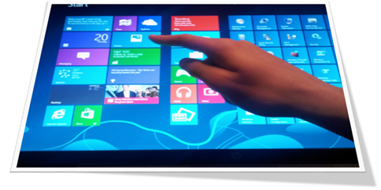

While I was actually looking for something totally different, I stumbled over the **IsTouchEnabled.exe **that is stored within the MDT 2012 \Tools\OSDResults folder. The name says it all, it detects whether the device supports Touch or not. So I copied the utility and ran it on a Samsung Tablet with Windows 7 installed, a HP Workstation with Windows 7 installed, on a HP Mobile workstation with Windows 8 installed and on the HP ElitePad with Windows 8 installed. On both the Tablet devices the utility correctly detected touch being enabled. 

  

  So if you happen to run across a scenario where you need to do this or that depending on whether the device supports Touch or not the IsTouchEnabled.exe might help. 

  @echo off

  for /f "delims=" %%a in ('IsTouchEnabled.exe') do set Touch=%%a

  If "%Touch%" == "1" (

          Echo Touch is enabled

          ‘ run your code here

          ) ELSE (

          Echo Touch is not enabled

          ‘ run your code here

  )

  pause

