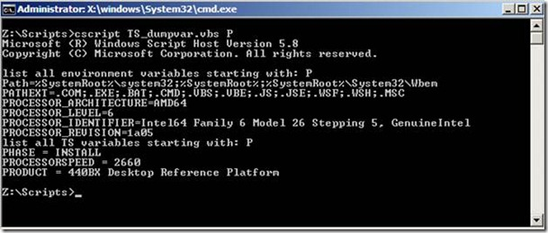

For years I have been using the following script from [myITforum](http://www.myitforum.com/articles/42/view.asp?id=11729) to list Task Sequence environment variables and values:

```vbscript
Set oTSEnv = CreateObject("Microsoft.SMS.TSEnvironment")
For Each oVar In oTSEnv.GetVariables
  WScript.Echo oVar & "=" & oTSEnv(oVar)
Next
```

Because there are so many variables, the most useful way to use this script is to pipe the output to a file, then open the file and search for the variable and its value.

I created the script below, which can do the following:

- List both system and task sequence variables.
- If you provide no command-line option, all system environment variables and task sequence variables are listed.
- If you provide a single first letter, all matching system and task sequence variables that start with that letter are listed.
- If you provide multiple starting letters, only variables matching those letters are listed.

Examples:

```cmd
cscript ts_var.vbs
cscript ts_var.vbs P
cscript ts_var.vbs Processor
```



Copy the script below into a file named `TS_var.vbs`, then store it in a location that is accessible while running an MDT or SCCM task sequence, such as `<DeploymentShare>\Scripts`.

```vbscript
On Error Resume Next
Set wshShell = CreateObject("WScript.Shell")
Set env = wshShell.Environment("System")
Set env1 = CreateObject("Microsoft.SMS.TSEnvironment")
If Err Then
  wscript.echo "TS Environment not available"
  wscript.echo "The script can only be used while the Task Sequence components are loaded"
  wscript.quit()
End If
If Wscript.Arguments.Count = 0 Then
  wscript.echo "No first letter(s) of variable provided so showing all"
  wscript.echo "list all environment variables"
  For Each strItem In env
    WScript.Echo strItem
  Next
  wscript.echo "list all TS variables"
  For Each v In env1.GetVariables
    WScript.Echo v & " = " & env1(v)
  Next
Else
  If Wscript.Arguments.Count > 0 Then
    VarLetter = WScript.Arguments.Item(0)
    If Len(VarLetter) = 1 Then
      wscript.echo "list all environment variables starting with: " & VarLetter
      For Each strItem In env
        If Ucase(Left(strItem,1)) = Ucase(VarLetter) Then
          WScript.Echo strItem
        End If
      Next
      wscript.echo "list all TS variables starting with: " & VarLetter
      For Each v In env1.GetVariables
        If Ucase(Left(v,1)) = Ucase(VarLetter) Then
          WScript.Echo v & " = " & env1(v)
        End If
      Next
    Else
      wscript.echo "list variable: " & VarLetter
      varlen = Len(VarLetter)
      For Each strItem In env
        If Ucase(Left(strItem,varlen)) = Ucase(VarLetter) Then
          WScript.Echo strItem
        End If
      Next
      wscript.echo "list TS variable: " & VarLetter
      varlen = Len(VarLetter)
      For Each v In env1.GetVariables
        If Ucase(Left(v,varlen)) = Ucase(VarLetter) Then
          WScript.Echo v & " = " & env1(v)
        End If
      Next
    End If
  End If
End If
```


