Many companies nowadays take advantage of some sort of VDI type solutions. In some cases where all of the users applications are made available within this environment, there is no need for providing them with a fully loaded desktop or notebook hence the reason why companies are considering the use of Thin Clients. In the long run the use of real thin clients definitely makes sense, not only are they usually cheaper than normal desktops but also do they consume less power and require less management. However a valid option for transitioning into thin client computing can be to repurpose existing desktops.

Enterprises that have a Software Assurance (SA) contract with Microsoft can use Windows ThinPC a locked down version of Windows 7 to repurpose existing desktops as thin clients.  In fact Windows ThinPC is really another Windows 7 SKU but builds on Windows Embedded Standard 7. Windows ThinPC runs on any hardware that is capable of running Windows 7. Existing PCs with a minimum processor of 1GHz, 1 GB RAM and 16 GB are perfect candidates for running ThinPC.

More details about Windows ThinPC are described in the FAQ that can be downloaded from [here](http://download.microsoft.com/download/1/4/8/148AD06A-B4BD-4078-8AFA-68F829A83E23/WinTPC%20FAQ%20v2%200.pdf)


Now let's get to the fun part. As I got a number of requests recently about repurposing existing PCs as a thin client, I have created a basic automated ThinPC deployment using MDT 2012 that transforms an existing PC into a thin client kiosk just to get an idea of how this all works.

## Required Software

To setup the ThinPC deployment you will need the following:

- Windows ThinPC installation sources. You can download these from Microsoft Volume Licensing portal for via MSDN or TechNet if you have a subscription there.

- Microsoft Deployment Toolkit (MDT) 2012 Update 1
[http://www.microsoft.com/en-us/download/details.aspx?id=25175](http://www.microsoft.com/en-us/download/details.aspx?id=25175)

- ThinKiosk from Andrew Morgan
[http://andrewmorgan.ie/thinkiosk/](http://andrewmorgan.ie/thinkiosk/)

- Microsoft Security Compliance Manager (we use need the LocalGPO tool that's included in there) [http://www.microsoft.com/en-us/download/details.aspx?id=16776](http://www.microsoft.com/en-us/download/details.aspx?id=16776)

- Citrix Receiver [http://receiver.citrix.com/](http://receiver.citrix.com/)

- Enhanced Write Filter Management Tool for Windows ThinPC
[http://www.microsoft.com/en-us/download/details.aspx?id=27884](http://www.microsoft.com/en-us/download/details.aspx?id=27884) and KB2539566
[http://www.microsoft.com/en-us/download/details.aspx?id=27882](http://www.microsoft.com/en-us/download/details.aspx?id=27882)


## Development Environment

I created the entire build on a client running Windows 8 x64 Enterprise with Hyper-V enabled. MDT 2012 including the ADK are also installed on the same client.

## Step 1 - Setup the MDT Deployment Share

First setup the MDT Share for Windows ThinPC and import the ThinPC operating system sources.

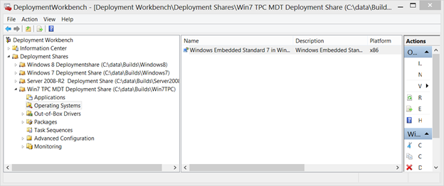

Then prepare the bootstrap.ini as shown below.

```ini
[Settings]
Priority=Default
[Default]
;DeployRoot=\\LAB-ALVE01\WIN7TPC$
DeployRoot=\\AVWIN8-01\Win7TPC$
UserID=BuildUser
UserDomain=AVWIN8-01
UserPassword=BuildUser123
KeyboardLocale=en-US
SkipBDDWelcome=YES
```

Then prepare the customsettings.ini as shown below.

```ini
[Settings]
Priority=Default
Properties=DriversApplied
[Default]
_SMSTSOrgName=Anything About IT
DriversApplied=NO
OSInstall=Y
SkipCapture=YES
SkipAdminPassword=YES
AdminPassword=P@ssWord
SkipProductKey=YES
SkipComputerBackup=YES
SkipBitLocker=YES
ApplyGPOPack=NO
SkipUserData=YES
SkipDomainMembership=YES
SkipComputerName=YES
SkipSummary=YES
SkipFinalSummary=YES
FinishAction=RESTART
SkipLocaleSelection=YES
KeyboardLocale=en-US
UserLocale=en-US
SkipTimeZone=Yes
TimeZoneName=W. Europe Standard Time
SkipTaskSequence=YES
TaskSequenceID=001
ComputerName=TPC#Right("%SERIALNUMBER%",10)#
```

Then open the unattend.xml and add the creation of an additional local user called "User" with password "User". Then set the ProtectYourPC value to 3 to disable Windows Update.

Then import any security updates and functional updates for Windows Embedded/ThinPC into MDT.

And finally create the boot media.


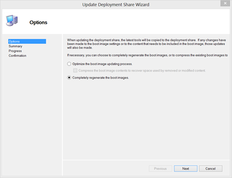


Once the boot media wizard has completed you should have the LiteTouchPE_x86.iso located in the deployment share's boot folder.

## Step 2 - Create the Task Sequence

Create a new Task Sequence based on the *New Client* Template.

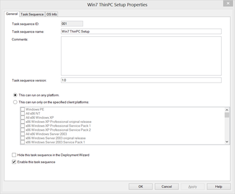

Within the standard task sequence I have added / customized the following:

- Disabled the default Inject Drivers Task and replaced it with the Driver Management method described [here](http://adminnexus.blogspot.ch/2012/08/yet-another-approach-to-driver.html) by the Admin Nexus. If you're only deploying into Hyper-V for now, you can ignore this step.

- The Install Applications Task installs an Application Bundle I describe in more detail below.

- A task that creates a scheduled task that enables Autologon

- A task that enables the Enhanced Write Filter

I suggest that before adding these custom tasks, just launch the installation by booting a VM from the LiteTouchPE_x86.iso to ensure a default install works.

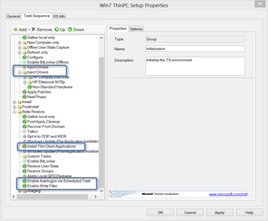


## Step 3 - Injecting Drivers

Depending on to how many different hardware platforms you are going to deploy ThinPC you can either just import all drivers directly into MDT and let MDT find out what's best or use a more enhanced approach as described [here](http://adminnexus.blogspot.ch/2012/08/yet-another-approach-to-driver.html).  Since we are using the x86 version of Windows Embedded you must download the appropriate x86 drivers for the appropriate hardware models.

## Step 4 - The ThinPC Application Bundle

Within the Application bundle I have included the following Software / scripts.

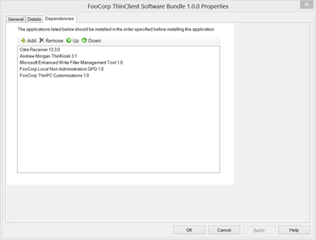


Within the Application Bundle details I have enabled the setting to reboot the computer once completed.


The Citrix Receiver Application contains the CitrixReceiver.exe and a script called install_citrix_receiver.cmd that has the following content:

```bat
set CommandLineOptions=/silent /noreboot SERVER_LOCATION="demo.citrixcloud.net"
CitrixReceiver.exe %CommandLineOptions%
```

The ThinKiosk Application contains the Kiosk-installer.msi, kiosk.cab and a script called install_thinkiosk.cmd that has the following content:

```bat
msiexec /i Kiosk-Installer.msi /qb
```

The Microsoft Enhanced Write Filter Management Tool application contains the EWFMgmtToolInstall_x86.msi package. The Quiet install command used is:

```bat
msiexec.exe /i "EWFMgmtToolInstall_x86.msi" /qb REBOOT="ReallySuppress"
```

The Local non-Administrators GPO application contains a GPO Pack I've previously created and is installed with the following quiet install command:

```bat
cscript.exe "GPOPack.wsf" /MLGPO:Non-Administrators
```

The content of the GPO Pack is as shown below.

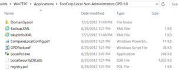

The local GPO pack I've created contains a number of settings to lock down the client, the most important however is the policy that replaces the default explorer shell with ThinKiosk.

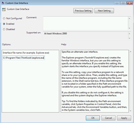


Then there are a few ThinKiosk specific GPO settings such as the web interface URL to launch when starting ThinKiosk and the unlock password.

A detailed listing of all applied local GPO setting can be found at the end of this post. If you haven't used the LocalGPO Tool yet, then watch out for the upcoming blog post I have planned for this.

The ThinPC customization Application contains a script called TPC_Customizations.cmd that applies some further customizations.

```bat
cscript.exe trustedsites.vbs
reg add "HKEY_LOCAL_MACHINE\SYSTEM\CurrentControlSet\Control\Terminal Server" /v fDenyTSConnections /t REG_DWORD /d 0 /f
netsh advfirewall firewall add rule name="All ICMP V4" dir=in action=allow protocol=icmpv4
netsh advfirewall firewall set rule group="remote administration" new enable=yes
netsh advfirewall firewall set rule group="remote desktop" new enable=Yes
exit
```

The trustedsites.vbs contains the code to add demo.citrixcloud.net to the trusted sites.

```vbscript
' set trusted site at machine level
Const HKEY_LOCAL_MACHINE = &H80000002
strComputer = "."
Set objReg=GetObject("winmgmts:\\" & strComputer & "\root\default:StdRegProv")
strKeyPath = "Software\Microsoft\Windows\CurrentVersion\Internet Settings\" _
    & "ZoneMap\Domains\demo.citrixcloud.net"
objReg.CreateKey HKEY_LOCAL_MACHINE, strKeyPath
strValueName = "http"
dwValue = 2
objReg.SetDWORDValue HKEY_LOCAL_MACHINE, strKeyPath, strValueName, dwValue
```

Code source: Microsoft Scripting Guys.

## Step 5 - Enable Autologon via Scheduled Task

At the end of the deployment we want the ThinPC to logon automatically with a user called "User" and then directly launch ThinKiosk. Because the MDT cleanup task removes the Autologon keys, I had to find a way how to enable the Autologon settings "after" MDT finishes. I decided to use a scheduled task that is executed at the next system startup and then deletes itself.

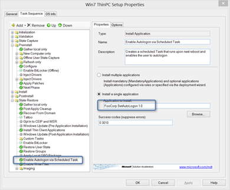


The content of the application is as following:

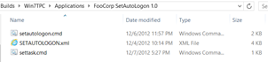


The SetAutologon application executes the script settask.cmd. The script first copies the setautologon.cmd and setautologon.xml to the local drive into c:\Widnows and then creates the scheduled task that will execute setautologon.cmd upon the next system startup.

```bat
xcopy setautologon.cmd c:\windows /y
xcopy setautologon.xml c:\windows /y
schtasks.exe /create /TN SetAutologon /XML c:\Windows\setautologon.xml
exit
```

The content of setautologon.xml is as following

```xml
<?xml version="1.0" encoding="UTF-16"?>
<Task version="1.3" xmlns="http://schemas.microsoft.com/windows/2004/02/mit/task">
  <RegistrationInfo>
    <Date>2012-12-04T21:51:37.278125</Date>
    <Author>TPC60-4436-70\Administrator</Author>
    <Description>Set Autologon</Description>
  </RegistrationInfo>
  <Triggers>
    <BootTrigger>
      <Enabled>true</Enabled>
    </BootTrigger>
  </Triggers>
  <Principals>
    <Principal id="Author">
      <UserId>S-1-5-18</UserId>
      <RunLevel>LeastPrivilege</RunLevel>
    </Principal>
  </Principals>
  <Settings>
    <MultipleInstancesPolicy>IgnoreNew</MultipleInstancesPolicy>
    <DisallowStartIfOnBatteries>false</DisallowStartIfOnBatteries>
    <StopIfGoingOnBatteries>false</StopIfGoingOnBatteries>
    <AllowHardTerminate>true</AllowHardTerminate>
    <StartWhenAvailable>false</StartWhenAvailable>
    <RunOnlyIfNetworkAvailable>false</RunOnlyIfNetworkAvailable>
    <IdleSettings>
      <StopOnIdleEnd>true</StopOnIdleEnd>
      <RestartOnIdle>false</RestartOnIdle>
    </IdleSettings>
    <AllowStartOnDemand>true</AllowStartOnDemand>
    <Enabled>true</Enabled>
    <Hidden>false</Hidden>
    <RunOnlyIfIdle>false</RunOnlyIfIdle>
    <DisallowStartOnRemoteAppSession>false</DisallowStartOnRemoteAppSession>
    <UseUnifiedSchedulingEngine>false</UseUnifiedSchedulingEngine>
    <WakeToRun>false</WakeToRun>
    <ExecutionTimeLimit>P3D</ExecutionTimeLimit>
    <Priority>7</Priority>
  </Settings>
  <Actions Context="Author">
    <Exec>
      <Command>C:\Windows\system32\cmd.exe</Command>
      <Arguments>/C C:\Windows\setautologon.cmd</Arguments>
    </Exec>
  </Actions>
</Task>
```

And finally the script that is executed at the next system startup is called setautologon.cmd and has the following content:

```bat
REG DELETE "HKLM\Software\Microsoft\Windows NT\CurrentVersion\Winlogon" /v AutoLogonCount /f
REG ADD "HKLM\Software\Microsoft\Windows NT\CurrentVersion\Winlogon" /v AutoAdminLogon  /t REG_SZ /d "1" /f
REG ADD "HKLM\Software\Microsoft\Windows NT\CurrentVersion\Winlogon" /v DefaultUserName   /t REG_SZ /d "User" /f
REG ADD "HKLM\Software\Microsoft\Windows NT\CurrentVersion\Winlogon" /v DefaultPassword  /t REG_SZ /d "User" /f
REG ADD "HKLM\Software\Microsoft\Windows NT\CurrentVersion\Winlogon" /v DefaultDomainName  /t REG_SZ /d "." /f
REG ADD "HKLM\Software\Microsoft\Windows NT\CurrentVersion\Winlogon\AutoLogonChecked" /ve  /t REG_SZ /d 1 /f
C:\Windows\System32\schtasks.exe /Delete /TN SetAutologon /F
C:\Windows\System32\ewfmgr.exe c: -commit
ping localhost -n 5
shutdown -r -t 5
```

When the scheduled task has completed the system will restart and then automatically logon.

## Step 6 - Enable the Write Filter

As a last step of the Task Sequence we are going to enable the write filter.

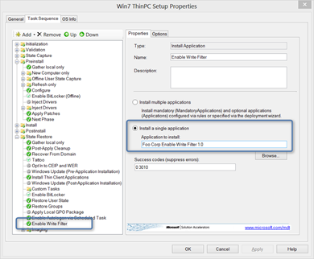


The Enable Write Filter Application runs the script called enable_writefilter.cmd that has the following content.

```bat
:: +--------------------------------------------------------------------+
:: Enable Write Filter
:: Update BCD to suppress Boot errors caused by enabling the write filter
:: +--------------------------------------------------------------------+
ewfmgr.exe c: -enable
ping -n 20 localhost
bcdedit /set {current} bootstatuspolicy ignoreallfailures
ping -n 20 localhost
ewfmgr.exe c: -commit
ping -n 20 localhost
exit
```

Once this task is completed, MDT will end the Task Sequence and because we have set the FinishAction property to RESTART within the customsettings.ini, the client will reboot and then execute the Scheduled Task to enable the Autologon.

## The repurposed PC

Below a screenshot of the repurposed PC, using ThinKiosk and configured to directly launch the public Citrix demo environment.

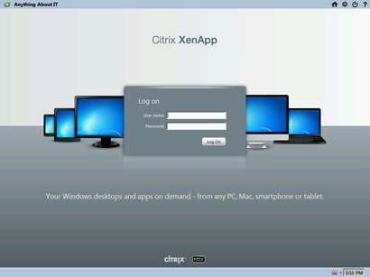


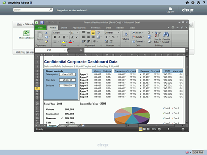


You see, reusing existing PCs as a thin client isn't that hard. I hope this blog post gave you some ideas, any comments are welcome.

The below report shows all the local GPO settings included In the local GPO pack that is applied to "Non-Administrators" only.

## User Configuration

### Policies

### Administrative Templates

Policy definitions (ADMX files) retrieved from the local machine.

### Desktop

| Policy | Setting | Winning GPO |
| --- | --- | --- |

| Hide and disable all items on the desktop | Enabled | Local Group Policy |
| Prohibit adjusting desktop toolbars | Enabled | Local Group Policy |
| Remove the Desktop Cleanup Wizard | Enabled | Local Group Policy |

### Start Menu and Taskbar

| Policy | Setting | Winning GPO |
| --- | --- | --- |
| Do not allow pinning items in Jump Lists | Enabled | Local Group Policy |
| Do not allow pinning programs to the Taskbar | Enabled | Local Group Policy |
| Do not display or track items in Jump Lists from remote locations | Enabled | Local Group Policy |
| Hide the notification area | Enabled | Local Group Policy |
| Lock all taskbar settings | Enabled | Local Group Policy |
| Lock the Taskbar | Enabled | Local Group Policy |
| Prevent changes to Taskbar and Start Menu Settings | Enabled | Local Group Policy |
| Prevent users from adding or removing toolbars | Enabled | Local Group Policy |
| Prevent users from moving taskbar to another screen dock location | Enabled | Local Group Policy |
| Prevent users from rearranging toolbars | Enabled | Local Group Policy |
| Prevent users from resizing the taskbar | Enabled | Local Group Policy |
| Remove access to the context menus for the taskbar | Enabled | Local Group Policy |
| Remove Default Programs link from the Start menu | Enabled | Local Group Policy |
| Remove Favorites menu from Start Menu | Enabled | Local Group Policy |
| Remove Games link from Start Menu | Enabled | Local Group Policy |
| Remove Help menu from Start Menu | Enabled | Local Group Policy |
| Remove links and access to Windows Update | Enabled | Local Group Policy |
| Remove Music icon from Start Menu | Enabled | Local Group Policy |
| Remove Network icon from Start Menu | Enabled | Local Group Policy |
| Remove Pictures icon from Start Menu | Enabled | Local Group Policy |
| Remove pinned programs from the Taskbar | Enabled | Local Group Policy |
| Remove pinned programs list from the Start Menu | Enabled | Local Group Policy |
| Remove the Action Center icon | Enabled | Local Group Policy |
| Remove user folder link from Start Menu | Enabled | Local Group Policy |
| Remove user name from Start Menu | Enabled | Local Group Policy |
| Remove user's folders from the Start Menu | Enabled | Local Group Policy |
| Remove Videos link from Start Menu | Enabled | Local Group Policy |
| Turn off all balloon notifications | Enabled | Local Group Policy |
| Turn off automatic promotion of notification icons to the taskbar | Enabled | Local Group Policy |
| Turn off feature advertisement balloon notifications | Enabled | Local Group Policy |

### System

| Policy | Setting | Winning GPO | Value |
| --- | --- | --- | --- |
| Custom User Interface | Enabled | Local Group Policy | C:\Program Files\ThinKiosk\iexplore.exe |

### System/Ctrl+Alt+Del Options

| Policy | Setting | Winning GPO |
| --- | --- | --- |
| Remove Change Password | Enabled | Local Group Policy |
| Remove Lock Computer | Enabled | Local Group Policy |
| Remove Task Manager | Enabled | Local Group Policy |

### ThinKiosk Settings

| Policy | Setting | Winning GPO | Value |
| --- | --- | --- | --- |
| Custom Title | Enabled | Local Group Policy | Anything About IT |
| Unlock Password | Enabled | Local Group Policy | unlock |
| Web Interface URL | Enabled | Local Group Policy | http://demo.citrixcloud.net |

### Windows Components/Windows Mail

| Policy | Setting | Winning GPO |
| --- | --- | --- |
| Turn off Windows Mail application | Enabled | Local Group Policy |

### Windows Components/Windows Update

| Policy | Setting | Winning GPO | Notes |
| --- | --- | --- | --- |
| Remove access to use all Windows Update features | Enabled | Local Group Policy | Configure notifications: 0 - Do not show any notifications |


