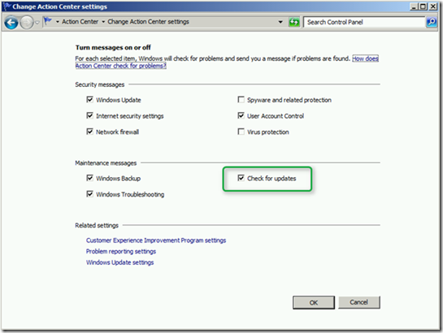
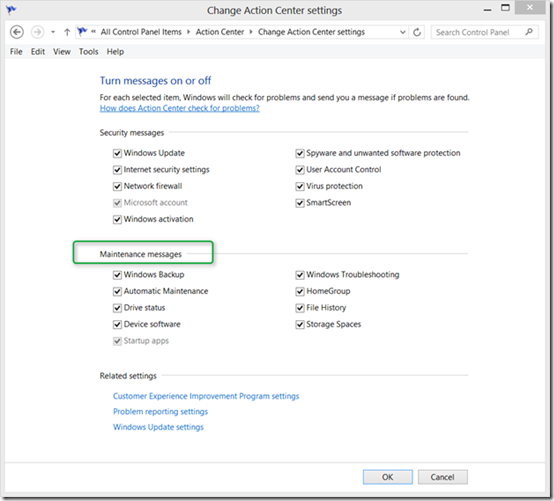
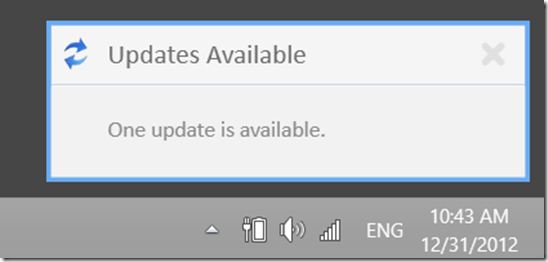
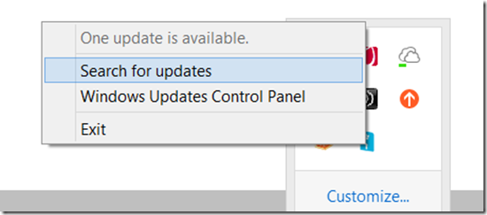

With the introduction of Windows 7 Microsoft started to pay attention to remove unnecessary noise from the Windows Desktop meaning reducing the number of system notification balloons. For details read the [Action Center](http://blogs.msdn.com/b/e7/archive/2008/11/11/action-center.aspx) blog post on the Engineering Windows 7 blog. 

  As you can see from the screenshot below, in Windows 7 the user can still receive notification messages about available Windows Updates. 

  

  But in Windows 8 this option has disappeared, meaning that in Windows 8 there are no Windows Update messages shown anymore on the desktop but only on the logon screen. The below screenshot shows the Action Center in Windows 8 and you’ll notice the Check for Updates option under Maintenance Messages is gone. 

  

  Personally I think this is a good thing, as for the regular user there is no real added value to know whether updates are available or not, they will just install as needed. But for those who miss the Windows Update notifications there is a little FREE utility called Windows 8 Update Notifier. 

  

  The Windows Update Notifier can be downloaded from [here](http://wun.codeplex.com/) and consists of just one executable. To install the utility just extract the executable from the downloaded ZIP file and then place a shortcut into the startup folder (e.g. "C:\Users\{Username}\AppData\Roaming\Microsoft\Windows\Start Menu\Programs\Startup).

  

