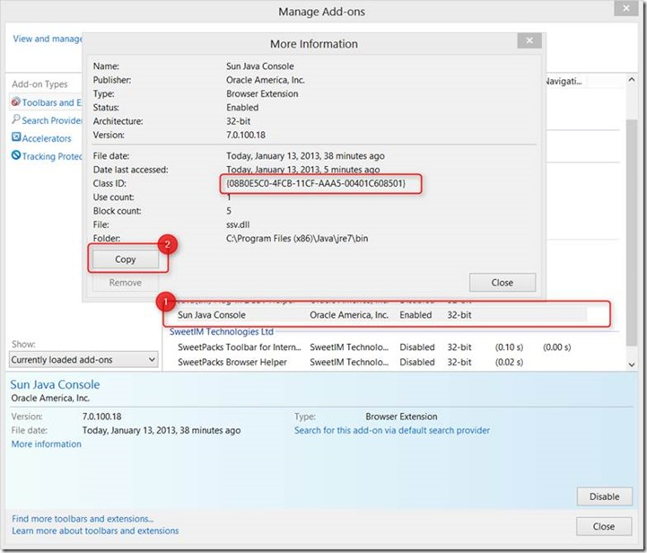
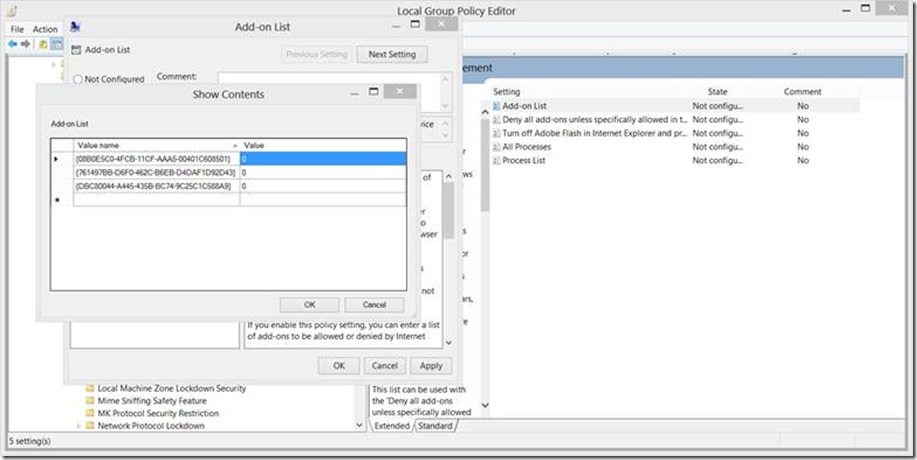
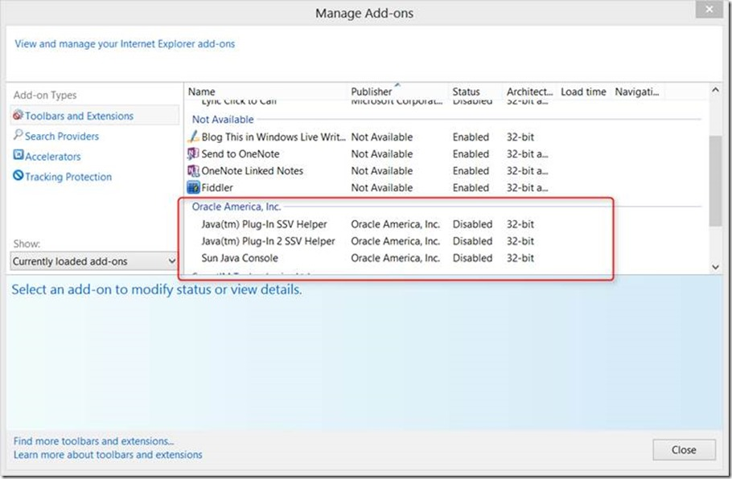

Follow the below steps to disable Java in Internet Explorer with Group Policy. 

  Open Internet Explorer, then from the Tools menu select Manage Add-ons. Locate the Java add-on, select and double click on it. 

  

  Click on the Copy button to copy the content and paste it into notepad

  Name: Sun Java Console

  Publisher: Oracle America, Inc.

  Type: Browser Extension

  Architecture: 32-bit

  Version: 7.0.100.18

  File date: ‎Today, ‎January ‎13, ‎2013, ‏‎15 minutes ago

  Date last accessed: Not available

  **Class ID: {08B0E5C0-4FCB-11CF-AAA5-00401C608501}**

  Use count: 0

  Block count: 0

  File: ssv.dll

  Folder: C:\Program Files (x86)\Java\jre7\bin

  Repeat the same for any other Java related add-ons. 

  Now open the Group Policy editor and navigate to Computer Configuration \ Administrative Templates \ Windows Components \ Internet Explorer \ Security Features \ Add-on Management. 

  Open the Add-on list Setting, Enable it and then add the Class IDs of all Java add-on-s to the list. Set the value to 0. Click OK to save the changes. 

  

  Note that you can also apply the same settings under the User Configuration node. Possible values that can be entered are:

     
- 0 - The add-on is disabled, and users cannot manage the add-on from the user interface.     
- 1 - The add-on is enabled, and users cannot manage the add-on from the user interface.     
- 2 - The add-on is enabled, and users can manage the add-on from the user interface.  

  Once the updates settings have applied to your machine the add-ons should be disabled. 

  

  To test if it-s working go to the Java applet test page here [http://www.java.com/en/download/testjava.jsp](http://www.java.com/en/download/testjava.jsp)

