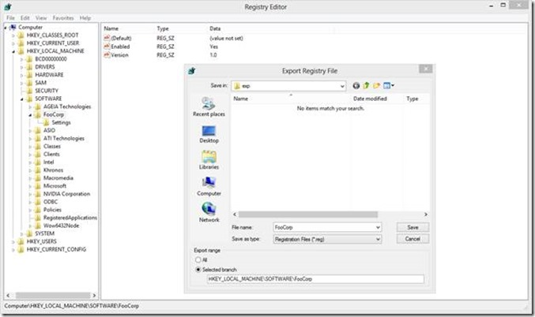
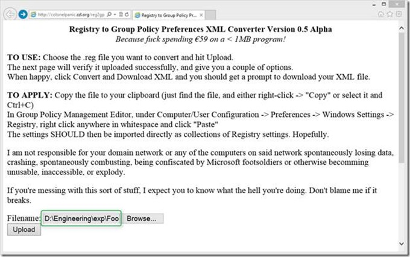
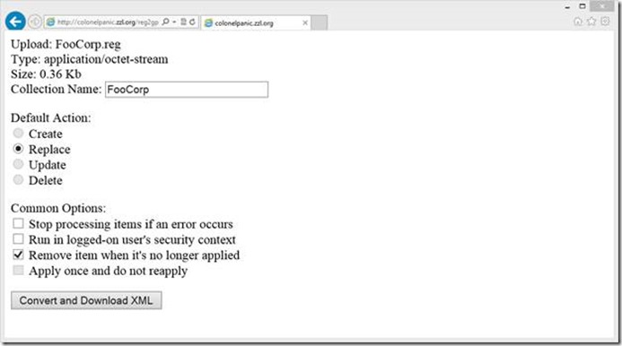
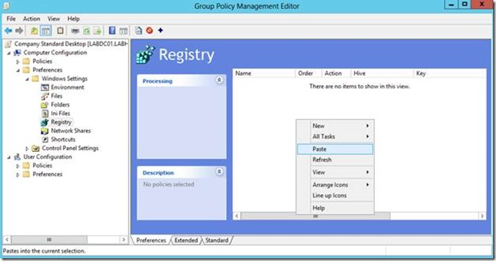
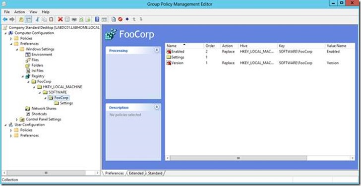
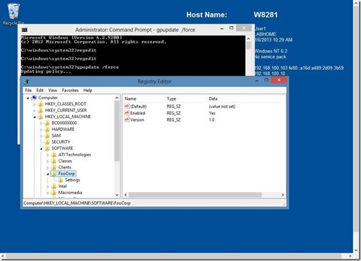

Creating registry settings manually within the Group Policy Preferences editor can become a cumbersome task, especially when you need to create many of them. Although the Group Policy Management console allows you to import registry keys stored within an XML formatted file, unfortunately out of the box Microsoft doesn’t provide any tooling to export and convert registry settings into xml. 

  A couple of days ago I found an online “FREE” [Registry to Group Policy Preferences XML converter](http://colonelpanic.zzl.org/reg2gpp/) that looks pretty promising. It’s still under development but definitely worth a try before starting a lengthy manual task. 

  First open the Registry editor and export the settings you want to manage with Group Policy Preferences. 

  

  When exported, open the .REG file with notepad and review the settings. Then open a browser and go to [http://colonelpanic.zzl.org/reg2gpp/](http://colonelpanic.zzl.org/reg2gpp/)

  Then select the previously exported .REG file and click on Upload

  

  Next provide a meaningful name, configure the Action and Common Options. 

  

  Then click on Convert and Download XML and save the file. 

  Then open the Group Policy Management Console, open an existing Group Policy Object or create a new one and navigate to the Preferences Node, then expand Windows Settings and select Registry. 

  In previous versions of Windows you could just drag and drop the xml file into the Group Policy Management Editor, but with Windows 8 / Server 2012 this does not seem to work anymore. So just select the file within File Explorer, select Copy and then select Paste within the GP Management Editor. 

  

  And after confirming that we really want to import this, we have our GPP registry settings imported. 

  

  On a client that gets the GP run gpupdate /force and wait for the registry keys to be created. 

  

  Another method to import registry keys is to use the [Registry Wizard](http://technet.microsoft.com/en-us/library/cc771001.aspx) which is build-in within the console. 

  Additional Information

  [Group Policy Preferences : Colorful and Mysteriously Powerful, just like Windows 7](http://blogs.technet.com/b/grouppolicy/archive/2009/11/02/group-policy-preferences-colorful-and-mysteriously-powerful-just-like-windows-7.aspx)

