Most enterprises take advantage of Group Policies to manage security configuration settings across their server and desktop infrastructure. Usually once tested and implemented it’s assumed they get applied correctly. But can we be 100% sure that our clients and servers do actually receive these settings? 

  With the help of the Microsoft Security Compliance Manager 3.0 and SCCM 2012 SP1 we can configure a security baseline to monitor security group policy settings compliance. To do so we need the following:

     
- Microsoft Security Compliance Manager 3.0    
- Microsoft System Center Configuration Manager 2012 SP1    
- Group Policy Management Console 

  For demonstration purposes I have created a new Group Policy object called Company Standard Desktop that contains 4 settings. 

  [
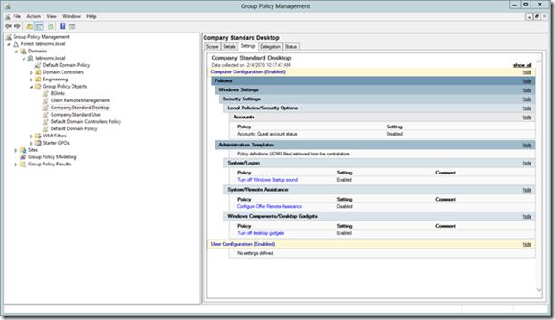
](https://www.verboon.info/wp-content/uploads/2013/02/clip_image002.png)

  In the above settings you see the Accounts Guest account setting, however after reading the [release notes](http://social.technet.microsoft.com/wiki/contents/articles/1864.microsoft-security-compliance-manager-scm-release-notes.aspx) I had to learn that:

  The following settings are not currently supported when generating SCAP content or DCM configuration packs: 

     
- Accounts: Rename administrator account     
- Accounts: Rename guest account     
- Accounts: Administrator account status     
- Accounts: Guest account status     
- Network security: Force logoff when logon hours expire 

  We are going to proceed with this setting included and delete it later once imported into SCCM. 

  To import the settings into SCM we must first export the GPO e.g. create a Backup. 

  [
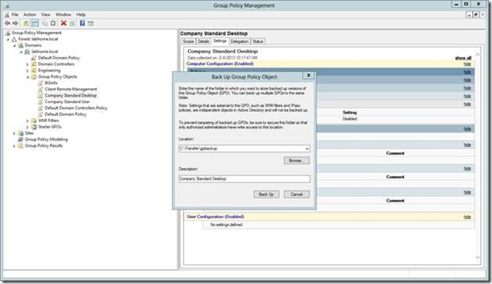
](https://www.verboon.info/wp-content/uploads/2013/02/clip_image004.jpg)

  We then launch the Microsoft Security Compliance Manager and select Import – GPO (Backup Folder). When prompted we enter the Name of the baseline. 

  [
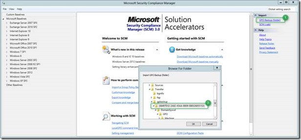
](https://www.verboon.info/wp-content/uploads/2013/02/clip_image006.jpg)

  Once imported successfully, we can see the settings within the SCM console. 

  [
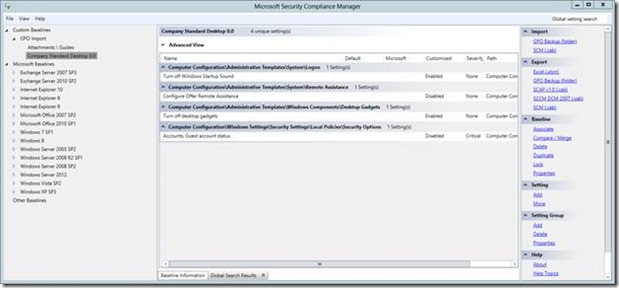
](https://www.verboon.info/wp-content/uploads/2013/02/clip_image008.jpg)

  To use this baseline within SCCM we must export it into a DCM cab file. Under the Export node, select SCCM DCM 2007 (cab) and then associate the baseline with a Product. For this demo we select Windows 8. 

  [
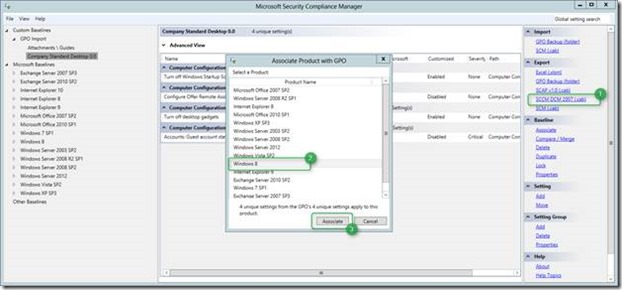
](https://www.verboon.info/wp-content/uploads/2013/02/clip_image010.jpg)

  When prompted save the CAB file. 

  [
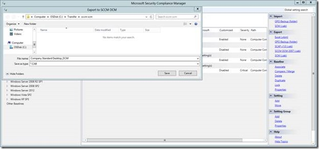
](https://www.verboon.info/wp-content/uploads/2013/02/clip_image012.jpg)

  Note that **SCCM DCM 2007** relates to the “**format**” of the DCM cab file, but according to Jose Maldonado Security Product Manager at Microsoft for SCM this works with SCCM 2012 Service Pack 1 as well. Without SCCM 2012 SP1 some of the DCM packs have issues. 

  [
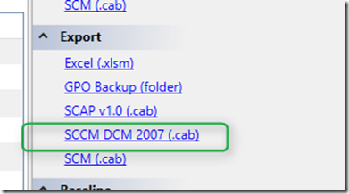
](https://www.verboon.info/wp-content/uploads/2013/02/image.png)

  Next we open the SCCM Console and under Assets and Compliance \ Compliance Settings \ Configuration Baselines we select **Import Configuration Data. **

  [
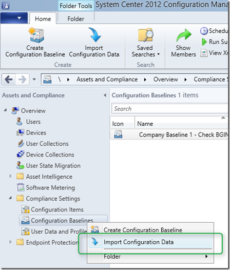
](https://www.verboon.info/wp-content/uploads/2013/02/clip_image013.png)

  We then select **Add** and select the previously exported CAB file. Once imported we see the baseline listed. 

  [
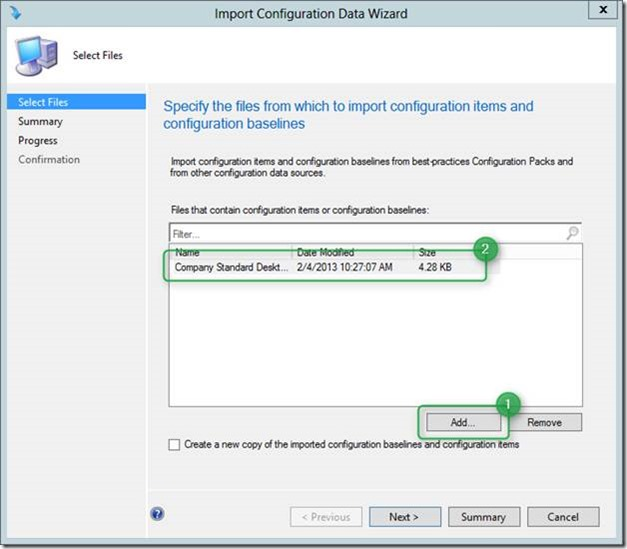
](https://www.verboon.info/wp-content/uploads/2013/02/clip_image015.jpg)

  Then click **Next**, **Next** and if all goes well, we get the following results. 

  [
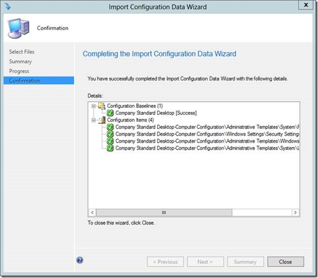
](https://www.verboon.info/wp-content/uploads/2013/02/clip_image017.jpg)

  We now have a new Baseline

  [
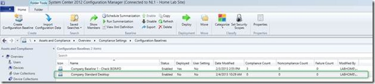
](https://www.verboon.info/wp-content/uploads/2013/02/clip_image019.jpg)

  When we right click on the Configuration Baseline and select **Show Members**

  [
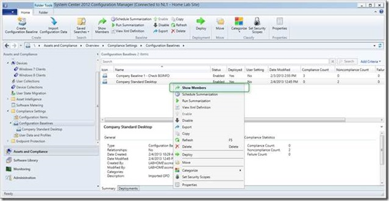
](https://www.verboon.info/wp-content/uploads/2013/02/clip_image021.jpg)

  We see all configuration items associated with this security baseline. 

  [
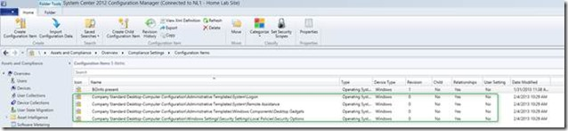
](https://www.verboon.info/wp-content/uploads/2013/02/clip_image023.jpg)

  Because we know that the Accounts:Guest account configuration item won’t work, we will simply delete this one. 

  [
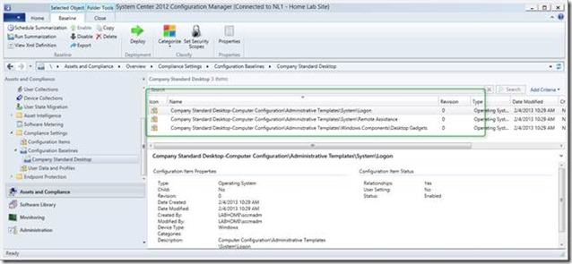
](https://www.verboon.info/wp-content/uploads/2013/02/clip_image025.jpg)

  Next we are going to deploy this baseline. Select the new created baseline and click on the **Deploy** icon. 

  [
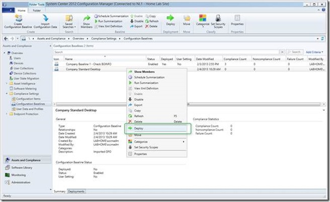
](https://www.verboon.info/wp-content/uploads/2013/02/clip_image027.jpg)

  Select the Configuration Baseline to deploy, then select a Collection and then select the schedule. For demonstration purposes I have this this to once every hour, but within a production environment depending on how important compliance is for your organization you probably want to set this to once a day, every 3 days or once a week. 

  [
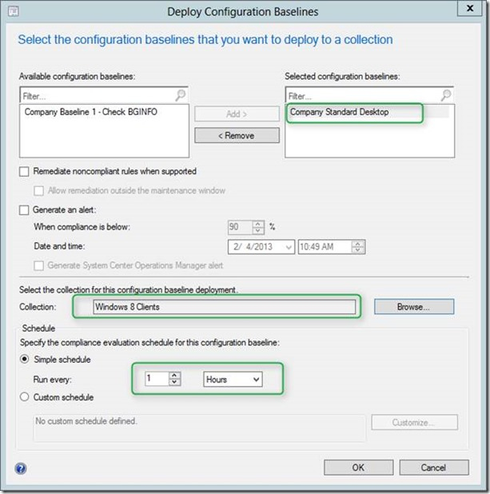
](https://www.verboon.info/wp-content/uploads/2013/02/clip_image029.jpg)

  Once all settings are made click OK and you should see the Configuration Baseline deployment within the SCCM console. 

  [
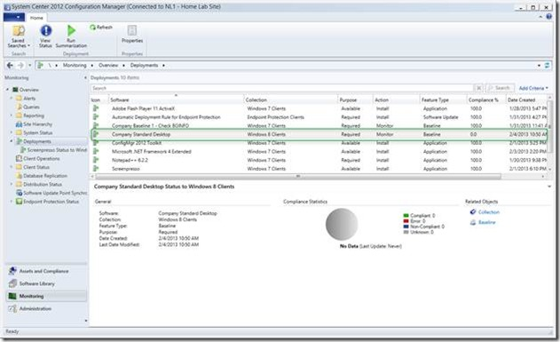
](https://www.verboon.info/wp-content/uploads/2013/02/clip_image031.jpg)

  And once clients have processed the compliance settings task the results are shown in the console. For this demonstration I have only used one client. 

  [
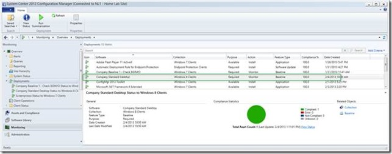
](https://www.verboon.info/wp-content/uploads/2013/02/clip_image033.jpg)

  **Additional Information:**

  SCM 3.0 Download [http://www.microsoft.com/en-us/download/details.aspx?id=16776](http://www.microsoft.com/en-us/download/details.aspx?id=16776)

  SCM – Known issue with IE10   
[http://social.technet.microsoft.com/wiki/contents/articles/15607.microsoft-security-compliance-manager-scm-internet-explorer-10-security-and-compliance-baseline-release-notes-en-us.aspx](http://social.technet.microsoft.com/wiki/contents/articles/15607.microsoft-security-compliance-manager-scm-internet-explorer-10-security-and-compliance-baseline-release-notes-en-us.aspx)

  SCCM – Compliance Settings log files [http://technet.microsoft.com/en-us/library/hh427342.aspx#BKMK_CompSettingsLog](http://technet.microsoft.com/en-us/library/hh427342.aspx#BKMK_CompSettingsLog)

