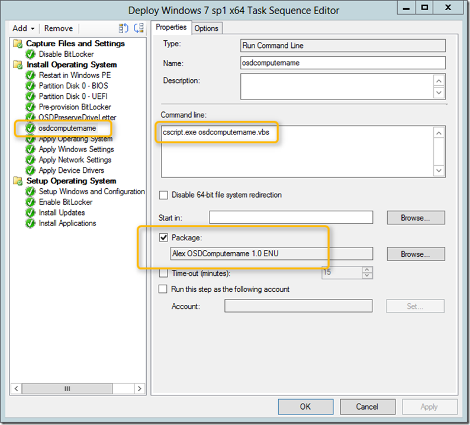

For my **lab** environment I use the below described approach to generate random computernames for my clients. The script does the following:

	
- Read the Task Sequence Package Name
	
- Based on the name set the appropriate prefix
	
- Generate a random number between 100 and 1000
	
- Generate the new computer name based on Prefix + random number

To implement this do the following:

	
- Put the script listed below into a package
	
- Add the script to the TS by adding a Run Command Line task *after* Partition Disk and *before* Apply Operating System

 

**Script: OSDComputername.vbs**

 

[sourcecode language="vb"]
Set env = CreateObject("Microsoft.SMS.TSEnvironment")
tsname = env("_SMSTSPackageName")

select case tsname
case "Deploy Windows 7 sp1 x64"
Prefix = "Win7"
case "Deploy Windows 8 x64"
Prefix = "Win8"
case else
Prefix = "CL"
end select

env("OSDComputerName") = RCompName()

Function RCompName()
On Error Resume Next
Dim CompName : CompName = ""
Dim max,min
max=1000
min=100
Randomize
CompName = "" & Prefix & (Int((max-min+1)*Rnd+min))
oLogging.CreateEntry "Generated random Computername '" & CompName & "'", LogTypeInfo
RCompName = CStr(CompName)
End Function

 [/sourcecode]

