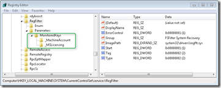
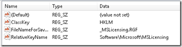
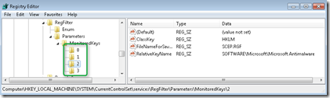
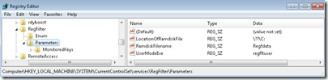
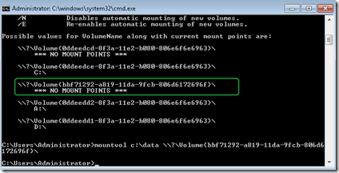
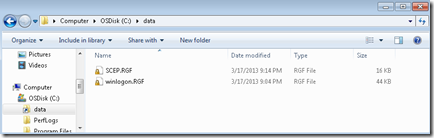

When running Windows Embedded Standard 7 or Windows ThinPC with the Enhanced Write Filter (volume based protection) or File Based Write Filter (File based protection) enabled, the system returns to its original state upon every reboot. This is a good thing, but as always there are exceptions, one of them is Antivirus Software. When after a reboot a system is reset to its original state, it means that any changes such as the installation of engine updates are lost, to avoid this from happening file and registry exclusions can be set.  I am going to focus on the registry filter as I made some findings I believe is worth sharing and might save you some time getting it to work.  Registry Filter settings are stored within the Registry Filter Service located under HKEY_LOCAL_MACHINE\SYSTEM\CurrentControlSet\services\RegFilter\Parameters\MonitoredKeys 

 Windows Embedded Standard 7 and Windows ThinPC have two registry filters set by default. The _MachineAccount exclusion handles registry changes related to domain joined clients, the _MSLicensing exclusion manages registry changes for remote the remote desktop client. A more detailed description of the two default exclusions can be found [here](http://msdn.microsoft.com/en-us/library/ff793988(v=winembedded.60).aspx).  Taking the _MSLicensing filter as an example, we have the following settings.   The **Classkey **defines where in the registry the key is located, this must HKLM. The **FileNameForSaving** is the file name that for storing the registry changes, more on this later. The **RelativeKeyName **points to the location of the registry key that must be monitored for changes.  You would think that adding another registry key, so it survives a reboot should be something easy to do, Just create another entry under MonitoredKeys and we’re good. Unfortunately this will not work.  As soon as we add additional custom keys, we must also change the existing ones to get it working. Instead of using descriptive names like _MachineAccount _MSLicensing _CustomXYZ the keys must be changed to numbers starting with 0 and 1 for the default keys, then add 2 for your custom key 3 for the next etc.   If you are not joining the client to the domain, you will most likely see the following warning in the Windows Event log.  “The Registry Filter was unable to open some registry keys for monitoring” EventID:16 from Source: RegFilter. This is because the _MachineAccount filter tries to monitor HKLM\SECURITY\Policy\Secrets\$MACHINE.ACC a key that does not exist on non-domain joined clients. However I noticed that when I deleted the “0" (_MachineAccount) key, the error disappeared, but suddenly my other filters wouldn’t work anymore, so I recommend just leaving it there.  Now let me get back to the **FileNameForSaving** setting. For each monitored key a separate unique filename is defined e.g. _MachineAccount.RGF, _MSLicensing.RGF and for custom keys we use something like SCEP.RGF and winlogon.RGF. These files however are not stored somewhere on the disk but within a RAM Drive that is defined under HKEY_LOCAL_MACHINE\SYSTEM\CurrentControlSet\services\RegFilter\Parameters   When opening Windows Explorer with show protected system files enabled, we only see C:\RegData. To see the content of the RAM Drive use the mountvol command. e.g.  mountvol C:\Data   [\\?\Volume{bbf71292-a819-11da-9fcb-806d6172696f}\](file://\\?\Volume{bbf71292-a819-11da-9fcb-806d6172696f}\)    To umount the drive, just run mountvol.exe c:\data /D   Additional Information: [Using System Center Endpoint Protection 2012 SP1 on Windows Embedded Standard 7 and POSReady 7 with File Based Write Filters](http://blogs.msdn.com/b/windows-embedded/archive/2013/02/15/using-system-center-endpoint-protection-2012-sp1-on-windows-embedded-standard-7-and-posready-7-with-file-based-write-filters.aspx) [How to Manage Windows Embedded Write Filters Using System Center 2012 Configuration Manager](http://blogs.technet.com/b/configmgrteam/archive/2012/07/20/how-to-manage-windows-embedded-write-filters-using-system-center-2012-configuration-manager.aspx) [Managing Embedded Devices with Write Filters in Configuration Manager Service Pack 1](http://blogs.technet.com/b/configmgrteam/archive/2012/11/26/managing-embedded-devices-with-write-filters-in-configuration-manager-service-pack-1.aspx) [Registry Filter (Windows Embedded Standard 7 Service Pack 1)](http://msdn.microsoft.com/en-us/library/ff793988(v=winembedded.60).aspx)

