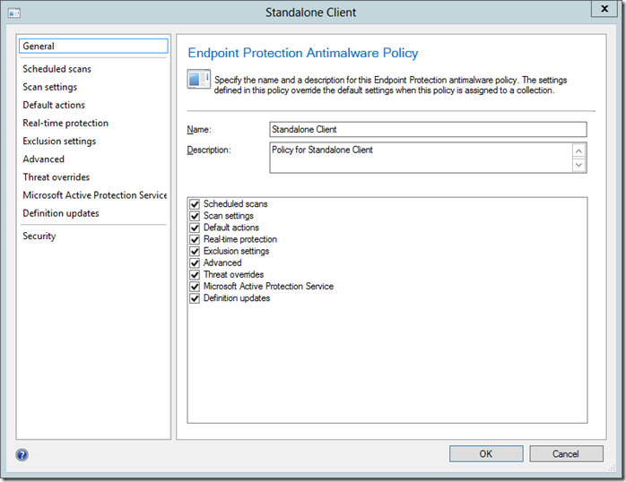
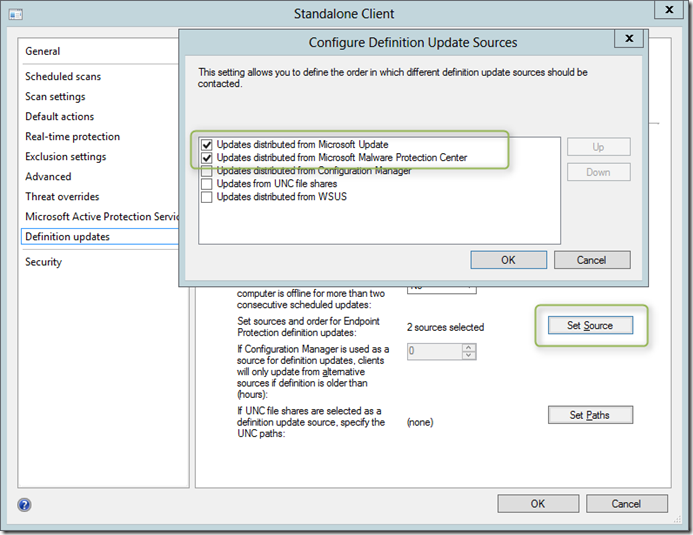
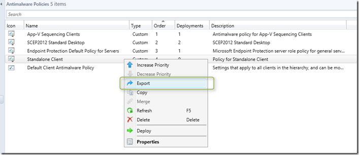
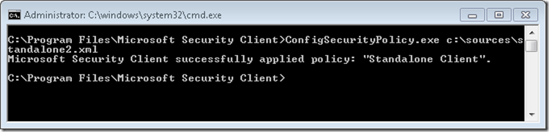

Suppose you have a need to deploy System Center 2012 Endpoint Protection to a number of clients that later run in standalone mode, meaning that they are not joined to a domain, can’t be managed by SCCM and operate in a network that is not connected to your corporate network. 

  The installation source **scepinstall.exe** for the System Center Endpoint Protection agent is stored within the SCCM 2012 client installation folder on the SCCM 2012 SP1 server under C:\Program Files\Microsoft Configuration Manager\Client. Within that same directory we also find the endpoint protection default policy settings stored as **ep_defaultpolicy.xml**, but we won’t use this , as we are going to prepare our own policy that meets our requirements for a standalone unmanaged client. 

  To create a standalone policy open the Configuration Manager 2012 Console and under Assets and Compliance select Endpoint Protection / Antimalware Policies. Then select Create Antimalware policy. 

  Configure the various settings as per your requirements. 

  

  One very important setting is the Definition Updates Source configuration which by default points to the Configuration Manager. For our standalone scenario we will enable Microsoft Update and Microsoft Malware Protection Center only. If your clients do not have direct connectivity to the internet the use of a UNC share could also be an alternative, but then requires that you periodically update the share with latest definition updates packages.  

  

  Finally we export the settings and save them as standalone.xml

  

  To install the System Center Endpoint Protection client run the following command (both the installer and policy file are stored in C:\Sources).

  **scepinstall.exe /s /q //policy C:\Sources\standalone.xml**

  Should you not wish to have the installer searching and installing definition updates, just add the **/NoSigsUpdateAtInitialExp** option. 

  If at some point you would need to change/update settings, simply create/update a new policy, export it within the Configuration Manager 2012 console and then run the following command on the client. 

  C:\Program Files\Microsoft Security Client\**ConfigSecurityPolicy.exe** c:\Sources\standalone2.xml

  

