While preparing for an SCCM 2012 upgrade, I thought it might be a good idea to consider implementing some of the best practices that are around such as integrating the DaRT Remote Connection tool into the OSD deployment process. I’m sure it comes in handy when having to troubleshoot OSD related tings, as it allows us to access the client remotely without having to give lengthy instructions to an onsite engineer. 

  I know others have written about this before, but it appeared to me that most content relates to MDT or SCCM 2007, so I thought it’s worth writing down an update for those using the latest Dart 8.x version and SCCM 2012 SP1. Nevertheless the following blog posts served as great input for what is described below. 

  
>    [Software Assurance Pays Off – Remote Connection to WinPE during MDT/SCCM deployments](http://www.deploymentresearch.com/Blog/tabid/62/EntryId/36/Software-Assurance-Pays-Off-Remote-Connection-to-WinPE-during-MDT-SCCM-deployments.aspx) by johan arwidmark

    [Remote Connection to WinPE during SCCM deployments - creating shortcuts with Ticket numbers and IP on a file share](http://blogs.msdn.com/b/alex_semi/archive/2011/11/29/remote-connection-to-winpe-during-sccm-deployments-creating-shortcuts-with-ticket-numbers-and-ip-on-a-file-share.aspx) by Alexey Semibratov

    [MDT 2012 New Feature: DaRT integration](http://blogs.technet.com/b/mniehaus/archive/2011/11/28/mdt-2012-new-feature-dart-integration.aspx) by Michael Niehaus

 

  Note that the DaRT Remote Connection tool is part of the Microsoft Diagnostics and Recovery Toolset, a core component of the Microsoft Desktop Optimization Pack (MDOP) available for customers with Software Assurance. 

  1. Install  DaRT 8.0 SP1. The installation MSI can be found on the MDOP installation media. (\DaRT\Installers\x64)

  2. When installed you will find a Toolsx86.cab and Toolsx64.cab file located in the "C:\Program Files\Microsoft DaRT 8\v8\” directory. 

  3. Create the following folder structure that you can access later when preparing the boot image in SCCM.    
**..\PreStart_x64\CM12Dart\Windows\System32**    
    
*The below screen shot shows the structure I have in my lab.*  

  [
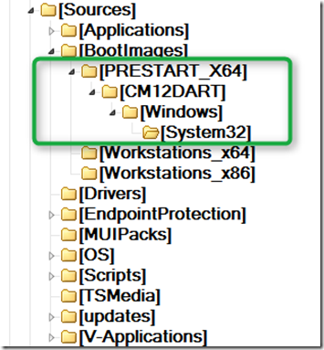
](https://www.verboon.info/wp-content/uploads/2013/04/image12.png)

  4. Extract the following files from the CAB file. (note that I use the 64 Bit version of the CAB file)

  FirewallExceptionChange.dll   
LockingHooks.dll    
mfc100u.dll    
MSDartCmn.dll    
msvcp100.dll    
msvcr100.dll    
RdpCore.dll    
rdpencom.dll    
RemoteRecovery.exe    
WaitForConnection.exe

  and copy them all into the previously created .**\PreStart_x64\CM12Dart\Windows\System32** folder. If you have no tools available to extract the files from the CAB file you can get them later in the process when we generate the DartConfig.dat file in step 7. 

  5. Next download the StartRemoteRecovery.zip created by Alexey Semibratov from [here](http://blogs.msdn.com/cfs-file.ashx/__key/communityserver-components-postattachments/00-10-24-26-20/StartRemoteRecovery.zip). From the archive file extract

  StartRemoteRecovery.wsf   
ZTIUtility.vbs

  and copy them as well into the previously created System32 folder. Use the ZTIUtility.vbs provided. Replacing it with a newer one with cause the script to fail. 

  6. Since the script was originally written for DaRT 7, the line (124) containing the path to the DaRT Remote Viewer Tool must be updated.Replace the path with ""C:\Program Files\Microsoft DaRT 8\v8\DartRemoteViewer.exe" as shown below. 

  [
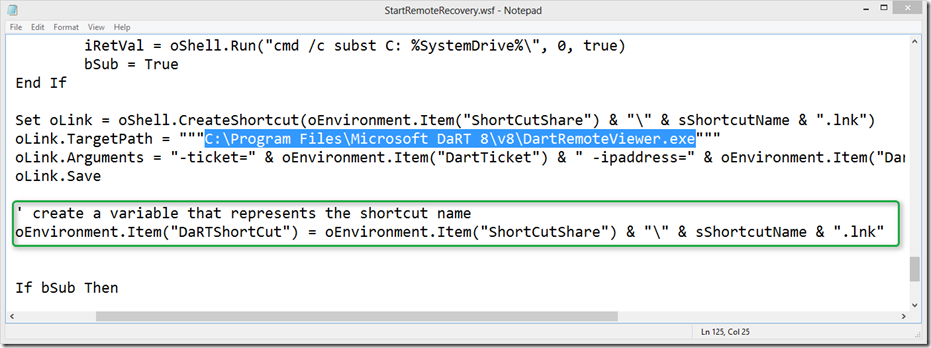
](https://www.verboon.info/wp-content/uploads/2013/04/image1.png)

  In order to easily identify the created shortcut we add the following code which creates the OSD environment variable *DartShortCut*

  
>    ' create a variable that represents the shortcut name     
oEnvironment.Item("DaRTShortCut") = oEnvironment.Item("ShortCutShare") & "\" & sShortcutName & ".lnk"

 

  *I haven’t had time for this yet, but the plan is to add a step to the Task Sequence to remove the link, so that our share doesn’t get filled with outdated connection links. I’ve therefore already created the variable. *

  7. Since on some networks not just all ports are open we are going to use a static port. e.g. 3388. Unfortunately this information is stored in a file called DartConfig.dat that can only be generated using the DaRT Recovery Image wizard that we have installed in step 1. 

  [
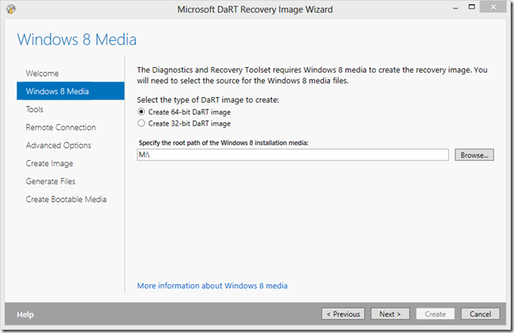
](https://www.verboon.info/wp-content/uploads/2013/04/image2.png)

  On the next page just select Next. Then select “**Allow remote connections**” and “**specify the port number**”

  [
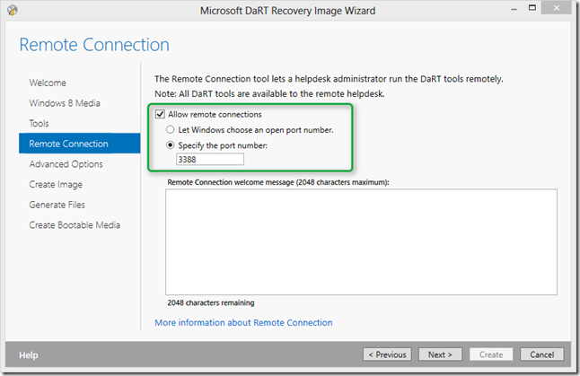
](https://www.verboon.info/wp-content/uploads/2013/04/image3.png)

  Skip through the following Wizard pages until you get here. Select “**Edit Image**”. 

  [
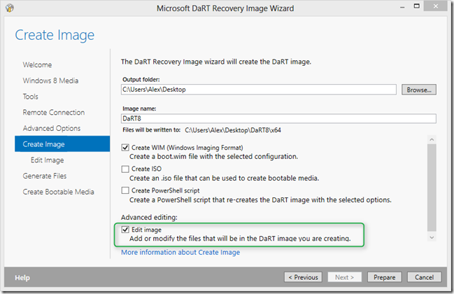
](https://www.verboon.info/wp-content/uploads/2013/04/image4.png)

  Now wait while the DaRT image is generated. (This can take a while). Then select “**Open in Windows Explorer**”

  [
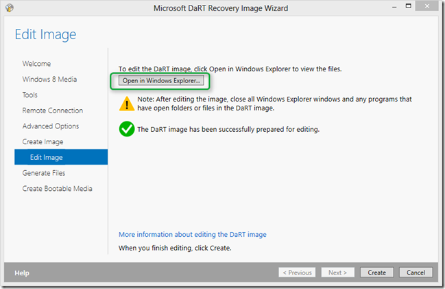
](https://www.verboon.info/wp-content/uploads/2013/04/image5.png)

  From the System32 folder copy the DartConfig.DAT and copy it into the **..\PreStart_x64\CM12Dart\Windows\System32** folder. If you did not extract the files from the CAB file in Step 4, you find them here as well. When done close the Explorer. 

  [
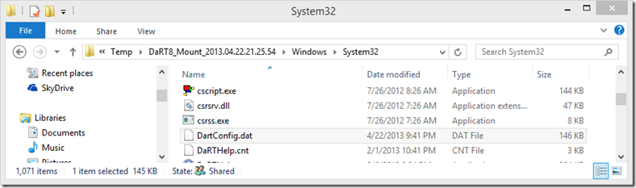
](https://www.verboon.info/wp-content/uploads/2013/04/image6.png)

  Going back to the wizard you can either select Cancel or Create. 

  8. Then create a batch file called PRESTART.CMD with the following content and copy that file into the **.\PreStart_x64\CM12Dart** folder

  
>    @echo off     
XCOPY CM12DART X:\ /y /s      
CSCRIPT X:\Windows\System32\StartRemoteRecovery.wsf /ShortCutShare:<\\servername\share> /UserID:<username> /UserDomain:<domain> /UserPassword:<password>

 

  If you do not have a general purpose share in place yet, create one. I used the following:

  \\labsccm01\Dart_Remote

  9. Open the configuration manager console and open the Software Library Node. To not make this blog post too lengthy I am just going to assume that you're familiar with creating a new or updating an existing boot image. Otherwise follow the steps described [here](http://social.technet.microsoft.com/wiki/contents/articles/16233.how-to-create-or-re-create-a-default-sccm-boot-image-windows-pe-4-0-for-sccm-2012-sp1-en-us.aspx).     
    
Within the Image properties select the “**Customization**” tab. Select “Enable prestart command”. Then within the command line add:    
**cmd.exe /c PRESTART.CMD**

  Select “Include files for the prestart command” and navigate to the **.\PreStart_x64 folder      
      
**Then Click “**Apply**” to save the changes. 

  [
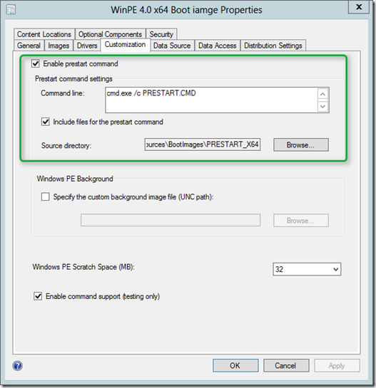
](https://www.verboon.info/wp-content/uploads/2013/04/image7.png)    

  Now that we have put everything in place, let’s start the OS Deployment Task Sequence. I am using SCCM boot media here, so I have booted my VM with SCCM Boot media that I have previously created. 

  [
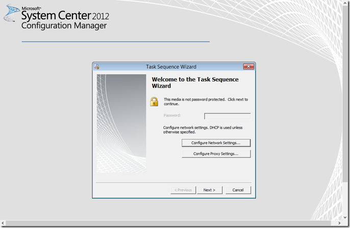
](https://www.verboon.info/wp-content/uploads/2013/04/image8.png)

  As soon as we hit “Next” the prestart command kicks in and launches the DaRT Remote Connection tool, that sits minimized in the corner of the screen. 

  [
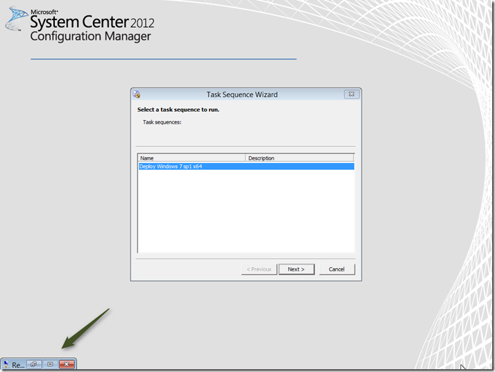
](https://www.verboon.info/wp-content/uploads/2013/04/image9.png)

  Now heading over to the Server where I have installed the DaRT Remote Viewer Tool and open the Share where the shortcut link is automatically created by the StartRemoteRecovery.wsf script. 

  [
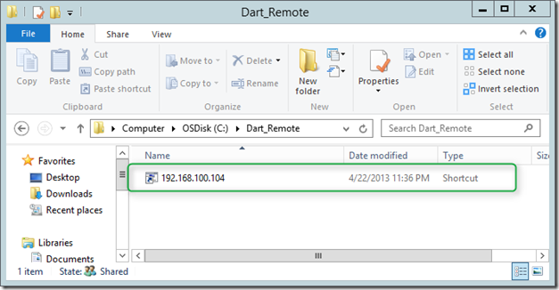
](https://www.verboon.info/wp-content/uploads/2013/04/image10.png)

  and there you go, we now have a remote connection into our OS Deployment session. 

  [
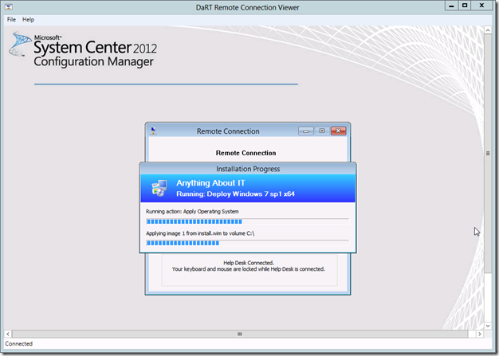
](https://www.verboon.info/wp-content/uploads/2013/04/image11.png)

  Note that as soon as the client starts into Windows we loose the ability to use the DaRT remote connection tool  

  Any comments are welcome.

