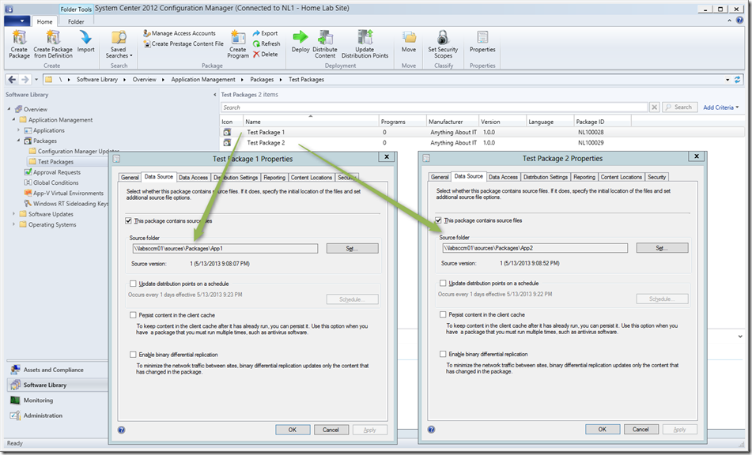
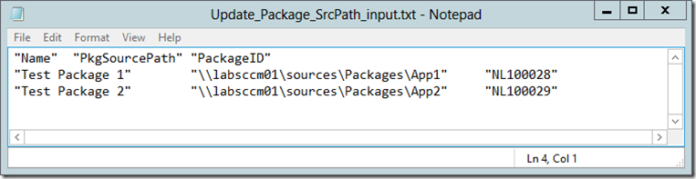
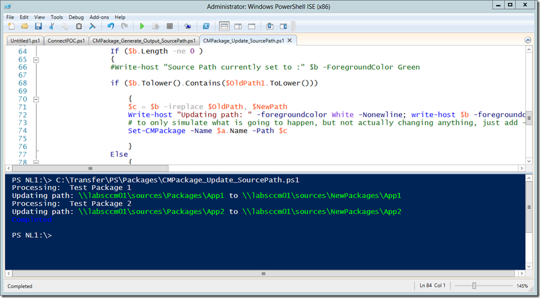
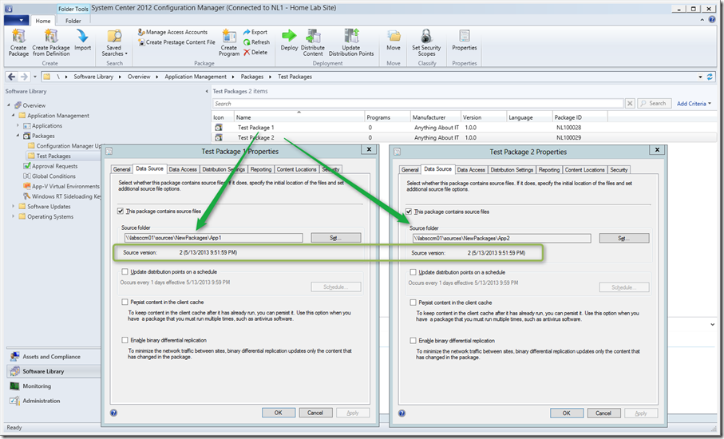

Let’s assume you’ve just created a larger number of packages within SCCM 2012 and then you’re asked to move the package sources to a different location. I guess no-one on earth would want to visit each package and update the data source manually, So I wrote 2 scripts that automate this task. It could actually be done with one script, but when it comes to changing such things I prefer to validate things. 

  As you can see from the screen shot below, we have 2 packages, with their Source Folder pointing to **\\labsccm01\sources\Packages\App1** and **\\labsccm01\sources\Packages\App2**

  [

](https://www.verboon.info/wp-content/uploads/2013/05/package1.png)

  Now we want to change the Source path from \\labsccm01\sources\**Packages**\App1 to \\labsccm01\sources\**NewPackages**\App1 and \\labsccm01\sources\**Packages**\App2 to \\labsccm01\sources\**NewPackages**\App2

  The script does not move the actual content, so before running the scripts below, the source must be copied to the new location. 

  First we are going to look for packages that have their content stored under **\\labsccm01\sources\Packages **by running the following PowerShell script. 

  **Note**: Before running the below script make sure you’re connected to the site through PowerShell.  Also make sure to set the variable $OldPath1 according to your environment. 

  
```

# Define output file
$script_parent = Split-Path -Parent $MyInvocation.MyCommand.Definition
$csv_path      = $script_parent + "\Update_Package_SrcPath_input.txt"

# Define data source path to search for
$OldPath1 = "\\LABSCCM01\Sources\Packages"

# Search and export packages 
Get-CMPackage | Select-object Name, PkgSourcePath, PackageID | Where-Object {$_.PkgSourcePath.ToLower().contains($OldPath1.ToLower())} |  Export-Csv $csv_path -Encoding Unicode -NoTypeInformation -delimiter "`t"

}
```

 

The output generated looks as following.

[

](https://www.verboon.info/wp-content/uploads/2013/05/packag2.png)

If we are sure that these are the packages we want to change, we copy paste the content and store into a new file called Update_Package_SrcPath.txt. Then open CMPackage_Update_SourcePath.ps1 containing the code below. Edit the variables $OldPath, $OldPath1 and $NewPath. If you just want to simulate things, add –whatif to the line that starts with Set-CMPackage 

```

  <#   
    .SYNOPSIS   
      Script to change the Package Data Source Folder path
         
    .DESCRIPTION   
      Script to change the Package Data Source Folder path

      This script allows you to change the server + Share path of the package source path.
      for example when you created the packages first on \\server1\packagesource$\
      and you want to move the content to \\server2\packages$\
        
    .PARAMETER (none)
      update the variables below
         
    .NOTES   
        Author: Alex Verboon
        Version: 1.0       
            - initial version
     
    .EXAMPLE 
        
  
    #>         

# ----------------------------------------------------------------------------------------------------*
# Variables
# ----------------------------------------------------------------------------------------------------*

# Specify the Source Path and the new Target path. 
# Make sure to specify both OldPath and OldPath1

# Old Path - double the backslashes and add \ before $ signs so that the regular expression works...not nice but works
$OldPath = "\\\\labsccm01\\sources\\Packages"
# old path
$OldPath1 = "\\labsccm01\sources\Packages"
# New Path
$NewPath = "\\labsccm01\sources\NewPackages"

# ----------------------------------------------------------------------------------------------------*
# The Code
# ----------------------------------------------------------------------------------------------------*

# Get the input file
$script_parent = Split-Path -Parent $MyInvocation.MyCommand.Definition
$csv_path      = $script_parent + "\Update_Package_SrcPath.txt"
$csv_import    = Import-Csv $csv_path -delimiter "`t"

# Process all Package names in input file
ForEach ($item In $csv_import)
{
    Write-host "Processing: " $item.Name 
    
    # Check if Package with "Name" exists
    $a = Get-CMPackage |  Where-Object {$_.Name -eq ($item.Name.Trim())} 

    If ($a.Length  -ne 0 ) 
    {
            
                #Package exists, now check if the Package has a source path defined
                $b = $a.PkgSourcePath

                If ($b.Length -ne 0 ) 
                {
                #Write-host "Source Path currently set to :" $b -ForegroundColor Green

                if ($b.Tolower().Contains($OldPath1.ToLower()))

                    {
                    $c = $b -ireplace $OldPath, $NewPath
                    Write-host "Updating path: " -foregroundcolor White -Nonewline; write-host $b -foregroundcolor green -nonewline; Write-host " to " -foregroundcolor White -NoNewline; write-host $c -ForegroundColor Green
                    # to only simulate what is going to happen, but not actually changing anything, just add -WhatIf to the next line
                    Set-CMPackage -Name $a.Name -Path $c 

                    }
                Else
                    {
                    write-host "Current path: " -ForegroundColor Yellow -NoNewline; write-host $b -ForegroundColor green -NoNewline; write-host " not matching with current path " -ForegroundColor White -NoNewline; write-host $OldPath1 -ForegroundColor Green -NoNewline; write-host " No action required!" -ForegroundColor Yellow
                    }
                }
        
                Else

                {
                Write-host "Package" $item.Name " has no Source Path set. No action required" -ForegroundColor Yellow
                }
            }

    Else
    {
        Write-host "Package not found" -ForegroundColor Red 
    }
}

Write-host "Completed" -ForegroundColor blue

}
```

[

](https://www.verboon.info/wp-content/uploads/2013/05/package3.png)

Going back to the Console we see the updated Source folders. 

[

](https://www.verboon.info/wp-content/uploads/2013/05/pacakge4.png)

