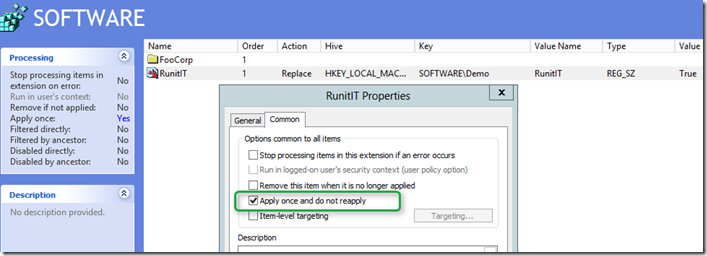
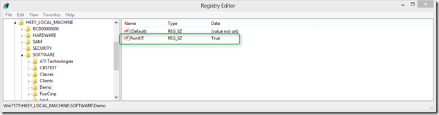
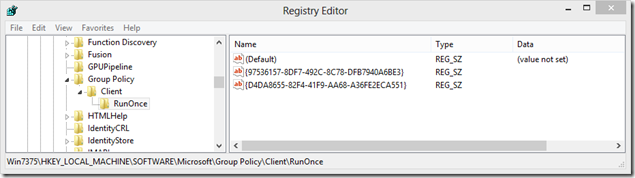
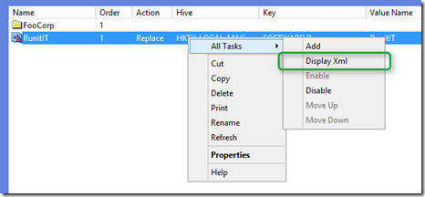
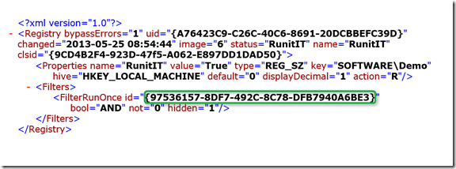
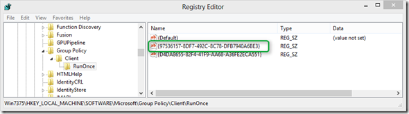

When creating a Group Policy Preference you can configure it to only apply once. The exact wording is “Apply once and do not reapply”. But when you are implementing such a GPP you most likely want to test the setting prior moving it into production. So here’s a brief explanation how to reapply a GPP when it’s configured to apply once. 

  The below screen shot illustrates a GPP that is configured to write a registry key to HKLM\Software\Demo\RunIT with the value set to True. 

  

  When applying the GPP on a client, the registry settings are created. 

  

  But when deleting the registry key, the settings will not be re-applied when GPPs are processed the next time. So how does the GPP know it has already processed once? The answer is because it’s stored within the registry. When we look at HKEY_LOCAL_MACHINE\SOFTWARE\Microsoft\Group Policy\Client\RunOnce we find one or multiple GUIDs from the GPP that are configured to only apply once. 

  

  The next challenge is to find out what GUID corresponds to what GPP setting. To find out we go back to the Group Policy Management console, select the GPP and select “Display Xml”. 

  

  

  The “FilterRunOnce id” is the GUID stored within the registry. 

  

  So if we want to reapply a setting that is configured to only apply once, we just delete the GUID from the registry and run gpupdate. 

  That’s it.

