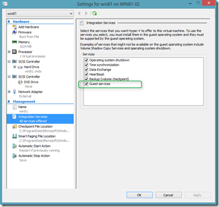

When opening the Virtual Machine Settings Integration Services node in Hyper-V running on Windows 8.1 Preview, you will notice that there is now an additional Integration Service listed called **Guest Services**. By default the service is not enabled, 

  [

](https://www.verboon.info/wp-content/uploads/2013/06/hv01.png)

  With this integration service enabled, you can now directly copy a file from a remote system into the VM without utilizing a network connection. A new PowerShell cmdlet **Copy-VMFile** has been added for this new feature. 

  The following example first enables the Guest Services Integration service and then copies a file from the VM host system into the running VM. 

  
```
Enable-VMIntegrationService -VMName "win81" -Name "Guest Service Interface" -ErrorAction Continue
Copy-VMFile -Name "win81" -SourcePath "C:\data\test.txt" -DestinationPath "c:\data\test.txt"  -FileSource Host -Force
```

