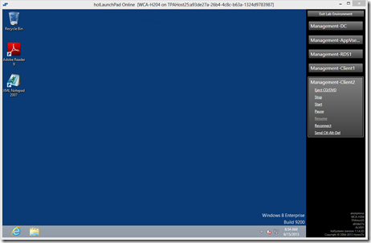

The issue with learning new stuff is that often you have to spend a lot of time in getting a test environment up and running before you can actually start testing out things. I was therefore very pleased to see that Microsoft has made the Hands-On labs from TechEd 2013 available online.

  The Hands-On labs are prepared within less than 30 seconds. Awesome!

  

  Below a list of Hands-on labs now available for Windows Client, Access and Management. Check for updates directly on Channel 9 – TechEd North America 2013
[http://channel9.msdn.com/Events/TechEd/NorthAmerica/2013#fbid=6pQTUrStsWU](http://channel9.msdn.com/Events/TechEd/NorthAmerica/2013#fbid=6pQTUrStsWU)

  [New for SP1: Upgrading from Microsoft System Center 2012 - Configuration Manager to Configuration Manager 2012 SP1](http://channel9.msdn.com/Events/TechEd/NorthAmerica/2013/WCA-H200#fbid=6pQTUrStsWU)

  [Microsoft Application Virtualization 5.0 Sequencing, Migration and Coexistence](http://channel9.msdn.com/Events/TechEd/NorthAmerica/2013/WCA-H201#fbid=6pQTUrStsWU)

  [Microsoft Application Virtualization 5.0: Flexible Virtualization with Virtual Application Connection, Virtual Application Extension and Dynamic Configuration](http://channel9.msdn.com/Events/TechEd/NorthAmerica/2013/WCA-H202#fbid=6pQTUrStsWU)

  [Getting Started with Microsoft Deployment Toolkit 2012 Update 1](http://channel9.msdn.com/Events/TechEd/NorthAmerica/2013/WCA-H203#fbid=6pQTUrStsWU)

  [Implementing and Managing Microsoft Application Virtualization 5.0](http://channel9.msdn.com/Events/TechEd/NorthAmerica/2013/WCA-H204#fbid=6pQTUrStsWU)

  [Microsoft Bitlocker Administration and Monitoring (MBAM) v2](http://channel9.msdn.com/Events/TechEd/NorthAmerica/2013/WCA-H205#fbid=6pQTUrStsWU)

  [Microsoft Diagnostics and Recovery Toolset (DaRT)](http://channel9.msdn.com/Events/TechEd/NorthAmerica/2013/WCA-H206#fbid=6pQTUrStsWU)

  [Microsoft User Experience Virtualization Overview](http://channel9.msdn.com/Events/TechEd/NorthAmerica/2013/WCA-H207#fbid=6pQTUrStsWU)

  [Microsoft User Experience Virtualization Setup and Configuration Lab](http://channel9.msdn.com/Events/TechEd/NorthAmerica/2013/WCA-H208#fbid=6pQTUrStsWU)

  [Windows 8 Deployment Using Microsoft Deployment Toolkit 2012 Update 1 and Microsoft System Center 2012 SP1 - Configuration Manager](http://channel9.msdn.com/Events/TechEd/NorthAmerica/2013/WCA-H209#fbid=6pQTUrStsWU)

  [Advanced Software Distribution](http://channel9.msdn.com/Events/TechEd/NorthAmerica/2013/WCA-H301#fbid=6pQTUrStsWU)

  [Basic Software Distribution](http://channel9.msdn.com/Events/TechEd/NorthAmerica/2013/WCA-H302#fbid=6pQTUrStsWU)

  [Deploying Microsoft System Center 2012 - Configuration Manager](http://channel9.msdn.com/Events/TechEd/NorthAmerica/2013/WCA-H304#fbid=6pQTUrStsWU)

  [Deploying Windows 8 to Bare Metal Clients](http://channel9.msdn.com/Events/TechEd/NorthAmerica/2013/WCA-H305#fbid=6pQTUrStsWU)

  [Implementing Microsoft System Center 2012 - Endpoint Protection](http://channel9.msdn.com/Events/TechEd/NorthAmerica/2013/WCA-H307#fbid=6pQTUrStsWU)

  [Implementing Settings Management](http://channel9.msdn.com/Events/TechEd/NorthAmerica/2013/WCA-H308#fbid=6pQTUrStsWU)

  [Introduction to Microsoft System Center 2012 - Configuration Manager](http://channel9.msdn.com/Events/TechEd/NorthAmerica/2013/WCA-H309#fbid=6pQTUrStsWU)

  [Managing Applications](http://channel9.msdn.com/Events/TechEd/NorthAmerica/2013/WCA-H310#fbid=6pQTUrStsWU)

  [Managing Microsoft Software Updates](http://channel9.msdn.com/Events/TechEd/NorthAmerica/2013/WCA-H313#fbid=6pQTUrStsWU)

