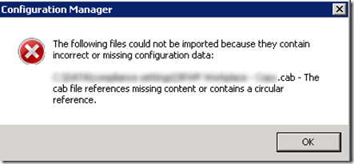
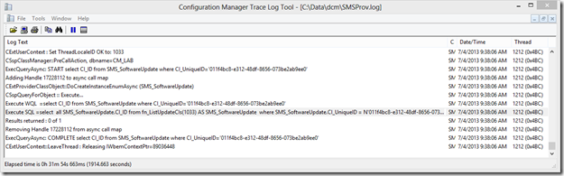
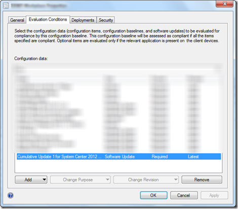

While importing a Configuration Manager Configuration Baseline within our lab infrastructure  that I had previously exported from our production environment I received the following error:

 

 ***“The following files could not be imported because they contain incorrect or missing configuration data:***

 ***…..CAB - The cab file references missing content or contains a circular reference”***

 This configuration baseline contains several configuration items, but sadly the error message doesn’t provide a clear message about which item causes a problem.

 As a next step I started looking within the **smsprov.log** file on the CM server and noticed a log entry written at the same time of starting the import.

 

 Execute WQL =select CI_ID from SMS_SoftwareUpdate where CI_UniqueID='011f4bc8-e312-48df-8656-073be2ab9ee0'~ \$\$<SMS Provider><07-04-2013 09:38:06.559-120><thread=1212 (0x4BC)>
Execute SQL =select all SMS_SoftwareUpdate.CI_ID from fn_ListUpdateCIs(1033) AS SMS_SoftwareUpdate where SMS_SoftwareUpdate.CI_UniqueID = N'**011f4bc8-e312-48df-8656-073be2ab9ee0'**~ \$\$<SMS Provider><07-04-2013 09:38:06.561-120><thread=1212 (0x4BC)>
Results returned : 0 of 1~ \$\$<SMS Provider><07-04-2013 09:38:06.615-120><thread=1212 (0x4BC)>

 I then opened the Configuration Baseline XML file that is located within the exported CAB file and searched for the CI_UniqueID.

     </Annotation>
    <RequiredItems>
      <ApplicationReference AuthoringScopeId="ScopeId_6EA78D32-8998-4CB5-B851-9037B197714A" LogicalName="Application_da212167-149d-4837-85e4-a9a2c671462a" />
      <BusinessPolicyReference AuthoringScopeId="ScopeId_CAC06B65-6394-4164-9339-7651559154E9" LogicalName="BusinessPolicy_852346a2-5839-4647-984b-347de11db670" />
      <BusinessPolicyReference AuthoringScopeId="ScopeId_6EA78D32-8998-4CB5-B851-9037B197714A" LogicalName="LogicalName_4ac11fda-0cf4-49ff-925b-aa2e44bf6389" />
      <BusinessPolicyReference AuthoringScopeId="ScopeId_6EA78D32-8998-4CB5-B851-9037B197714A" LogicalName="LogicalName_380f3c64-3f5b-439e-a72d-c8f62549d545" />
      <BusinessPolicyReference AuthoringScopeId="ScopeId_6EA78D32-8998-4CB5-B851-9037B197714A" LogicalName="LogicalName_e3cec719-b54a-48e0-8e56-4d27ce47c95e" />
    </RequiredItems>
    <ProhibitedItems />
    <OptionalItems />
    <OperatingSystems>
      <OperatingSystemReference AuthoringScopeId="ScopeId_6EA78D32-8998-4CB5-B851-9037B197714A" LogicalName="OperatingSystem_93d525bf-a9eb-41f1-b38c-1dcdb188d632" />
      <OperatingSystemReference AuthoringScopeId="ScopeId_6EA78D32-8998-4CB5-B851-9037B197714A" LogicalName="OperatingSystem_dfb370f9-d450-447d-974a-f2793ba57ce0" />
      <OperatingSystemReference AuthoringScopeId="ScopeId_6EA78D32-8998-4CB5-B851-9037B197714A" LogicalName="OperatingSystem_2977aa28-c07c-4bbd-a597-6075706d3663" />
      <OperatingSystemReference AuthoringScopeId="ScopeId_6EA78D32-8998-4CB5-B851-9037B197714A" LogicalName="OperatingSystem_c329cb46-1cc9-4fbf-b586-4d397cd8d754" />
      <OperatingSystemReference AuthoringScopeId="ScopeId_6EA78D32-8998-4CB5-B851-9037B197714A" LogicalName="OperatingSystem_1aff5bc1-eb2d-4514-bbbc-4e31c5ffdc53" />
      <OperatingSystemReference AuthoringScopeId="ScopeId_6EA78D32-8998-4CB5-B851-9037B197714A" LogicalName="OperatingSystem_4385b91b-9b55-4e8e-a869-82012053c9b9" />
    </OperatingSystems>
    <SoftwareUpdates>
**  **    <SoftwareUpdateReference AuthoringScopeId="Site_6EA78D32-8998-4CB5-B851-9037B197714A" LogicalName="SUM**_011f4bc8-e312-48df-8656-073be2ab9ee0" />**
    </SoftwareUpdates>
    <Baselines />
    <OtherConfigurationItems />
  </Baseline>
</DesiredConfigurationDigest>

 When I then opened the Configuration Baseline I noticed that I have one Software Update Configuration Item included within the Configuration Baseline.

 

 The reason why the import process ended up in an error is because no reference to the software update item could be made. So once I removed the software update item, exported the baseline again, the new generated CAB file could be successfully imported.

