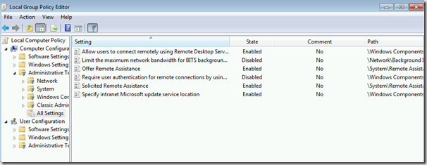
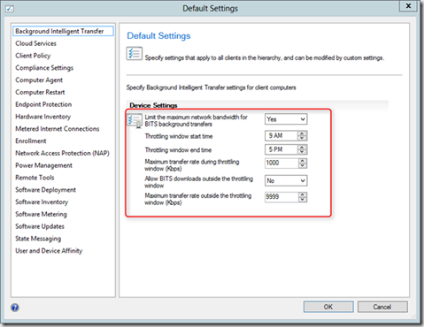
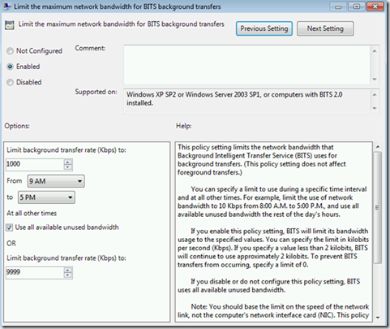
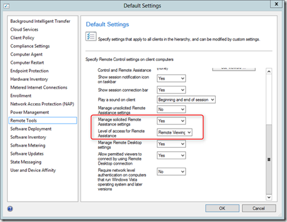
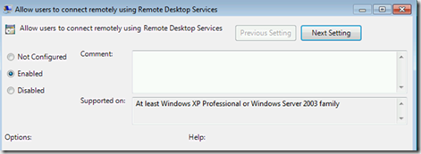
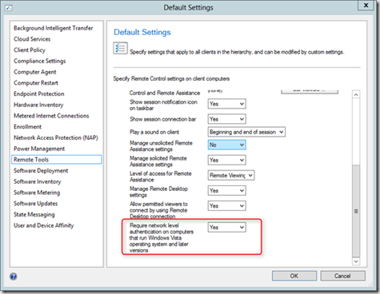
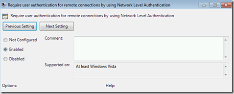
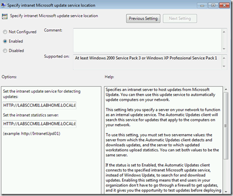

When configuring ConfigMgr 2012 client settings, notice that some of these settings result in Local Group Policy Settings being applied to the client. If you’re sure that you have not configured any other local GPOs, then a simple way to find out what settings are applied by ConfigMgr is to open the Local Group Policy Editor (gpedit.msc( and filter for configured settings. 

 

 When configuring the Background Intelligent Transfer Settings within ConfigMgr, the settings are applied into a local GPO. 

 

 

 Also configuring some of the Remote Tools settings result in a local GPO setting. 

 

 

 

 

 Although not a client agent setting, also the Intranet Microsoft Update service location is set through a local GPO.

 

 Conclusion: make sure that there are not conflicts with settings applied via GPO and Configuration Manager. 

 **Additional information worth reading**

 Observation on SCCM Clients BITS Settings
[http://blog.tyang.org/2012/05/05/my-observation-on-sccm-clients-bits-settings/](http://blog.tyang.org/2012/05/05/my-observation-on-sccm-clients-bits-settings/)
Configuration Manager Software Update Management and Group Policy
[http://blog.configmgrftw.com/?p=88](http://blog.configmgrftw.com/?p=88)
[http://blog.configmgrftw.com/?p=89](http://blog.configmgrftw.com/?p=89)

