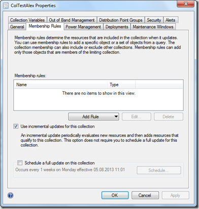
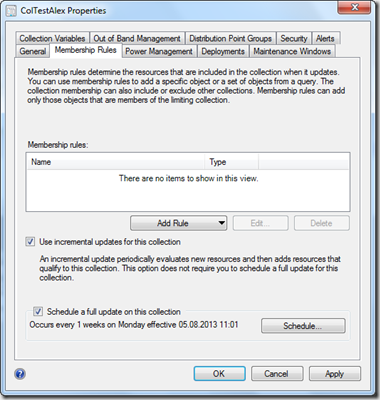

As described within the [ConfigMgr 2012 Best Practices Wiki](http://social.technet.microsoft.com/wiki/contents/articles/11215.system-center-2012-configuration-manager-best-practices.aspx#Best_Practices_for_Collections) on TechNet it’s recommended to keep the number of collections with incremental updates enabled to around 200, this to prevent evaluation delays. So I thought it might be a good idea to keep an eye on collections with incremental updates enabled within our infrastructure using a PowerShell script.

 The property **RefreshType** within the **SMS_Collection** WMI class defines how Configuration Manager refreshes the collection. According to the documentation on MSDN the property can have the following 3 values.

    **Value** **Description**  1 Manual  2 Periodic  4 CONSTANT_UPDATE But while looking at the data returned by the PowerShell Cmdlet i noticed that there were also collections with a value of 6. As it turns out, when a collection has incremental updates enabled but no schedule the value is 4.

 

 But when both incremental updates and a schedule is enabled the value is 6.

 

 Therefore the list of possible values should be as following.

    **Value** **Description**  1 Manual  2 Periodic  4 CONSTANT_UPDATE  6 CONSTANT_UPDATE and PERIODIC The following script uses the ConfigMgr CmdLets Get-CMDeviceCollection and Get-CMUserCollection to retrieve Device and User Collections that have incremental updates enabled.

```powershell
# Import the Configuration Manager PS Module (You must have the Admin Console installed for this to work)
import-module  ($Env:SMS_ADMIN_UI_PATH.Substring(0,$Env:SMS_ADMIN_UI_PATH.Length-5) + '\ConfigurationManager.psd1')
# Connect to the Primary Site
cd  POC:
# list all collections that have RefreshType set to 4 or 6
$A  = Get-CMDeviceCollection | Select-Object Name, RefreshType | Where-Object {$_.RefreshType -eq 4 -or $_.RefreshType -eq 6} | Format-Table
$b  = Get-CMDeviceCollection | Select-Object Name, RefreshType | Where-Object {$_.RefreshType -eq 4 -or $_.RefreshType -eq 6} | measure
$a
write-host  "Total Device Collections with dynamic update enabled " $b.count
# list all collections that have RefreshType set to 4 or 6
$a  = Get-CMUserCollection | Select-Object Name, RefreshType | Where-Object {$_.RefreshType -eq 4 -or $_.RefreshType -eq 6} | Format-Table
$b  = Get-CMUserCollection | Select-Object Name, RefreshType | Where-Object {$_.RefreshType -eq 4 -or $_.RefreshType -eq 6} | measure
$a
write-host  "Total User Collections with dynamic update enabled " $b.count
```

