Last week I had an issue with a Software Update package in Configuration Manager 2012 SP1 that wouldn’t update properly after i had changed it’s source location. Below a step by step description of what i did to resolve it. 

 The Content status of the Software Update Package called “Windows 7 Functional Updates” indicated that there was a problem with the package. [
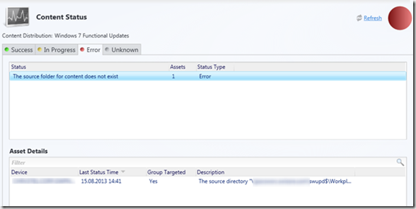
](https://www.verboon.info/wp-content/uploads/2013/08/image8.png)

 The detailed message was as following. 

 [
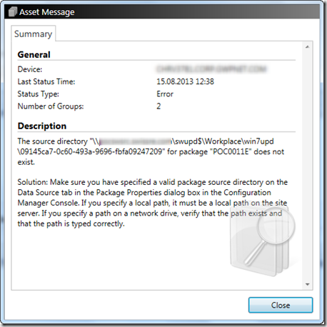
](https://www.verboon.info/wp-content/uploads/2013/08/image9.png)

 The folder ….\swupd$\workplace\win7upd is the root folder where all Windows 7 functional updates are stored. So i took a look into the **distmgr.log** on the server and noticed the below shown error message. 

 [
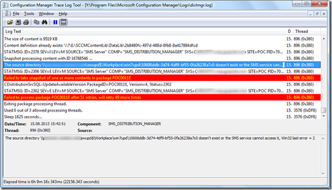
](https://www.verboon.info/wp-content/uploads/2013/08/image10.png)

 *“The source directory \\<servername>\swupd$\workplace\win7upd\10606ddb-3d74-4df9-bf55-0fa26238a7c0 doesn’t exist or the SMS service cannot access it, Win32 last error = 2”*

 I knew the package was updated properly before, so the content must have been in the Content Store already, so I did a search for 10606ddb-3d74-4df9-bf55-0fa26238a7c0 within the Content library and got the following results within the DataLib folder. 

 [
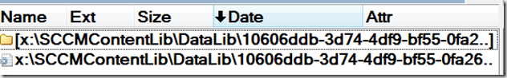
](https://www.verboon.info/wp-content/uploads/2013/08/image11.png)

 Within the folder 10606ddb-3d74-4df9-bf55-0fa26238a7c0 i found the INI file that relates to the content, since the update file contains the KB number, it was quite easy to find out what particular update was causing the update. 

 [
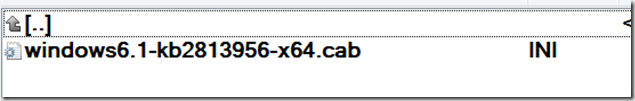
](https://www.verboon.info/wp-content/uploads/2013/08/image12.png) Next i searched foe KB number under the software updates node and deleted the entry within the software update package.  [
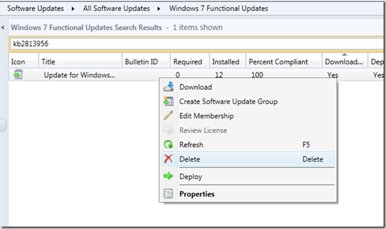
](https://www.verboon.info/wp-content/uploads/2013/08/image13.png) I then searched for the update within the software update group where it was now marked as an invalid software update but also marked as not being downloaded yet. 

 [
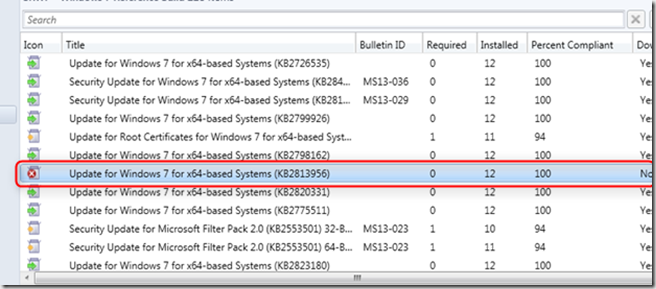
](https://www.verboon.info/wp-content/uploads/2013/08/image14.png)

 So I downloaded the patch again and selected the Windows 7 functional updates package as the deployment package. 

 [
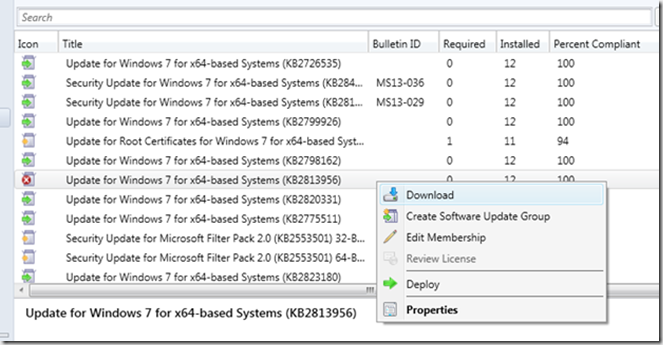
](https://www.verboon.info/wp-content/uploads/2013/08/image15.png)

 [
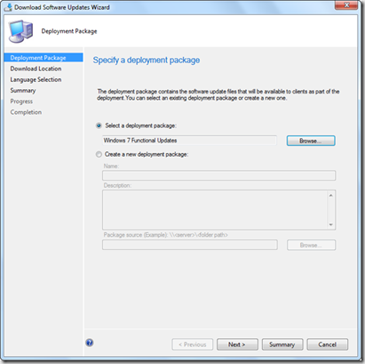
](https://www.verboon.info/wp-content/uploads/2013/08/image16.png)

 Once downloaded the folder 10606ddb-3d74-4df9-bf55-0fa26238a7c0 appeared within the ….\swupd$\workplace\win7upd folder. 

 [
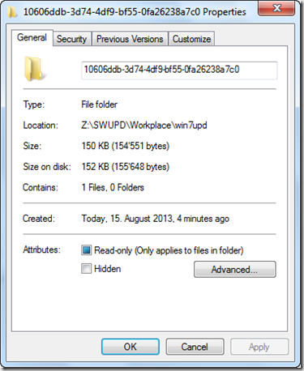
](https://www.verboon.info/wp-content/uploads/2013/08/image17.png)

 and there you go, the Software Update Content status went back to green and no errors in the distmgr.log anymore. 

 [
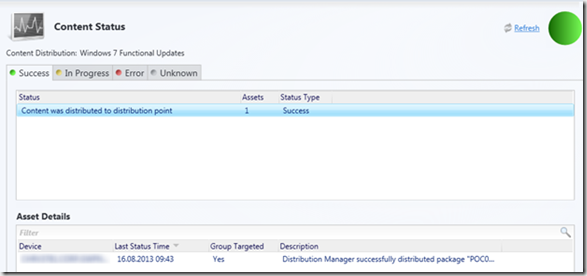
](https://www.verboon.info/wp-content/uploads/2013/08/image19.png)

 Having read the [ConfigMgr 2012 Content Library Overview](http://blogs.technet.com/b/configmgrdogs/archive/2012/04/16/configmgr-2012-content-library-overview.aspx) blog post previously became very useful in this troubleshooting exercise. 

 .

