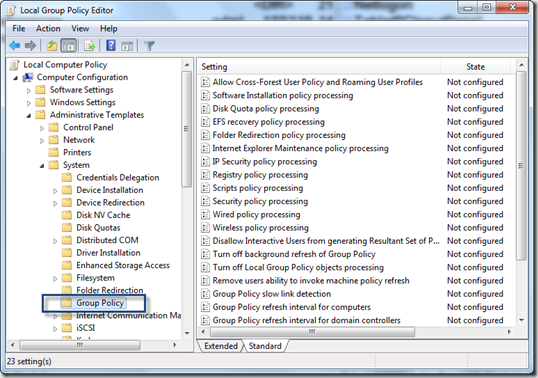
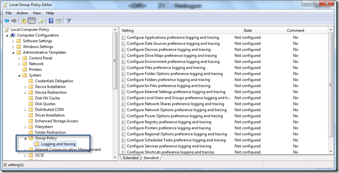

When opening the local Group Policy Editor (gpedit.msc) you will notice that on a default Windows 7 SP1 Enterprise client there is no logging and tracing node for Group Policy Preferences logging underneath the Group Policy node.

 

 The reason for this is because Group Policy Preferences can only be managed within domain based Group Policy objects and therefore a Windows 7 SP1 client does not have the Group Policy Preferences related administrative template GroupPolicyPreferences.admx installed that also includes the logging settings.

 So how to enable Group Policy Preferences logging using the Local Group Policy editor? The solution is simple. Assuming that you have already a central store available, just copy the GroupPolicyPreferences.admx and GroupPolicyPreferences.adml from the Policydefinitions folder located on a domain controller [\\<server>\sysvol\<domain>\Policies\PolicyDefinitions](file://\\<server>\sysvol\<domain>\Policies\PolicyDefinitions) and copy them into the local PolicyDefinitions folder on the client C:\Windows\PolicyDefinitions

 Then reopen the Local Group Policy Editor and you will now see the logging and tracing node where you can now enable logging for Group Policy Preferences

 

 Once enabled, you'll find the logs under C:\ProgramData\GroupPolicy\Preference\Trace.
That's it

