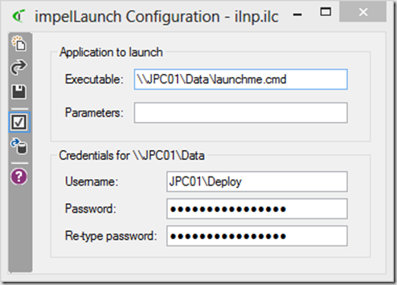
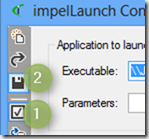
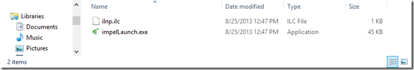
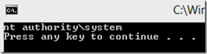

If you are using Windows Intune, this little FREE utility from [Impeltec](http://www.impeltec.com/Default.aspx) might be of interest to you. ImpelLaunch was created to overcome the following Application deployment challenges when deploying Software with Windows Intune. . 

  
- For Windows clients you can only [Windows Intune - Adding Software Packages](http://technet.microsoft.com/en-us/library/jj662695.aspx) with a. EXE, MSI or .APPX file extension. 
- Distribute Applications which source files are already stored on a local network share 
- Allow the Windows Intune Agent that runs in the system context to access local network shares

 Although created to work around the described challenges when using Windows Intune, the utility can be used with in any other environment such as Configuration Manager or just in standalone mode. 

 ImpelLaunch is what we call a so-called wrapper. The Utility consists of the following components. 

  
- impelLaunchConfig.exe is used to create the configuration file and extract the impellaunch.exe 
- ImpelLaunch.exe is the wrapper itself 
- Configuration file (*.ilc) contains the information about the location of the script, optional parameters and network credentials. 

 The setup is really simple. Open the ImpelLaunch Configuration utility and enter the necessary information 

 

 In the above example I defined to execute the launchme.cmd batch file that is located on a network share that resides within the local network. Because the System management agent runs in the system context a username and password is provided to access the content. 

 I have enabled the checkbox just below the Save button so that when the configuration file is saved the ImpelLaunch executable is automatically extracted within the same folder where the configuration file is stored. 

 

 

 Because I am to lazy now to use Windows Intune or Configuration manager, i use psexec.exe from Sysinternals to simulate the Agent that runs in the system context. 

 psexec.exe -s -i c:\data\impeltec_launch\impelLaunch.exe  c:\data\impeltec_launch\ilnp.ilc

 

 ImpelLaunch stores all actions into the following log file. “C:\Windows\Logs\impelLaunch.log" The results of the previously launched action look as following. 

 [25.08.2013 13:29:36]  ==============================================
[25.08.2013 13:29:36]  Authenticating to \\JPC01\Data
[25.08.2013 13:30:03]  Required privileges granted
[25.08.2013 13:30:03]  About to launch '\\JPC01\Data\launchme.cmd '
[25.08.2013 13:30:03]  Launched, waiting for process completion
[25.08.2013 13:30:28]  Process completed
[25.08.2013 13:30:28]  Privileges restored

 More details and examples are included within the ImpelLaunch help that’s build into the ImpelLaunch configuration utility. 

 Download ImpelLaunch from [ImpelLaunch Download](http://www.impeltec.com/Resources/Software/impelLaunch.aspx)

