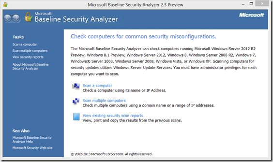

Based on a statement made by Microsoft in the August 2012 security bulletin, I wrote a short blog post back in November 2012 that there would be [no MBSA version available for Windows 8](https://www.verboon.info/index.php/2012/11/no-mbsa-for-windows-8-planned/). But it looks like plans have changed as Microsoft has now released a preview version of MBSA 2.3 that does provide support for Windows 8, Windows 8.1 as well as the new server editions. 

 

 *MBSA 2.3 release adds support for Windows 8, Windows 8.1, Windows Server 2012, and Windows Server 2012 R2. Windows 2000 will no longer be supported with this release. The final release of MBSA 2.3 is expected to be available in Fall 2013. Due to the remaining short product cycle, we will be unable to implement any design change requested for this release.* 

 For more details and downloads go to the Microsoft Connect site
:[https://connect.microsoft.com/ConfigurationManagervnext/content/content.aspx?ContentID=29784](https://connect.microsoft.com/ConfigurationManagervnext/content/content.aspx?ContentID=29784)

