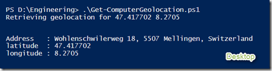
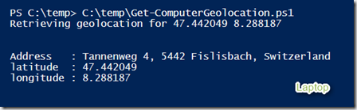
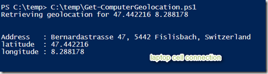

**28-OCT-2013 Update**: I have updated the script to retry when the status of the location provider is in initializing mode. 

 The below script uses the Windows Location provider and the Google Geocoding API to retrieve the geographical location of the computer. The accuracy of the information retrieved depends on the source used to determine the location which are:

  
- Wi-Fi triangulation  
- IP address resolution  
- Cell phone tower triangulation  
- Global Position System (GPS)

 Windows automatically uses the best source, so when accessing the Windows Location provider you don’t need to tell it which source to use. 

 More details can be found on the [MSDN Windows Location Provider site](http://msdn.microsoft.com/en-us/library/windows/apps/hh464919.aspx). 

 This is why when i run the below script on my desktop that is located in the basement and directly connected to our cable-modem, the result is different as when I run the script on our laptop that has a build-in GPS sensor. On the desktop the Windows Location provider used IP Address resolution whereas the laptop used GPS data to determine its location. 

 [

](https://www.verboon.info/wp-content/uploads/2013/10/image9.png)

 [

](https://www.verboon.info/wp-content/uploads/2013/10/2013-10-27_14h10_32.png)

 The GPS information wasn’t very accurate because I am sitting inside. When connecting via cell-phone the information gets more accurate. 

 [

](https://www.verboon.info/wp-content/uploads/2013/10/2013-10-27_14h31_00.png)

  

```

<#
.Synopsis
    Retrieves the Computer's geographical location
.DESCRIPTION
   Retrieves the Computer Geolocation using the Windows location platform and Google geocoding API
.EXAMPLE
   Get-ComputerGeolocation
.NOTES
    Version 1.0
    Written by Alex Verboon

#>

function Get-ComputerGeoLocation ()
{

# Windows Location API
$mylocation = new-object –ComObject LocationDisp.LatLongReportFactory

# Get Status 
$mylocationstatus = $mylocation.status
If ($mylocationstatus -eq "4")
{
    # Windows Location Status returns 4, so we're "Running"

    # Get Latitude and Longitude from LatlongReport property
    $latitude = $mylocation.LatLongReport.Latitude 
    $longitude = $mylocation.LatLongReport.Longitude

    if ($latitude -ne $null -or $longitude -ne $Null)
    {
        # Retrieve Geolocation from Google Geocoding API
        $webClient = New-Object System.Net.WebClient 
        Write-host "Retrieving geolocation for" $($latitude) $($longitude)
        $url = "https://maps.googleapis.com/maps/api/geocode/xml?latlng=$latitude,$longitude&sensor=true"
        $locationinfo = $webClient.DownloadString($url) 
 
        [xml][/xml]$doc = $locationinfo
        # Verify the response
        if ($doc.GeocodeResponse.status -eq "OK")
        {
            $street_address = $doc.GeocodeResponse.result | Select-Object -Property formatted_address, Type | Where-Object -Property Type -eq "street_address" 
            $geoobject = New-Object -TypeName PSObject
            $geoobject | Add-Member -MemberType NoteProperty -Name Address -Value $street_address.formatted_address
            $geoobject | Add-Member -MemberType NoteProperty -Name latitude -Value $mylocation.LatLongReport.Latitude
            $geoobject | Add-Member -MemberType NoteProperty -Name longitude -Value $mylocation.LatLongReport.longitude
            $geoobject | format-list
        }
        Else
        {
            Write-Warning "Request failed, unable to retrieve Geo locatiion information from Geocoding API"  
        }
    }
    Else
        {
            write-warning "Latitude or Longitude data missing"
        }
    }

Else
{
    switch($mylocationstatus)
    {
    # All possible status property values as defined here: 
    # http://msdn.microsoft.com/en-us/library/windows/desktop/dd317716(v=vs.85).aspx
    0 {$mylocationstatuserr = "Report not supported"} 
    1 {$mylocationstatuserr = "Error"}
    2 {$mylocationstatuserr = "Access denied"} 
    3 {$mylocationstatuserr = "Initializing" } 
    4 {$mylocationstatuserr = "Running"} 
    }

    If ($mylocationstatus -eq "3")
        {
        write-host "Windows Loction platform is $mylocationstatuserr" 
        sleep 5
        Get-ComputerGeoLocation
        }
    Else
        {
        write-warning "Windows Loction platform: Status:$mylocationstatuserr"
        }
}
} # end function
Get-ComputerGeoLocation

```

