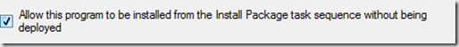

Kind of a long title for a blog post, but I could not come up with something shorter to describe the content of this blog post. The below script shows the status of the “**Allow this Application / program to be installed from the Application / program install task sequence action without being deployed”** setting. 

 [

](https://www.verboon.info/wp-content/uploads/2013/11/image.png)

 [

](https://www.verboon.info/wp-content/uploads/2013/11/image1.png)

  

  
```

<#
.Synopsis
    Get Application and Package - Program information regarding Task Sequence support
.DESCRIPTION
   The script checks all applications and packages if they are allowed to be installed from a TS without being deployed
.EXAMPLE
   Get-TSInstallEnabled -Site Lab
.NOTES
    Version 1.0
    Written by Alex Verboon
#>

[CmdletBinding()]

param( 
    # ConfigMgr Site
    [Parameter(Mandatory = $true, ValueFromPipeline=$true)]
    [String[]] $Site
    )

if ($Site.Length -eq 0)
     {    
     Throw "ConfigMgr Site code required"
     } 
Else
    {
    $SiteCode = $Site
    }

function Get-TSInstallEnabled ()
{

# Check that youre not running X64
if ([Environment]::Is64BitProcess -eq $True)
     {    
     Throw "Need to run at a X86 PowershellPrompt"
     } 
# Load ConfigMgr module if it isn't loaded already
if (-not(Get-Module -name ConfigurationManager))
    {        
    Import-Module ($Env:SMS_ADMIN_UI_PATH.Substring(0,$Env:SMS_ADMIN_UI_PATH.Length-5) + '\ConfigurationManager.psd1')
    } 
       
# Change to site
Push-Location
Set-Location ${SiteCode}:

    function Get-AppTSInfo()
    {
    $Apps = @() 
    foreach ($Application in Get-CMApplication)
        {
        $AppMgmt = ([xml][/xml]$Application.SDMPackageXML).AppMgmtDigest
        $AppName = $AppMgmt.Application.DisplayInfo.FirstChild.Title
        $AllowTs =  $AppMgmt.Application.AutoInstall
        $object = New-Object -TypeName PSObject
        $object | Add-Member -MemberType NoteProperty -Name "Application Name" -Value $Appname

        if ($AllowTs -ne "true") {$AllowTs = "false"}

        $object | Add-Member -MemberType NoteProperty -Name "Allowed TS Install" -Value $AllowTs
        $Apps += $object
         }
    $Apps 
    }

    Function Get-PackageTSInfo()
    {
    $Progs = @() 
    foreach ($Prog in Get-CMProgram)
        {
        $ProgName = $Prog.ProgramName
        $PackageName = $prog.PackageName
        $AllowTs = $Prog.ProgramFlags -band [math]::pow(0,0)
        $object = New-Object -TypeName PSObject
        $object | Add-Member -MemberType NoteProperty -Name "Program Name" -Value $ProgName
        $object | Add-Member -MemberType NoteProperty -Name "Package Name" -value $Packagename

        if ($AllowTs -ne "1") {$AllowTs = "false"} Else {$AllowTs = "true"}

        $object | Add-Member -MemberType NoteProperty -Name "Allowed TS Install" -Value $AllowTs
        $Progs += $object
     }
     $progs 
}

Get-AppTSInfo | Format-Table -AutoSize 
Get-PackageTSInfo | Format-Table -AutoSize 
Pop-Location
}

Get-TSInstallEnabled

```

**Additional Information**

- [SMS_Program Server WMI Class](http://msdn.microsoft.com/en-us/library/hh949572.aspx) (ProgramFlags) 

- [Application.AutoInstall Property](http://msdn.microsoft.com/en-us/library/hh947725.aspx) 

- [Application Members](http://msdn.microsoft.com/en-us/library/hh946964.aspx)

