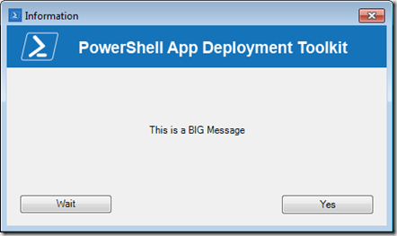
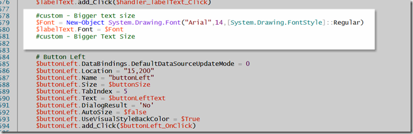
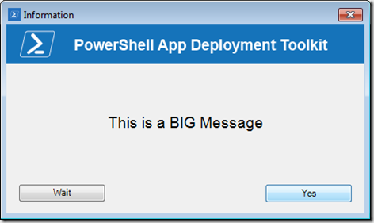

I have had a request this week to make the font size of the Message text displayed by the PowerShell App Deployment Tookit function **Show-InstallationPrompt **a bit larger. 

 

 To make the font of the message larger, all you need to do is adding 2 lines of code to the **Function** 
**Show-InstallationPrompt** that is embedded within the **AppDeployToolkitMain.ps1** file. 

 Add the following code just above the “#button left” section. 

 #custom - Bigger text size
$Font = New-Object System.Drawing.Font("Arial",14,[System.Drawing.FontStyle]::Regular)
$labelText.Font = $Font
#custom - Bigger Text Size

 

 As you can see, now the text size of the message has increased. 

 

