During the past weeks I have been reading and listening about PowerShell Desired State Configuration a new feature introduced with PowerShell 4.0 which ships with Windows 8.1 and Server 2012R2 but is also available for Windows 7 SP1 and Server 2008 R2 as part of the [Windows Management Framework 4.0](http://www.microsoft.com/en-us/download/details.aspx?id=40855)

 To keep things simple at first, I have only focused at running DSC on a local client and only used two [built-in configuration resources](http://technet.microsoft.com/en-us/library/dn249921.aspx). What i wanted to achieve was not only to get a DSC running, but also understand how things work. 

 The **client_config.ps1** script below defines the configuration and generates the configuration MOF file. The below configuration defines a registry key and and a defined value  and a file that must exist and contain a defined content. 

  

```
#Configuration settings for the Foo Corp Client to demonstrate DSC

Configuration ClientConfig
{
Param ($MachineName)

Node $MachineName
    {
    Registry FooCorpReg1
        {
        Ensure = "Present"
        
        Key = "HKEY_LOCAL_MACHINE\Software\FooCorp"
        ValueName = "Name"
        ValueData = "DSCDemo"
        }

    File FooCorpFile1
        {
        DestinationPath = "c:\data\FooCorpFile1.txt"
        Ensure = "Present"
        Contents = "Hello DSC World"
        Type = "File"
        }
     
    }
}

# Save the MOF file
ClientConfig -MachineName "localhost" -OutPutPath "c:\Data\DSC\ClientConfig" 

```

The result of running the above script is the **localhost.mof** file

[
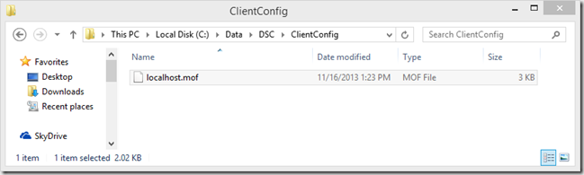
](https://www.verboon.info/wp-content/uploads/2013/11/2013-11-16_18h04_29.png)

The content of the MOF file looks as following (*Get-Content localhost.mof*)

/*
@TargetNode='localhost'
@GeneratedBy=Admin
@GenerationDate=11/16/2013 13:23:06
@GenerationHost=DEV001
*/

instance of MSFT_RegistryResource as $MSFT_RegistryResource1ref
{
ResourceID = "[Registry]FooCorpReg1";
Key = "HKEY_LOCAL_MACHINE\\Software\\FooCorp";
Ensure = "Present";
SourceInfo = "C:\\Data\\DSC\\Client_config.ps1::11::5::Registry";
ModuleName = "PSDesiredStateConfiguration";
ValueData = {
    "DSCDemo"
};
ModuleVersion = "1.0";
ValueName = "Name";

};

instance of MSFT_FileDirectoryConfiguration as $MSFT_FileDirectoryConfiguration1ref
{
ResourceID = "[File]FooCorpFile1";
Type = "File";
Ensure = "Present";
Contents = "Hello DSC World";
SourceInfo = "C:\\Data\\DSC\\Client_config.ps1::20::5::File";
DestinationPath = "c:\\data\\FooCorpFile1.txt";
ModuleName = "PSDesiredStateConfiguration";
ModuleVersion = "1.0";

};

instance of OMI_ConfigurationDocument
{
Version="1.0.0";
Author="Admin";
GenerationDate="11/16/2013 13:23:06";
GenerationHost="DEV001";
};

Now that we have the configuration stored in a MOF file, let’s apply it to the local machine by running the following command. 

```
# Apply the Configuration
Start-DscConfiguration -Path "c:\Data\DSC\ClientConfig" -wait -Verbose 

```

[
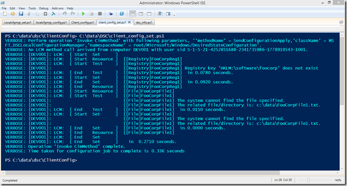
](https://www.verboon.info/wp-content/uploads/2013/11/2013-11-16_18h18_01.png)

The result is that we have now the file and the content that was expected
[
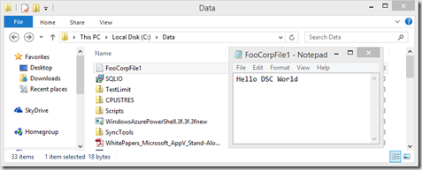
](https://www.verboon.info/wp-content/uploads/2013/11/2013-11-16_18h21_08.png)

as well as the registry key and expected value
[
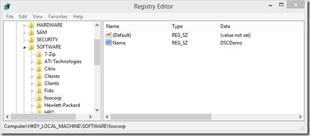
](https://www.verboon.info/wp-content/uploads/2013/11/2013-11-16_18h22_36.png)

But there is more, the configuration not only got applied but also stored on the system. I spend a bit of time figuring out where it actually stores the data. With the help of the Event log i found out that the configuration gets stored into **C:\Windows\System32\Configuration\Current.MOF**

Speaking about the Event log, if you open the Event log viewer, you will find a dedicated log for Desired State Configuration events. 

[
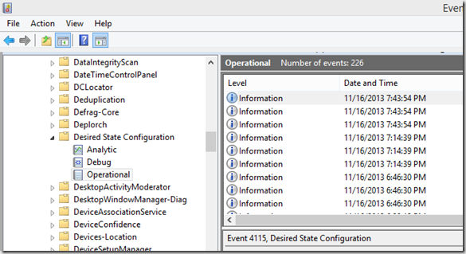
](https://www.verboon.info/wp-content/uploads/2013/11/2013-11-16_19h48_56.png)

To see what configuration is stored on the system, we can simply run the following command

```
Get-DSCConfiguration

```

[
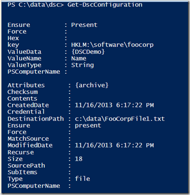
](https://www.verboon.info/wp-content/uploads/2013/11/2013-11-16_19h54_40.png)

To check whether our system is still compliant we run the following command

```
Test-DscConfiguration -Verbose

```

[
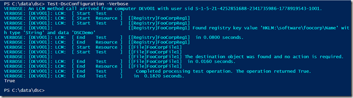
](https://www.verboon.info/wp-content/uploads/2013/11/2013-11-16_19h57_31.png)

Now let’s change things on our system. We remove the registry key and change the content of the file and then run the Test-DSCConfiguration command again. 

[
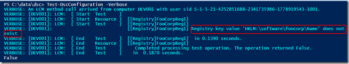
](https://www.verboon.info/wp-content/uploads/2013/11/2013-11-16_20h02_21.png)

What is interesting is that as soon as it detected that the registry setting is not compliant the test returns false, but also does not continue checking the other configuration. I assume this is by design. 

The engine that drives the Desired State Configuration is called the Local Configuration Manager. By running the following command we can see the Local Configuration Manager’s current configuration. 

```
Get-DscLocalConfigurationManager

```

[
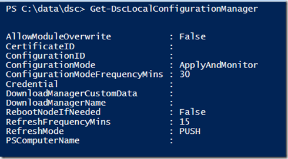
](https://www.verboon.info/wp-content/uploads/2013/11/2013-11-16_20h18_20.png)

It took me a bit to find this one out, but after putting together the following command

```
Get-CimClass -Namespace root/Microsoft/Windows/DesiredStateConfiguration -ClassName MSFT_DSCMetaConfiguration | Select-Object -ExpandProperty CimClassProperties | Select-Object @{Label="ConfigSetting";Expression={$_.Name}} -ExpandProperty Qualifiers

```

we know that there are three Configuration Modes. ApplyOnly, ApplyAndMonitor, ApplyAndAutoCorrect. On a Windows 8.1 client the default is ApplyAndMonitor. We look at how to change this in just a moment. 

During my DSC discovery journey I also found out that there is a Scheduled Task for DSC. 

[
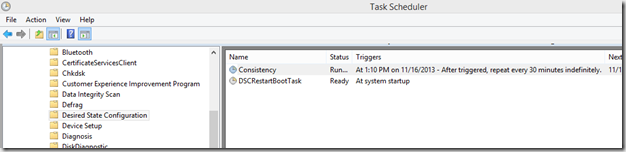
](https://www.verboon.info/wp-content/uploads/2013/11/2013-11-16_20h41_30.png)

To find out what actions these tasks perform, we can use the following command. 

```
# Get the Scheduled Task Execution Information
$DSCTasks = Get-ScheduledTask | Select-Object TaskName -ExpandProperty Actions| Select-Object TaskName, Execute, Arguments 
$DSCTasks | Select-Object TaskName, Execute, Arguments | Where-Object {$_.Arguments -like "*desired*"} | format-list *

```

[
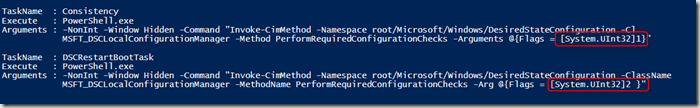
](https://www.verboon.info/wp-content/uploads/2013/11/2013-11-16_20h44_24.png)

Both commands are nearly the same except for the Flags set for [PerformRequiredConfigurationChecks](http://msdn.microsoft.com/en-us/library/dn469248(v=vs.85).aspx) . The first command has 1 specified, the scond 2. Unfortunately Microsoft hasn’t completed its documented yet, so its unclear to me what the meaning is of these flags. 

Now that we know that DSC is triggered through a Scheduled Task let’s change our registry key again and see what happens when we run the Consistency Task. Now tha the Name key and value are deleted we are definitely not compliant. 

**[
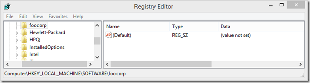
](https://www.verboon.info/wp-content/uploads/2013/11/2013-11-16_20h50_05.png)**

Run the Scheduled Task and and then check the event log

```
Start-ScheduledTask -TaskName "Consistency" -TaskPath "\Microsoft\Windows\Desired State Configuration\"

```

```
Get-WinEvent -ProviderName "Microsoft-Windows-DSC" -MaxEvents 10  | Select-Object TimeCreated, ID, LevelDisplayName, Message | format-list 

```

[
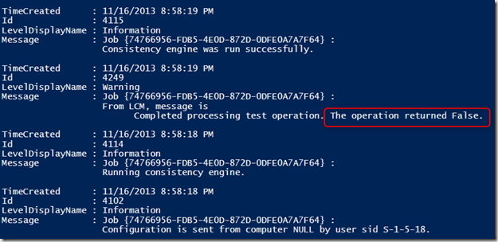
](https://www.verboon.info/wp-content/uploads/2013/11/2013-11-16_21h02_01.png)

****So now the registry key should be back right? unfortunatelyit is not. Although DSC did detect that the system is not in its desired configuration state, no action was taken. 

[
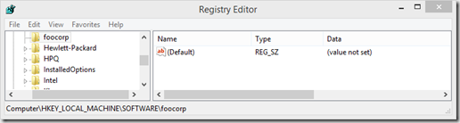
](https://www.verboon.info/wp-content/uploads/2013/11/2013-11-16_21h02_55.png)

Remember that we spoke about the Configuration Modes earlier. By default the local configuration manager is configured to ApplyAndMonitor, so if we want to change this behaviour to ApplyAndAutoCorrect we must change the configuration of the Local Configuration Manager. 

Configuring the Local Configuration Manager works just like creating any other configuration  You just include the local configuration manager configuration within an existing configuration by adding a LocalConfigurationManager block inside the Node block, or create a separate script as shown below. 

```
# Configuration Settings for DSC Local Configuration Manager

Configuration LocalCfgMgr
{
param ($MachineName)
Node $MachineName
    {
    LocalConfigurationManager
        {
            ConfigurationMode = "ApplyAndAutoCorrect"
        }
    }
}

# Write MOF File
LocalCfgMgr -MachineName localhost -OutPutPath "c:\Data\DSC\LocalCfgMgr" 

```

This time the MOF file created is called localhost.**meta**.mof
[
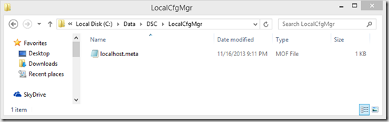
](https://www.verboon.info/wp-content/uploads/2013/11/2013-11-16_21h13_27.png)

****To change the Local Configuration Manager configuration, we run the following command

```
# Set DSCLocalConfiguration Manager configuration settings
Set-DscLocalConfigurationManager -Path "C:\Data\DSC\LocalCfgMgr" -Verbose

```

Running the Get-DscLocalConfigurationManager now shows the new configured Configuration Mode. 
[
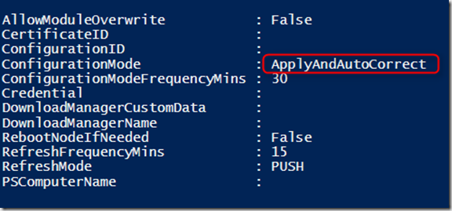
](https://www.verboon.info/wp-content/uploads/2013/11/2013-11-16_21h22_06.png)

If you change the ConfigurationModeFrequencyMins value, the Scheduled Task gets automatically updated as well. Just like the configuration, the Local Configuration Manager MOF data gets stored into C:\Windows\System32|configuration into the file **Metaconfig.mof
[
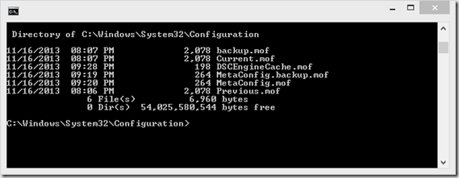
](https://www.verboon.info/wp-content/uploads/2013/11/2013-11-16_21h33_37.png)**

Now let’s run the Scheduled Task again and see what happens. 

```
start-ScheduledTask -TaskName "Consistency" -TaskPath "\Microsoft\Windows\Desired State Configuration\"

```

[
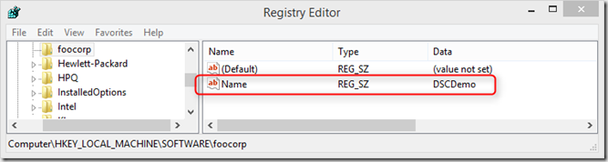
](https://www.verboon.info/wp-content/uploads/2013/11/2013-11-16_21h29_18.png)

After running the Scheduled Task the missing registry got automatically re-created. Nice. That’s what i have found out about DSC so far, I hope you enjoyed the post and as always, any feedback is welcome. 

**Additional Information**

- [Windows PowerShell Desired State Configuration Overview](http://technet.microsoft.com/en-us/library/dn249912.aspx) 

- [Introducing PowerShell Desired State Configuration (DSC)](http://blogs.technet.com/b/privatecloud/archive/2013/08/30/introducing-powershell-desired-state-configuration-dsc.aspx) 

- [Desired State Configuration in Windows Server 2012 R2 PowerShell](http://channel9.msdn.com/Events/TechEd/Europe/2013/MDC-B302#fbid=) 

- [Episode 236 – PowerScripting Podcast – MVP Don Jones on PowerShell Desired State Configuration](http://powershell.org/wp/2013/07/30/episode-236-powerscripting-podcast-mvp-don-jones-on-powershell-desired-state-configuration/) 

- [An In-Depth Walkthrough of Desired State Configuration in PowerShell Windows Management Framework v4](http://sdmsoftware.com/group-policy-blog/desired-state-configuration/an-in-depth-walkthrough-of-desired-state-configuration-in-powershell-windows-management-framework-v4/) 

- [PowerShell V4 Desired State Configuration – My Precio… ops… Desired !!!!!](http://shellyourexperience.com/2013/09/12/powershell-v4-desired-state-configuration-my-precio-ops-desired/) 

- [PowerShell v4 Desired State Configuration Cheat Sheet](http://blogs.technet.com/b/stefan_stranger/archive/2013/08/26/powershell-v4-desired-state-configuration-cheat-sheet.aspx) 

- [Building a Desired State Configuration Infrastructure](http://powershell.org/wp/2013/10/02/building-a-desired-state-configuration-infrastructure/)

- [Desired State Configuration MOF Reference](http://msdn.microsoft.com/en-us/library/dn469247(v=vs.85).aspx)

