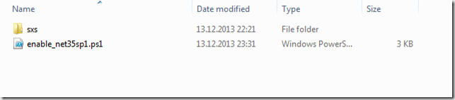
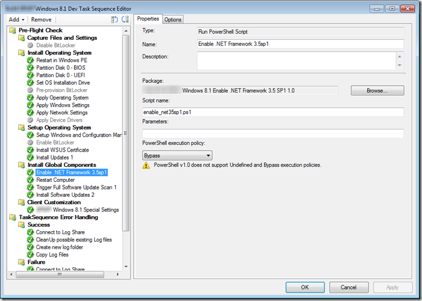
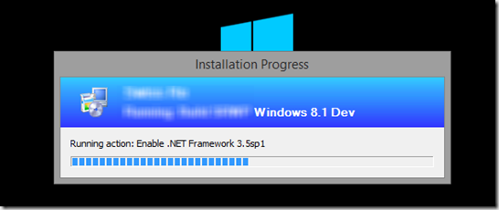
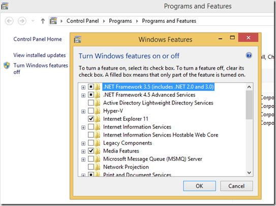

Windows 8.1 has the .NET Framework 4.5.1 enabled by default. If you need .NET Framework 3.5 which also includes support for .NET 3.0, and 2.0, then you must enable the feature as it is not enabled by default.However to enable it you need access to the content of the Sources\SXS folder that resides on the Windows 8.1 installation media. More details are described in the MSDN article [Installing the .NET Framework 3.5 on Windows 8 or 8.1](http://msdn.microsoft.com/en-us/library/hh506443(v=vs.110).aspx)

 Follow the below instructions to enable the .NET Framework 3.5 within a ConfigMgr 2012 R2 task sequence. 

 On the ConfigMgr package source share create a new folder that acts as the package source folder for the .NET Framework 3.5 content and enabling script. Then copy the **SXS** folder located under the Sources folder on the original Windows 8.1 media into the new created folder. Next copy the enable-net35sp1.ps1 script into the same folder as well. (the content of enable-net35sp1.ps1 is listed below)

 

 Within Configuration Manager create a new package called Windows 8.1 enable .NET Framework 3.5 sp1 with its data source path pointing to the previously created folder. The package does not need a program. 

 Next open the task sequence that is used to create the Windows 8.1 reference image and add a “Run PowerShell Script” task as shown in the example below. 

  
- Package: Windows 8.1 enable .NET Framework 3.5 sp1  
- Script Name: **enable-net35sp1.ps1**

 

 As a result you should see the following when execution the task sequence. 

 

 The result, .NET Framework 3.5 enabled in Windows 8.1

 

  

 Contents of the Enable-net35sp1.ps1 script. 

```powershell
<#
.Synopsis
   Enables the .NET Framework Feature on Windows 8.1
.DESCRIPTION
   Enables the .NET Framework Feature on Windows 8.1 using a copy of the \sources\sxs folder
   content from the Windows 8.1 installation media
.PARAMETER Source
  Optional parameter pointing to the location where the SXS files are located, if no -Source 
  parameter is provided, the SXS folder is expected to be in the same folder as the script. 
.EXAMPLE
 Enable-NET35SP1.ps1 
.EXAMPLE
 Enable-NET35SP1.ps1 -Source R:\Win81\Sources\sxs
.LINK
  
.NOTES
  Version 1.0, by Alex Verboon
#>

[CmdletBinding(SupportsShouldProcess=$true)]
Param(
[Parameter(Mandatory=$false,
            ValueFromPipelineByPropertyName=$true,
            ParameterSetName="SXSPath",
            HelpMessage= 'SXS Folder')]
            [String]$Source
)

Begin{
    If ((Get-windowsoptionalfeature -FeatureName NetFx3 -Online | Select-Object -ExpandProperty State) -ne "Enabled")
        {
        Write-Verbose ".NET Framework 3.5SP1 is not enabled on this system"
        if ([string]::IsNullOrEmpty($Source))
            {
            #No source path provided so set source path to SXS folder located in the script execution path
            # we'll check later if it actually exists
            $PSScriptRoot = Split-Path -Parent -Path $MyInvocation.MyCommand.Definition
            $SxsSource = "$PSScriptRoot\SXS"
            }
        else
            {
            # set the Source to the provided path, we'll check later if it exists
            $SxsSource = $Source
            }
        }
    Else
        {
            Write-Output ".NET Framework 3.5 SP1 is already installed"
            Exit
        }
}

Process{
If ((Test-Path -Path "$SxsSource") -eq $false)
{
    Write-Error "SXS Sources: SxsSource not found"
} 
Else
{
    Write-Verbose "SXS Sources: $SxsSource found"
    If ($PScmdlet.ShouldProcess("Enabling .NET Framework 3.5 Feature using Sources in $SxsSource","",""))
    {
        Write-Output "Enabling .NET Framework 3.5 Feature"
        enable-windowsoptionalfeature -featurename NetFx3 -Online -NoRestart -LimitAccess -All -Source $SxsSource -LogLevel WarningsInfo -ErrorAction Continue
    }
}
}

End{
        If ((Get-windowsoptionalfeature -FeatureName NetFx3 -Online | Select-Object -ExpandProperty State) -eq "Enabled")
        {
            Write-Output "Enabling .NET Framework 3.5 SP1 completed "
        }
        Else
        {
            Write-Output "Enabling .NET Framework 3.5 SP1 not completed"
        }
}

```
