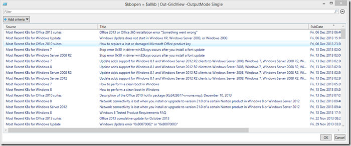

I frequently visit kbupdate.info which is a great resource for finding latest KB updates, but still you have to manually click through the various lists. Now that I am learning PowerShell anyway, i thought i’ll give myself another task to further improve my PowerShell skills. So here we go, below you find a script that retrieves the latest KB update information for various products and displays them on screen so that I can quickly browse through them and directly launch the article of interest in Internet Explorer. 

```
<#
.Synopsis
   Retrieve latest Microsoft KB updates for various products
.DESCRIPTION
   Retrieve latest Microsoft KB updates for various products. The script uses the 
   RSS feeds available for the various Microsoft products. For more RSS feeds check
   http://support.microsoft.com/gp/topissuesrss and 
   http://support.microsoft.com/select/?target=rss
.EXAMPLE
 Get-LatestKBUpdates.ps1
.LINK
  http://support.microsoft.com/gp/topissuesrss
  http://support.microsoft.com/select/?target=rss  
.NOTES
  Version 1.0, by Alex Verboon
#>

$rss ="http://support.microsoft.com/common/rss.aspx?rssid=16796&ln=en-us", # Most Recent KBs for Windows 8
        "http://support.microsoft.com/common/rss.aspx?rssid=14019&ln=en-us", # Most Recent KBs for Windows 7
        "http://support.microsoft.com/common/rss.aspx?rssid=6527", # Most Recent KBs for Windows Update
        "http://support.microsoft.com/common/rss.aspx?rssid=14134", # Most Recent KBs for Windows Server 2008 R2
        "http://support.microsoft.com/common/rss.aspx?rssid=1060", # Most Recent KBs for System Center Configuration Manager
        "http://support.microsoft.com/common/rss.aspx?rssid=13615", # Most Recent KBs for Office 2010 suites
        "http://support.microsoft.com/common/rss.aspx?rssid=16674&ln=en-us", # Most Recent KBs for Office 2013 suites
        "http://support.microsoft.com/common/rss.aspx?rssid=16526&ln=en-us" # Most Recent KBs for Windows Server 2012

$allkb =@()
ForEach($r in $rss) 
{
    $rssfeed = Invoke-RestMethod -Uri $r | Select-Object title,link,pubDate
    [xml]$Title = Invoke-WebRequest -uri $r
    forEach ($kbi in $rssfeed)
        {
        $object = New-Object -TypeName PSObject
        $object | Add-Member -MemberType NoteProperty -Name "Source" -Value $Title.rss.channel.title
        $object | Add-Member -MemberType NoteProperty -Name "Title" -Value $kbi.title 
        $object | Add-Member -MemberType NoteProperty -Name "PubDate" -Value $kbi.pubdate 
        $object | Add-Member -MemberType NoteProperty -Name "Link" -Value $kbi.link
        $allkb += $object
        }
    }
$kbopen = $allkb | Out-GridView -OutputMode Single 
Start-Process $kbopen.link

```

[

](https://www.verboon.info/wp-content/uploads/2013/12/2013-12-17_01h34_52.png)

