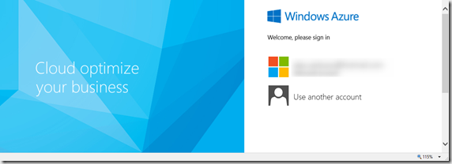

Whenever I worked with Azure, first thing i usualy did was fire a web search to get the url for the Azure Management portal. I know I could bookmark it……..it’s just that I already have way too many bookmarks. But today I discovered a nice cmdlet in PowerShell called [**Show-AzurePortal**](http://msdn.microsoft.com/en-us/library/dn408543.aspx#feedback)** **which gets you automatically to the right place. 

```
Show-AzurePortal

```

[

](https://www.verboon.info/wp-content/uploads/2013/12/2013-12-10_00h38_30.png)

Note: You must install the Azure PowerShell cmdlets. [http://msdn.microsoft.com/en-us/library/windowsazure/jj156055.aspx](http://msdn.microsoft.com/en-us/library/windowsazure/jj156055.aspx)

