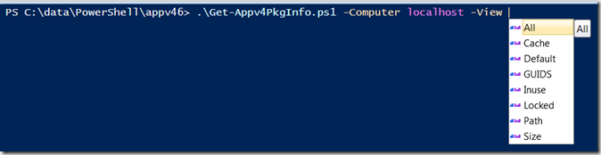

Today we’ve been looking at App-V 4.6 package settings before and after migrating them from ConfigMgr 2007 to ConfigMgr 2012, so after opening the App-V mmc console 3x manually…..another script was born. 

 The below Get-Appv4PkgInfo.ps1 script retrieves information from the App-V Package WMI class. You can run the script against one or more computers and the optional –View parameter lets you define what information you want to see. 

 [

](https://www.verboon.info/wp-content/uploads/2013/12/image.png)

  

```

<#
.Synopsis
   Retrieve local App-V 4.6 Package information
.DESCRIPTION
   Retrieve local App-v Package Information from root\Microsoft\appvirt\client
.PARAMETER Computer
   One or multiple computernames
.PARAMETER View
   Specifies the information that is displayed for the identified App-V Package
   Valid options for the view parameter are Default,Path, Cache, Inuse, Size, GUIDS, Locked,All
.EXAMPLE
  Get-Appv4PkgInfo.ps1 -Computer TestClient1, TestClient2

  Shows the same output as when providing the -View Default parameter

.EXAMPLE
  Get-Appv4PkgInfo.ps1 -Computer TestClient1 -View Default

    Computer                              AppVname                                Version                                    
    --------                              --------                                -------                                    
    TestClient1                           SCCM Client Center 2.0.4.1 x64 R1       5

.EXAMPLE
  Get-Appv4PkgInfo.ps1 -Computer TestClient1,Testclient2 -View Path    
     
    Computer                              AppVname                                SFTPath                                    
    --------                              --------                                -------                                    
    TestClient1                           SCCM Client Center 2.0.4.1 x64 R1       FILE://c:\windows\ccmcache\7\sccm client.
.LINK
  http://technet.microsoft.com/en-us/library/cc843631.aspx
.NOTES
  Version 1.0, by Alex Verboon
#>
[CmdletBinding()]
Param(
     [Parameter(Mandatory=$true,
     ValueFromPipelineByPropertyName=$true,HelpMessage="Enter Computername(s)",
     Position=0)]
     [Alias("ipaddress","host")]
     [String[]]$Computer,        

     [Parameter(Mandatory=$false,
     ValueFromPipelineByPropertyName=$true,HelpMessage="Select the type of information to display",
     Position=1)]
     [ValidateSet("Default","Path","Cache","Inuse","Size","GUIDS","Locked","All")] 
     $View="Default"
)

Begin{}

Process{
$appv =@()
ForEach($c in $Computer) 
{
    $applications = get-wmiobject -ComputerName $c -query "SELECT * FROM Package" -namespace "root\Microsoft\appvirt\client" -ErrorAction SilentlyContinue
    ForEach($app in $applications)
    {
     $object = New-Object -TypeName PSObject
     $object | Add-Member -MemberType NoteProperty -Name "Computer" -Value $c
     $object | Add-Member -MemberType NoteProperty -Name "AppVname" -Value $app.Name
     $object | Add-Member -MemberType NoteProperty -Name "Version" -Value $app.Version
     $object | Add-Member -MemberType NoteProperty -Name "SFTPath" -Value $app.SftPath
     $object | Add-Member -MemberType NoteProperty -Name "PackageGUID" -Value $app.PackageGUID
     $object | Add-Member -MemberType NoteProperty -Name "VersionGUID" -Value $app.VersionGUID
     $object | Add-Member -MemberType NoteProperty -Name "Locked" -Value $app.Locked
     $object | Add-Member -MemberType NoteProperty -Name "LaunchSize" -Value $app.LaunchSize
     $object | Add-Member -MemberType NoteProperty -Name "InUse" -Value $app.InUse
     $object | Add-Member -MemberType NoteProperty -Name "CachedSize" -Value $app.CachedSize
     $object | Add-Member -MemberType NoteProperty -Name "CachedPercentage" -Value $app.CachedPercentage
     $object | Add-Member -MemberType NoteProperty -Name "CachedLaunchSize" -Value $app.CachedLaunchSize
     $object | Add-Member -MemberType NoteProperty -Name "TotalSize" -Value $app.TotalSize
     $appv += $object
    } # end foreach application
} # end foreach computer
} # end process 

End{
# Define the properties to display based on -View parameter option
switch($view)
    {
    Default {$selcol = "Computer", "AppVname","version"}
    Inuse {$selcol = "Computer", "AppVname","Inuse"}
    Size {$selcol = "Computer", "AppVname","LaunchSize","TotalSize"}
    Cache {$selcol = "Computer", "AppVname","CachedSize","CachedPercentage","CachedLaunchSize"}
    GUIDS {$selcol = "Computer", "AppVname","PackageGUID","VersionGUID"}
    Path {$selcol = "Computer", "AppVname","SFTPath"}
    Locked {$selcol = "Computer", "AppVname","Locked"}
    All {$selcol = "*"}
    }
$appv | Select-Object -Property $selcol 
}

```

