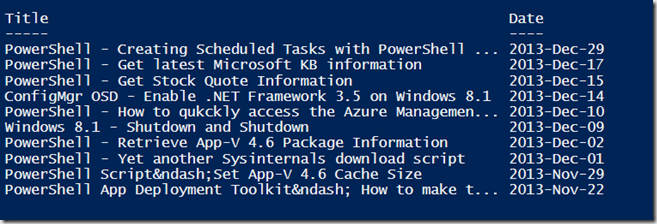

I just found out that meanwhile (since October last year) the Rest API for wordpress now also works on self-hosted wordpress sites. So i can now access the content of my blog through PowerShell. 

```
$posts = Invoke-RestMethod -uri "https://public-api.wordpress.com/rest/v1/sites/www.verboon.info/posts/?number=50"
$posts.posts | Select-Object @{"Name" = "Title";"e"= {($_.Title)-replace "–","-"}},  @{"Name" = "Date"; "Expression" = {get-date ($_.Date) -Format "yyyy-MMM-dd"}} | ft 

```

[

](https://www.verboon.info/wp-content/uploads/2013/12/2013-12-29_20h05_20.png)

More details abou the WordPress Rest API can be found [here](http://developer.wordpress.com/docs/api/)

