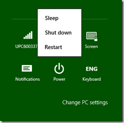
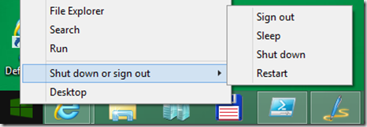
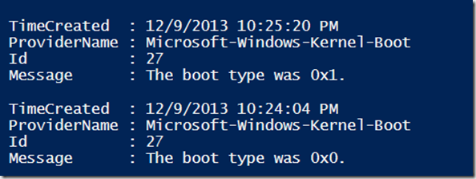

Hey there, when i watched the last edition of “[The Defrag Show](http://channel9.msdn.com/Shows/The-Defrag-Show/Defrag-Migration-Documentation-Folder-Search-Mouse-Lag#time=06m16s)” this week-end Gov Maharaj gave an interesting explanation about the difference in behaviour when using the Shutdown option within the charms bar or the Widnows X-menu. 

 [

](https://www.verboon.info/wp-content/uploads/2013/12/2013-12-09_22h38_47.png)

 [

](https://www.verboon.info/wp-content/uploads/2013/12/2013-12-09_22h40_11.png)

 To keep a long story short. When you have fast boot enabled, the shutdown option in thr charms bar will perform a so-called hybrid shutdown, but when using the shutdown option in the x-menu a full shutdown is performed meaning that the next time you turn on the machine a cold boot happens. 

 To find out how your client last booted, you can use the below powrshell code

```
$boot = Get-WinEvent -ProviderName Microsoft-Windows-Kernel-boot  -MaxEvents 10 | Where-Object {$_.message -like "The boot type*"}
$boot| format-list 

```

[

](https://www.verboon.info/wp-content/uploads/2013/12/2013-12-09_22h52_52.png)

- 0x1 indicates that the system did a fast startup

- 0x0 indicates that the system did a cold boot

