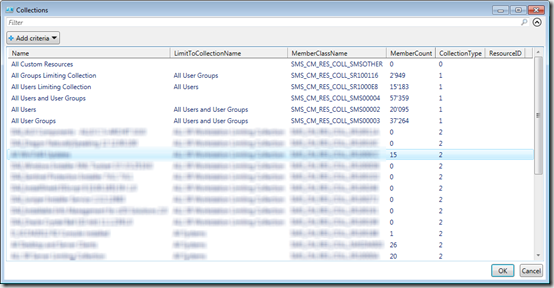
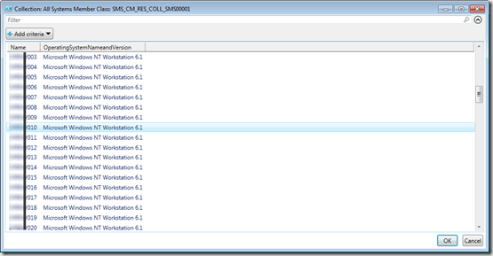

The below script provides a simple and quick method to find ConfigMgr Collections and its members. The script has a -Name parameter that accepts the exact or part of the collection name. Next all collections that match the name are listed. After selecting a collection, its members are listed. 

```
Function Get-CMColContent()
{
<#
.Synopsis
   Get Configuration Manager Collections and Members
.DESCRIPTION
   This script provides an interactive way to find collections and collection members within 
   Configuration Manager. 
.PARAMETER Name
   The exact or partial collection name. 
.EXAMPLE
   Get-CMColContent -Name All
#>

 Param(
    [Parameter(Mandatory=$true,
    ValueFromPipelineByPropertyName=$true,
    HelpMessage="Enter Collection Name or part of collection Name",
    Position=0)]
    [String]$Name
    )

# Change Site Server Name and Site code so it fits your environment
[string] $SiteServer = "servername"
[string] $SiteCode = "010"
[string] $Namespace = "root\SMS\site_$SiteCode"

$CollectionItem = Get-WmiObject -Namespace $Namespace -ComputerName $SiteServer -Query "SELECT Name,LimitToCollectionName,MemberClassName, MemberCount, CollectionType  FROM SMS_Collection WHERE Name LIKE '%$Name%'" | Select-Object Name,LimitToCollectionName,MemberClassName, MemberCount, CollectionType, ResourceID | Sort-Object CollectionType| Out-GridView -Title "Collections" -OutputMode Single

$CollectionType = $CollectionItem.CollectionType
$CollectionName = $CollectionItem.Name
$MemberClassName = $CollectionItem.MemberClassName

If ($CollectionType -eq 2) # Computer collections
    {
        Write-Output "Please wait, this can take a while..."
        $colcontent = Get-WmiObject -Namespace $Namespace -ComputerName $SiteServer -Query "SELECT Name, Active, OperatingSystemNameandVersion, ResourceID FROM SMS_R_SYSTEM where ResourceID in (Select ResourceID from $MemberClassName)" | Select-Object Name, Active, OperatingSystemNameandVersion -wait | Sort-Object Name 
        $colcontent = $colcontent | Out-GridView -Title "Collection: $CollectionName Member Class: $MemberClassName" -OutputMode Multiple
        #return $colcontent
    }
Elseif ($CollectionType -eq 1) # User Collections 
    {
       Write-Output "Please wait, this can take a while..."
       $colcontent = Get-WmiObject -Namespace $Namespace -ComputerName $SiteServer -Query "SELECT UserName, UserPrincipalName, ResourceID FROM SMS_R_USER  where ResourceID in (Select ResourceID from $MemberClassName)" | Select-Object Username, UserPrincipalName, ResourceID -wait
       $colcontent = $colcontent | Out-GridView -Title "Collection: $CollectionName Member Class: $MemberClassName" -OutputMode Multiple 
       #return $colcontent
    }
Else
    {
      Write-output "No support for other Collection Type $Collectiontype"
    }

return $colcontent
}

```

Example: 

Get-CMColContent -Name “All”

[

](https://www.verboon.info/wp-content/uploads/2014/01/SNAGHTMLa17ffb.png)

[

](https://www.verboon.info/wp-content/uploads/2014/01/SNAGHTMLa30678.png)

