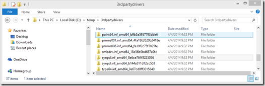
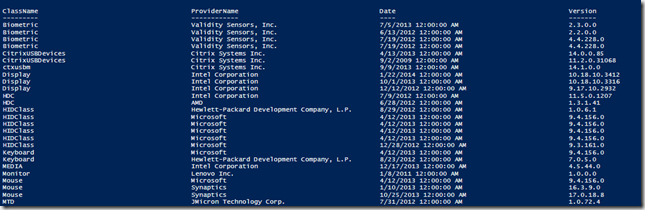

Windows 8.1 Update introduces a new cmdlet that allows you to export third-party drivers that are located within the driver store of a Windows client. 

`powershell
$ExpDrv = Export-WindowsDriver -Online -Destination c:\temp\3rdpartydrivers 

`powershell

The result, all drivers exported into the provided destination directory



Now we have a whole bunch of folders, but what drivers did we actually export?

`powershell

$ExpDrv | Select-Object ClassName, ProviderName, Date, Version | Sort-Object ClassName

```



For more information read the What’s new in DISM article [here](http://technet.microsoft.com/en-us/library/dn419776.aspx)