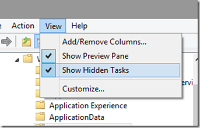

Here’s a simple script I put together to list the scheduled tasks including the description, status and whether the task is set to hidden or not. When deploying a new operating system I find it important to understand what scheduled tasks are enabled to run, as sometimes there might be some potential to improvie the systems performance by disabling those you feel are not needed in your environment. 

```
$schtasks = @()
$st = Get-ScheduledTask
ForEach ($SchTask in $st)
{
    $object = New-Object -TypeName PSObject
    $object | Add-Member -MemberType NoteProperty -Name "TaskName" -Value $SchTask.TaskName
    $object | Add-Member -MemberType NoteProperty -Name "Description" -Value $SchTask.Description
    $object | Add-Member -MemberType NoteProperty -Name "State" -Value $SchTask.State
    $object | Add-Member -MemberType NoteProperty -Name "Hidden" -Value $SchTask.Settings.Hidden
    $schtasks += $object
}
$schtasks | Sort-Object "Hidden" -Descending |  Format-list 

```

Within the Scheduled Tasks UI, by default you will not see the contents of Tasks that are set to hidden. But this can be enabled. Open the Task Scheduler with taskschd.msc and within the View Menu select “Show Hidden Tasks”. 

[

](https://www.verboon.info/wp-content/uploads/2014/04/2014-04-28_16h41_50.png)

