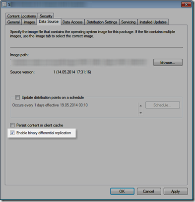

Here’s a script that lists all Boot and Operating system images stored within Configuration Manager and shows whether the Binary Delta Replication Setting is enabled or not. 

 [

](https://www.verboon.info/wp-content/uploads/2014/05/SNAGHTML3132c3.png)

  

```

<#
.Synopsis
   List Binary Delta Replication Setting for ConfigMgr Boot and Operating System images
.DESCRIPTION
   This cmdlet Lists ConfigMgr the Boot image and Operating System image Binary Delta Replication Setting
.EXAMPLE

.EXAMPLE
   Another example of how to use this cmdlet
.NOTES
 #http://msdn.microsoft.com/en-us/library/hh948196.aspx
 Version 1.0 by Alex Verboon

#>
function Get-CMImgBDRSetting
{
    [CmdletBinding()]
    Param
    (
        # Param1 help description
        [Parameter(Mandatory=$true,
                   ValueFromPipelineByPropertyName=$true,
                   Position=0)]
        $SiteCode,
        [Parameter(Mandatory=$true,
                   ValueFromPipelineByPropertyName=$true,
                   Position=1)]
        $SiteServer
    )

    Begin
    {
    [string] $Namespace = "root\SMS\site_$SiteCode"
    $allImages = Get-WmiObject -Namespace $Namespace -ComputerName $SiteServer -Query "SELECT Name, Description, Version,PkgFlags, PackageType  FROM SMS_PackageBaseclass Where PackageType = '258' OR PackageType = '257' "
    $USE_BINARY_DELTA_REP = "0x04000000"
    }
    Process
    {
        $bdr_images = @()
        ForEach ($img in $allImages)
        {
        $object = New-Object -TypeName PSObject
        $object | Add-Member -MemberType NoteProperty -Name "Name" -Value $img.Name
        $object | Add-Member -MemberType NoteProperty -Name "Version" -Value $img.Version
        $object | Add-Member -MemberType NoteProperty -Name "Description" -Value $img.Description
        $object | Add-Member -MemberType NoteProperty -Name "Binary_Delta_Rep" -Value ($ubdr = if($img.PkgFlags -band $USE_BINARY_DELTA_REP) {"Enabled"} Else {"Disabled"})
        $bdr_images += $object
        }
    }
    End
    {
        $bdr_images | Sort-Object Name
    }
}

```

