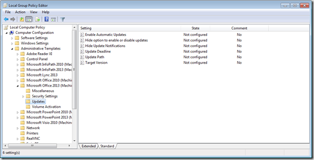

On April 28th 2014 Microsoft finally released an [fix for the Office 2013 SP1 Office customization tool](http://blogs.technet.com/b/odsupport/archive/2014/03/14/lync-2013-and-onedrive-for-business-are-not-installed-when-installing-office-2013-with-service-pack-1.aspx) as the version released with SP1 caused some issues with Lync 2013 and OneDrive for Business. But there’s more in this update.A few new Group Policy settings for Office 365 are included as well. 

 

 **Important**. These new Group Policy settings only apply to Office 365 (click to run installations) and not to Office 2013 MSI based installations. The reason for this is because the settings relate to the update mechanism that’s build in to the Office 365 product. 

 These are the new settings

    **Setting** **Description**  Hide Update Notifications  This policy setting allows you to hide notifications to users that updates to Office are available.

 When automatic updates are enabled for Office, in most cases updates are applied automatically in the background without any user input. However, updates can’t be applied if an Office program is open. If an Office program is open, other attempts are made to apply the updates at a later time. If, after several days, updates haven’t been applied, only then will users see a notification that an update to Office is available.

 If you enable this policy setting, users won’t see notifications that updates to Office are ready to be applied.

 If you disable or don’t configure this policy setting, users will see notifications that updates to Office are ready to be applied.

 This policy setting does not apply to notifications associated with update deadlines.

 Important:  This policy setting only applies to Office products that are installed by using Click-to-Run. It doesn't apply to Office products that use Windows Installer (MSI).

  Update Deadline  This policy setting allows you to set a deadline by when updates to Office must be applied. 

 Prior to the deadline, users will receive multiple reminders to install the updates. If Office isn’t updated by the deadline, the updates are applied automatically. If any Office programs are open, they’ll be closed, which might result in data loss. 

 We recommend that you set the deadline at least a week in the future to allow users time to install the updates.

 If you enable this policy setting, you set the deadline in the format of MM/DD/YYYY HH:MM in Coordinated Universal Time (UTC). For example, 05/14/2014 17:00.

 If you disable or don’t configure this policy setting, no deadline is set, unless you specify one by using the Office Deployment Tool. 

 You can use this policy setting with the Target Version policy setting to ensure that Office is updated to a particular version by a particular date.

 The deadline only applies to one set of updates. If you want to ensure that Office is always up-to-date, you need to update the deadline in this policy setting every time a new update for Office is available.

 Important:  This policy setting only applies to Office products that are installed by using Click-to-Run. It doesn't apply to Office products that use Windows Installer (MSI).

  Update Path  This policy setting allows you to specify the location where Office will get updates from.

 If you enable this policy setting, you can specify one of the following for the update location:  a network share, a folder on the local computer where Office is installed, or an HTTP address. Mapped network drives aren’t supported. 

 If you enable this policy setting, but you leave the update location blank, Office will get updates from the Internet.

 If you disable or don’t configure this policy setting, Office will get updates from the Internet, unless you specify a different location by using the Office Deployment Tool.

 Important: This policy setting only applies to Office products that are installed by using Click-to-Run. It doesn't apply to Office products that use Windows Installer (MSI).

  Target Version  This policy setting allows you to specify a version number that you want to update Office to.  For example, version 15.0.4551.1512.

 If you enable this policy setting, you specify the version that you want to update Office to. The next time Office looks for updates, Office will try to update to that version. The version must be available where Office is configured to look for updates (for example, on a network share). 

 If you enable this policy setting, but you leave the version blank, Office is updated to the most current version that’s available at the update location for Office.

 If you disable or don’t configure this policy setting, Office is updated to the most current version that’s available at the update location for Office, unless you specify a different version by using the Office Deployment Tool.

 Important:  This policy setting only applies to Office products that are installed by using Click-to-Run. It doesn't apply to Office products that use Windows Installer (MSI).

 The latest Office 2013 Administrative Template files (ADMX/ADML) and Office Customization Tool released on 28.04.2014 can be downloaded from [here](http://www.microsoft.com/en-us/download/details.aspx?id=35554)

