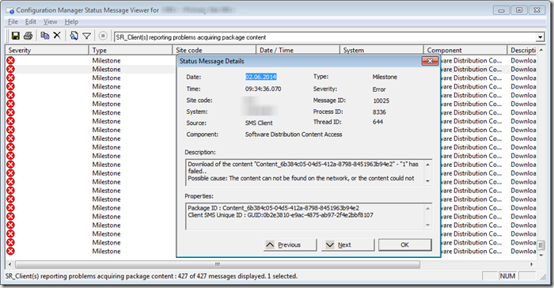

While reviewing ConfigMgr status messages for clients reporting problems acquiring package content (Message ID 10025) I found some code snippets on [sccmfaq.ch](http://sccmfaq.wordpress.com/2014/03/11/sccm-2012-get-from-content-id-to-the-name-of-an-application-with-powershell/) that maps the ContentID to the name of the application. As i had to do several lookups, I decided to create a function for it.

 

```powershell
function Get-xCMContentIDforApp
{
<#
.Synopsis
    Get-xCMContentIDforApp
.DESCRIPTION
   This function retrieves the Application name for the provided ContentID.
   Use this when analyzing status messages (10025) for clients reporting problems
   acquiring package content
.EXAMPLE
    Get-xCMContentIDforApp -SiteServer cmsrv01 -SiteCode lab -ContentID Content_4783c44a-3f5c-4bf3-a130-a89e5520173a, Content_1d336090-12e4-445b-9c15-718ee5ddf40a
    Application                             ContentID
    -----------                             ---------
    Mozilla Firefox_SW10012130              Content_4783c44a-3f5c-4bf3-a130-a89e5520173a
    Microsoft Excel 2010 x64_SW10011686_V   Content_1d336090-12e4-445b-9c15-718ee5ddf40a
    The above example retrieves the Application name for each contentID provided.
.NOTES
 Credits to sccmfaq.ch where i found the code snippets
#http://sccmfaq.wordpress.com/2014/03/11/sccm-2012-get-from-content-id-to-the-name-of-an-application-with-powershell/
 Version 1.0 by Alex Verboon
#>
[CmdletBinding(SupportsShouldProcess=$true)]
    Param
    (
        [Parameter(Mandatory=$true,
                   ValueFromPipelineByPropertyName=$true,
                   Position=0)]
        $SiteServer,
        [Parameter(Mandatory=$true,
                   ValueFromPipelineByPropertyName=$true,
                   Position=1)]
        $SiteCode,
        [Parameter(Mandatory=$true,
                   ValueFromPipelineByPropertyName=$true,
                   Position=2)]
        [string[]]$ContentID
    )
Begin{}
Process
{
    $CIDApps = @()
    ForEach ($cid in $ContentID)
    {
    If ($PScmdlet.ShouldProcess("Retrieving Application Name for  $cid"))
    {
        $ContenId01 = (("$cid").Split("."))[0]
        $ApplicationID = (Get-WmiObject -Namespace root\sms\site_$SiteCode -ComputerName $SiteServer -Class SMS_Deploymenttype -Filter "ContentID = '$ContenId01' and PriorityInLatestApp = '1'").AppModelName
        $App = (Get-WmiObject -Namespace root\sms\site_$SiteCode -ComputerName $SiteServer -Class SMS_Application -Filter "CI_UniqueID like '$ApplicationID%' and IsLatest = 'True'").LocalizedDisplayName
        $object = New-Object -TypeName PSObject
        $object | Add-Member -MemberType NoteProperty -Name "Application" -Value $App
        $object | Add-Member -MemberType NoteProperty -Name "ContentID" -Value $cid
        $CIDApps += $object
        }
    }
}
End
{
    $CIDApps | Select-Object Application, ContentID
}
}
```

