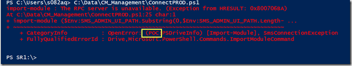
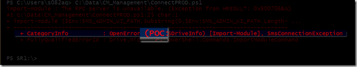

Since a few weeks, I received the below error message when importing the ConfigMgr module in PowerShell, but everything I ran afterwards worked fine, so I kept ignoring it for a while. 

 But now it was about time to get rid of this annoying message. My friend Claude Henchoz gave me a hint a while ago that helped me solve the issue. Looking at the error message more closely, I noticed the name of our old meanwhile decommissioned POC environment for ConfigMgr 2012 R2. 

 

 As it turns out, when importing the ConfigMgr module in PowerShell it seems to check whether the registered Sites can be reached. What registered Sites? Well when you connect to a ConfigMgr Site using the ConfigMgr Console, it stores the information of the sites into the registry. HKEY_CURRENT_USER\Software\Microsoft\ConfigMgr10\AdminUI\MRU

 Running the following PowerShell command lists all the Sites: 

 Get-ChildItem -Path "HKCU:\Software\Microsoft\ConfigMgr10\AdminUI\MRU"

 It turned out that MRU item 3 had information stored about a Site that doesn’t exist anymore, so I deleted it using the following command: 

 REMOVE-ITEM -Path "HKCU:\Software\Microsoft\ConfigMgr10\AdminUI\MRU\3"

 And gone was the error when importing the ConfigMgr module.

