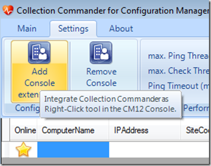
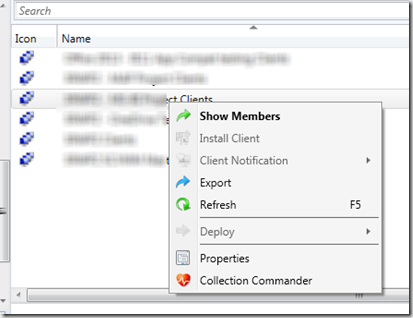
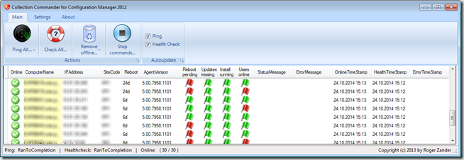
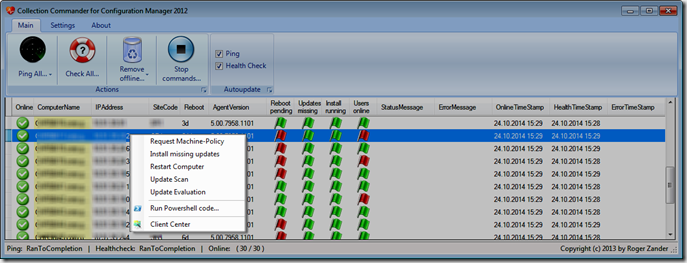
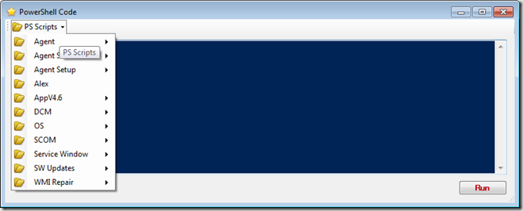
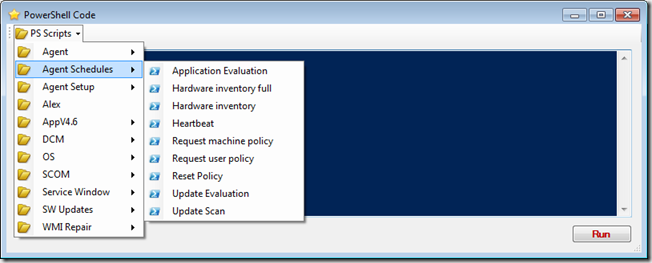
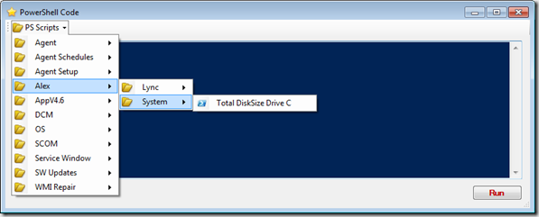
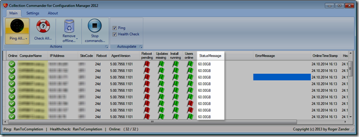
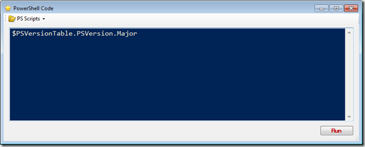

### Collection Commander

 Hey there, today I'd like to talk about an awesome tool called Collection Commander. If you're working with Microsoft System Center Configuration Manager you probably know [Client Center](https://sccmclictr.codeplex.com/). Now Client Center is also a very cool tool, but it only allows you to work on one client. Collection Commander allows you to do things on multiple clients at the same time. Oh and before I forget, Collection Commander is created by System Center MVP Roger Zander, the same guy who creates Client Center.  Just in case you are not using System Center Configuration Manager, don't walk away. While Collection Commander plays nicely with the System Center Configuration Manager Console, it also works without it.  
### Installation

 Installing Collection Commander is straight forward. Just go to the [Collection Commander CodePlex page](https://cmcollctr.codeplex.com/) and click on the Download button. When the download has completed run the windows installer package cmcollctr_1.0.0.11.msi Collection Commander by default installs itself into "C:\Program Files (x86)\Collection Commander for Configuration Manager". We will look at the content of that directory later.  
### Integrating Collection Commander as Right-Click Tool in the ConfigMgr Console

 As mentioned previously, Collection Commander runs perfectly without ConfigMgr, but can be integrated as a right-click tool for the ConfigMgr Console. To register Collection Commander as a right-click tool, open Collection Commander, go to Settings and then press the "Add Console extension" button.   Next time you right click on a collection, you'll see the Collection Commander option.   When selecting a ConfigMgr collection, and then launching Collection Commander, then all computers in the collection are added to the Collection Commander Computer list.  
### The Basics

 When launching the Collection commander either via the ConfigMgr Console or directly Collection commander first starts checking the client status. If you launched Collection Commander manually you have to enter the computer name manually or if you have an Excel sheet or text file with computer names, you can just copy paste them into the tool.   Collection commander first pings the client and then starts collecting some basic health information.  **Online states:**
= Machine is online, no error occured
= Machine is online, but an error occured (like: unable to connect by using WinRM)
= Machine is offline (no response from ping)

**The health state on the main form:**
Reboot pending = There are pending File-rename operations, or SCCM requires a reboot.
[
![clip_image014[1]](images/clip_image0141_thumb.gif)
](https://www.verboon.info/wp-content/uploads/2014/10/clip_image0141.gif)Updates missing = ConfigMgr. approved updates are missing.
[
![clip_image014[2]](images/clip_image0142_thumb.gif)
](https://www.verboon.info/wp-content/uploads/2014/10/clip_image0142.gif)Install running = ConfigMgr Agent is installing updates.
[
![clip_image014[3]](images/clip_image0143_thumb.gif)
](https://www.verboon.info/wp-content/uploads/2014/10/clip_image0143.gif)Users online = one or more users are logged on interactively. 
### Client Requirements

 To take full advantage of Collection Commander WinRM must be enabled on the remote clients. For more information about enabling WinRM I suggest you read [Enable Windows Remote Management through Group Policy](https://www.verboon.info/2011/11/enable-windows-remote-management-through-group-policy/).  
### Using Collection Commander

 Opening the right-click context menu shows some basic ConfigMgr tasks that you can initiate on one or multiple computers. I believe they are quite self-explaining so I won't go further into this.   Next are the "Run PowerShell Code" and the "Client Center" options. Before looking at the "Run PowerShell code", let me explain what he Client Center option does and share a little trick with you.  When selecting the Client Center option, Collection Commander launches another Tool called [Client Center](https://sccmclictr.codeplex.com/). I won't go into the details here, as I assume that you are familiar with it already, and if not I strongly recommend you check it out, at least if you are using ConfigMgr.  By default Collection Commander launches the web based installer for Client Center, but if you have Client Center already installed, you probably want Collection commander to launch your locally installed version. To change this behavior you have to make a small modification to the "C:\Program Files (x86)\Collection Commander for Configuration Manager\CMCollCtr.exe.config" file.  Change the entry <value>http://sccmclictr.codeplex.com/releases/clickonce/SCCMCliCtrWPF.application?{0}</value> With  <value>C:\Program Files\Client Center for Configuration Manager 2012\SCCMCliCtrWPF.exe</value> You have to restart Collection Commander for the change to take effect.  
### PowerShell, PowerShell

 Roger describes Collection Commander as following "The tool is designed for IT Professionals to trigger PowerShell Scripts on a list of devices".  When selecting the "Run PowerShell Code…" menu option, we get the following Window appears.   Within each of the folders you find some useful commands that can be executed against the targeted computers.   Out of the box, the following scripts are included:   
-  · Agent Service Restart 
-  · Agent Service Start 
-  · Agent Service Stop 
-  · Check CM Agent Service 
-  · Get cache size 
-  · Get cached content size 
-  · Get DNS suffix 
-  · Get GUID 
-  · Get HTTP port 
-  · Get HTTPS port 
-  · Get internet MP 
-  · Get MP 
-  · Get SLP 
-  · Reset policy 
-  · Set cache size 
-  · Set DNS suffix 
-  · Set HTTP port 
-  · Set HTTPS port 
-  · Set site code 
-  · Set SLP 
-  · Application Evaluation 
-  · Hardware inventory full 
-  · Hardware inventory 
-  · Heartbeat 
-  · Request machine policy 
-  · Request user policy 
-  · Reset Policy 
-  · Update Evaluation 
-  · Update Scan 
-  · Install CM12 Agent 
-  · AppV packages where content path is on a sepcifi server 
-  · Count Packages not fully loaded and older than 30 days 
-  · Count running AppV 
-  · Delete Packages where content is on a specific server 
-  · Start DCM Scan 
-  · Free disk space 
-  · Get logged on user 
-  · Logoff All Users 
-  · Restart enforced 
-  · Get SCOM Agent version 
-  · SetMaintenanceMode 
-  · CanProgramRunNow 
-  · CanUpdateRunNow 
-  · Count missing updates 
-  · Get status of KB 
-  · Install all mandatory updates 
-  · Fix DCOM Permissions 
-  · Register common DLLs 
-  · WMI Consistency check

 
### Add your own Scripts

 Extending Collection Commander with your own scripts is straight forward. Just go to the Collection Commander Scripts folder "C:\Program Files (x86)\Collection Commander for Configuration Manager\PSScripts" and there create a new Directory and copy your scripts into that folder.  Example: To add a script that checks the total disk space on drive C: create a script called Total DiskSize Drive C.ps1 with the following PowerShell code (([wmi]"root\cimv2:Win32_logicalDisk.DeviceID='C:'").Size/1GB).ToString("N2")+"GB"  Next copy the file into the PSScripts folder.  "C:\Program Files (x86)\Collection Commander for Configuration Manager\PSScripts\Alex\System\Total DiskSize Drive C.ps1" And there you go, the script is now included within Collection Commander.   The results of the scripts are displayed in the Status Message column.   
### Running PowerShell Commands

 If you have to run the same commands frequently, it makes sense to store them in a script, but you can also run PowerShell commands instantly. Just add the command directly into the PowerShell code Window and then click the Run button.   For more information about Collection Commander visit the page on CodePlex: [https://cmcollctr.codeplex.com/](https://cmcollctr.codeplex.com/) If you have any questions or feature requests post them on the Discussions page. [https://cmcollctr.codeplex.com/discussions](https://cmcollctr.codeplex.com/discussions) Cheers Alex

