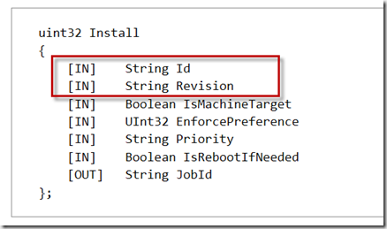
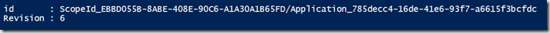
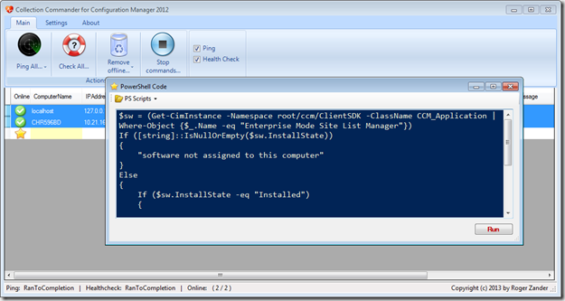
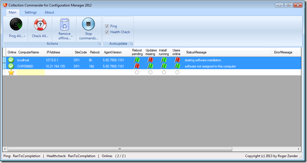
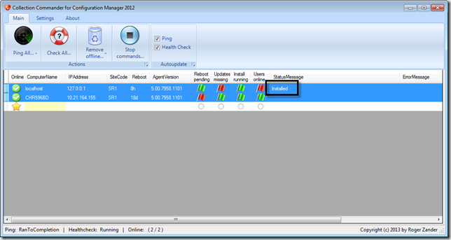

In the past days I had to provision a number of clients for testing purposes. A specific set of software also needed to be installed on these clients. At our company when deploying software to computers, the deployment for none mandatory software is always set to “Available” so that users can choose themselves when to install the software via the Software Center. 

 I did not want to logon to each machine and initiate the installation manually nor did i want to create a separate “required” deployment to install the software on these systems. Instead I wrote a few lines of PowerShell code and triggered them using collection commander. I must admit its a bit of a quick and dirty approach but it did the job in just a few minutes. 

 Let’s walk through this step by step. 

 Information about all software that is deployed to a client, whether installed or not installed, can be retrieved using the following PowerShell command: 

 Get-CimInstance -Namespace root/ccm/ClientSDK -ClassName CCM_Application 

 To find the information about a specific software, we can run a command as shown in the below example: 

 Get-CimInstance -Namespace root/ccm/ClientSDK -ClassName CCM_Application | Where-Object {$_.Name -eq "Enterprise Mode Site List Manager"}

 The CCM_Application Class provides an [install method](http://msdn.microsoft.com/en-us/library/jj902785.aspx) that allows us to invoke the installation of a software that is deployed to a client. 

 The important parameters to specify the application are the ID and Revision for the other parameters we can set static values. 

 

 Get-CimInstance -Namespace root/ccm/ClientSDK -ClassName CCM_Application | 
Where-Object {$_.Name -eq "Enterprise Mode Site List Manager"} | Select-Object id, Revision | fl

 

 The command to install the software would be as following: 

 ([wmiclass]'ROOT\ccm\ClientSdk:CCM_Application').Install('ScopeId_EBBD055B-8ABE-408E-90C6-A1A30A1B65FD/Application_785decc4-16de-41e6-93f7-a6615f3bcfdc', 6, $True, 0, 'Normal', $False) 

 Below is the final code I put together and executed through collection commander: 

 $sw = (Get-CimInstance -Namespace root/ccm/ClientSDK -ClassName CCM_Application | Where-Object {$_.Name -eq "Enterprise Mode Site List Manager"})
If ([string]::IsNullOrEmpty($sw.InstallState))
{
    "software not assigned to this computer"
}
Else
{
    If ($sw.InstallState -eq "Installed")
    {
        "Software is already installed"
    }
    Else
    {
    ([wmiclass]'ROOT\ccm\ClientSdk:CCM_Application').Install($sw.id, $sw.Revision, $True, 0, 'Normal', $False) | Out-Null
    "starting software installation"    
    }
}

  

 

 

 When all software is installed, we can do a final check by running the following command via Collection Commander: 

 (Get-CimInstance -Namespace root/ccm/ClientSDK -ClassName CCM_Application | Where-Object {$_.Name -eq "Enterprise Mode Site List Manager"}).InstallState

 

