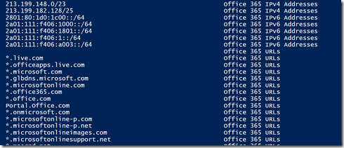

This week I took the [Office 365 Performance Management](http://www.microsoftvirtualacademy.com/training-courses/office-365-performance-management) course on the Microsoft Virtual Academy. If you have any plans using Office 365 I strongly recommend taking this course. One of the topics that was often highlighted is the importance of having all Office 365 URLs and IP Ranges configured on the outbound allow list. The Office 365 URLs and IP Ranges are documented [here](https://technet.microsoft.com/library/hh373144.aspx) and the changes to the list are described [here](https://technet.microsoft.com/en-us/library/jj129402.aspx).

  As part of my continuous PowerShell skill improvement activity, I thought I write a script to retrieve this information via PowerShell. Microsoft has stored  the URL and IP address information into tables on this page, but thanks to Lee Holmes [Get-WebRequestTable](http://www.leeholmes.com/blog/2015/01/05/extracting-tables-from-powershells-invoke-webrequest/) script I could loop through the various tables that contain the URL and IP address range information stored on the page.

  The Get-Office365URLIPInfo script can be downloaded from the Microsoft TechNet Gallery [here](https://gallery.technet.microsoft.com/Get-Office365URLIPInfo-613551bf).

   

  
```
function Get-Office365URLIPInfo
{
<#
.Synopsis
   This script lists all Office 365 URLs and IP Ranges
.DESCRIPTION
   This script retrieves all the URLs and IP addresses that are posted on the 
   Office 365 URLs and IP address ranges site
.EXAMPLE
  Get-Office365URLIPInfo
.NOTES
    Version 1.0, 05/02/2015, Alex Verboon
  
    Thanks to Lee Holmes for the Get-WebRequestTable function
    http://www.leeholmes.com/blog/2015/01/05/extracting-tables-from-powershells-invoke-webrequest/

#>

Begin{

# Link to Office 365 URLs and IP address ranges page
$url = "https://technet.microsoft.com/library/hh373144.aspx"
$info = Invoke-WebRequest -Uri $url 

    Function Get-Webrequesttable
    {
        # Lee holmes
        #http://www.leeholmes.com/blog/2015/01/05/extracting-tables-from-powershells-invoke-webrequest/

    param(
        [Parameter(Mandatory = $true)]
        [Microsoft.PowerShell.Commands.HtmlWebResponseObject] $WebRequest,
        [Parameter(Mandatory = $true)]
        [int] $TableNumber
    )

    ## Extract the tables out of the web request
    $tables = @($WebRequest.ParsedHtml.getElementsByTagName("TABLE"))
    $table = $tables[$TableNumber]
    $titles = @()
    $rows = @($table.Rows)

    ## Go through all of the rows in the table
    foreach($row in $rows)
    {
        $cells = @($row.Cells)
        ## If we’ve found a table header, remember its titles
        if($cells[0].tagName -eq "TH")
        {
            $titles = @($cells | % { ("" + $_.InnerText).Trim() })
            continue
        }

        ## If we haven’t found any table headers, make up names "P1", "P2", etc.
        if(-not $titles)
        {
            $titles = @(1..($cells.Count + 2) | % { "P$_" })
        }

        ## Now go through the cells in the the row. For each, try to find the
        ## title that represents that column and create a hashtable mapping those
        ## titles to content
        $resultObject = [Ordered] @{}
        for($counter = 0; $counter -lt $cells.Count; $counter++)
        {
            $title = $titles[$counter]
            if(-not $title) { continue }
            $resultObject[$title] = ("" + $cells[$counter].InnerText).Trim()
        }
        ## And finally cast that hashtable to a PSCustomObject
        [PSCustomObject] $resultObject
    } 
    }

}

Process{

# First let's identify how many tables there are, the scrtipt assumes that all tables have a title
$mtnr = 0
While ($true)
{
    Write-debug $mtnr
    $tr = Get-Webrequesttable -WebRequest $info -TableNumber $mtnr
    If ($tr.P1 | gm -ErrorAction SilentlyContinue ) 
    {
        $mtnr = $mtnr -1
        Break
    }
    $mtnr++
}

# maximum number of tables found in page
$maxtnr = $mtnr
Write-debug "Total number of tables in page: $maxtnr"

$URLIPInfo=@()

# we start with table 1 and not 0 because table 0 is just an information notice on this page. 
$table_nr = 1
while ($table_nr -le $maxtnr)
{
    write-debug "getting table number  $table_nr" 
    $url = Get-Webrequesttable -WebRequest $info $table_nr
    $tables = ($url | gm | Select-Object | Where-Object {$_.membertype -eq "NoteProperty"}).Name
    if ($tables -isnot [array] -eq $true)
    {
        $nr_sub_tables = 1
        write-debug "number of sub tables $nr_sub_tables"
            $stable = 0
            While ($stable -lt $nr_sub_tables)
            {
                $urls = ($url.$tables).Replace("Copy","").replace("^","").split("`r`n")
                $Table_Title = $tables
                write-debug "Table $Table_Title "
                write-debug "Sub Table nr $stable" 
                $stable++

                ForEach ($i in $urls)
                {
                    If ($i.Length -gt 0)
                   {
                      $object = New-Object -TypeName PSObject
                      $object | Add-Member -MemberType NoteProperty -Name  "IP_URL" -Value $i.TrimStart()
                      $object | Add-Member -MemberType NoteProperty -Name  "Service" -Value $Table_Title
                      $URLIPInfo += $object
                      
                   }
                }
            }
    }
    Else
    {
        $nr_sub_tables = $tables.Count
        write-debug "number of sub tables array $nr_sub_tables"
            $stable = 0
            While ($stable -lt $nr_sub_tables)
            {
                $urls = ($url.($tables[$($stable)])).Replace("Copy","").replace("^","").split("`r`n")
                $Table_Title = $tables[$($stable)]
                write-debug "Table $Table_Title " 
                write-debug "Sub Table nr $stable" 
                $stable++
                ForEach ($i in $urls)
                {
                    If ($i.Length -gt 0)
                   {
                      $object = New-Object -TypeName PSObject
                      $object | Add-Member -MemberType NoteProperty -Name  "IP_URL" -Value $i.TrimStart()
                      $object | Add-Member -MemberType NoteProperty -Name  "Service" -Value $Table_Title
                      $URLIPInfo += $object
                   }
                }
            }
    } 
$table_nr++
}

} # end process

End{
    $URLIPInfo
    }

} # end function
```

When you run the script, you get a list of all URLs or IP Ranges and the related Service.

[

](https://www.verboon.info/wp-content/uploads/2015/02/office365.png)

