When a physical device running Windows has problems, you have all sorts of possibilities to fix it, when virtual machine hosted within your on-premise virtualization infrastructure runs into issues, you still have all options to fix it. But the first time when a virtual machine hosted in Azure gets into trouble you might feel a little bit lost. But there’s hope. When I ran into an issue myself recently I found the following article “[Troubleshoot Remote Desktop connections to a Windows-based Azure Virtual Machine](http://azure.microsoft.com/en-us/documentation/articles/virtual-machines-troubleshoot-remote-desktop-connections/)” 

  The article mentions the Azure IaaS Remote Diagnostics Package. Here’s how it works. 

  First go to [https://home.diagnostics.support.microsoft.com/SelfHelp/](https://home.diagnostics.support.microsoft.com/SelfHelp/) and then search for “IaaS”, you then should find the IaaS Azure Diagnostics Package. 

  [
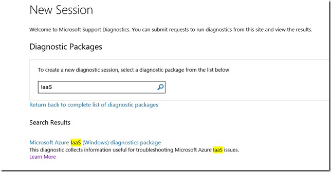
](https://www.verboon.info/wp-content/uploads/2015/04/image.png)

  Next Enter a Tracking ID (optional), then select “**Create**” 

  [
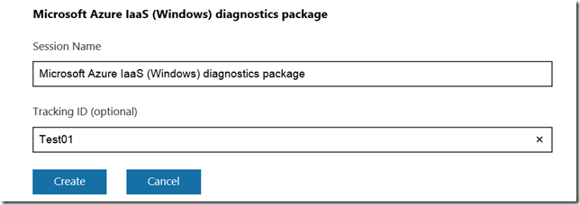
](https://www.verboon.info/wp-content/uploads/2015/04/image1.png)

  Next select “**Download**” 

  [
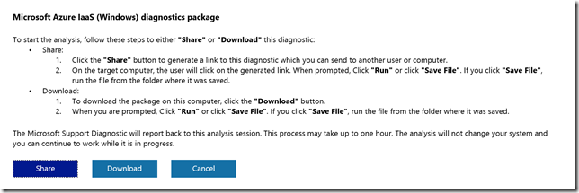
](https://www.verboon.info/wp-content/uploads/2015/04/image2.png)

  Save the file and then select “**Run**”

  

  Select “**Run now on this PC**”

        [
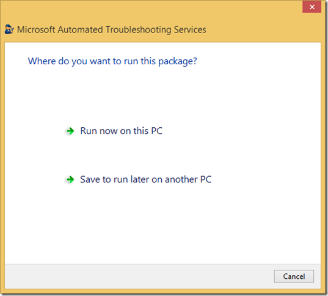
](https://www.verboon.info/wp-content/uploads/2015/04/image4.png)

  Select “**Accept**”

  [
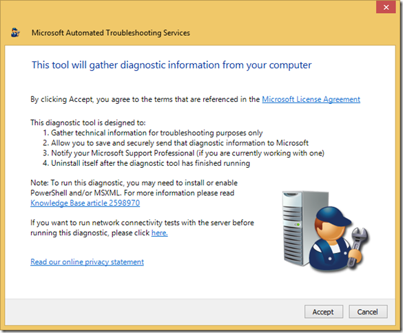
](https://www.verboon.info/wp-content/uploads/2015/04/image5.png)

  Select “**Start**” and confirm the UAC prompt

  [
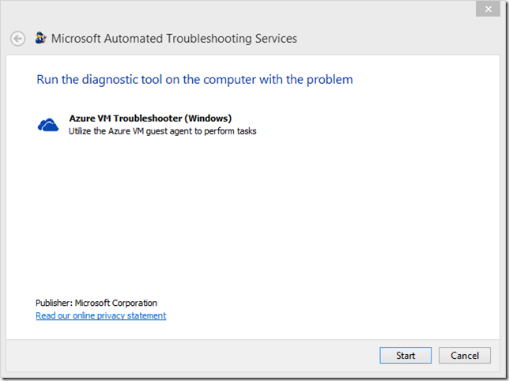
](https://www.verboon.info/wp-content/uploads/2015/04/image6.png)

    A folder c:\WindowsAzure is created on the local client. 

  Select “**Next**” 

  [
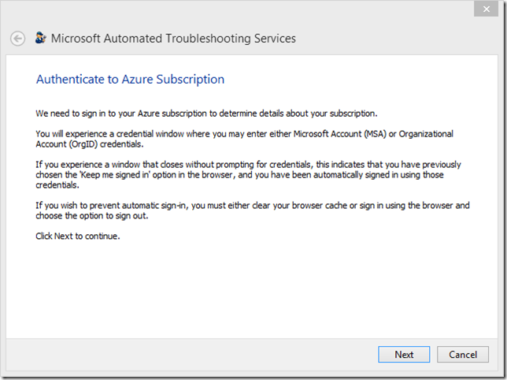
](https://www.verboon.info/wp-content/uploads/2015/04/image7.png)

  Next sign-in with your Azure Account. 

  [
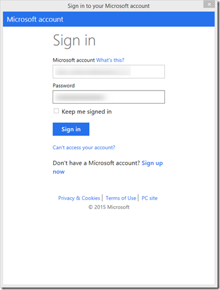
](https://www.verboon.info/wp-content/uploads/2015/04/image8.png)

  Select the Azure Subscription (in case you have multiple)

  [
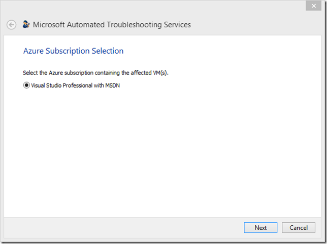
](https://www.verboon.info/wp-content/uploads/2015/04/image9.png)

  Next Accept to collect diagnostic data from Azure VMs. 

  [
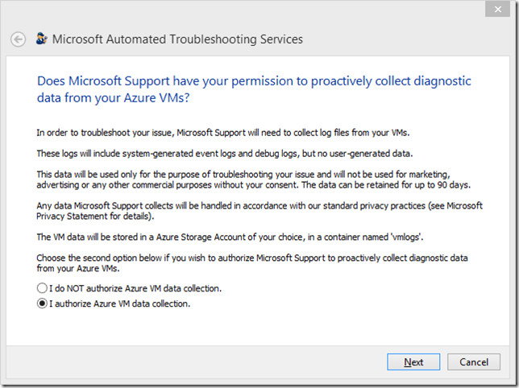
](https://www.verboon.info/wp-content/uploads/2015/04/image10.png)

  Select the Azure Storage Account (in case you have multiple)

  [
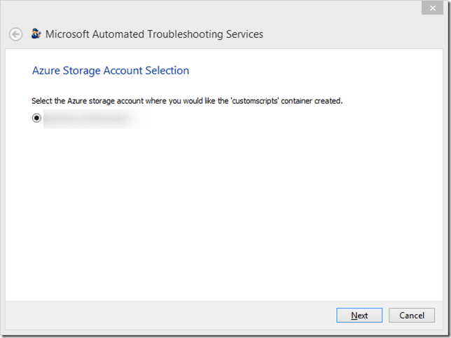
](https://www.verboon.info/wp-content/uploads/2015/04/image11.png)

  Next select the issue you are experiencing. 

  [
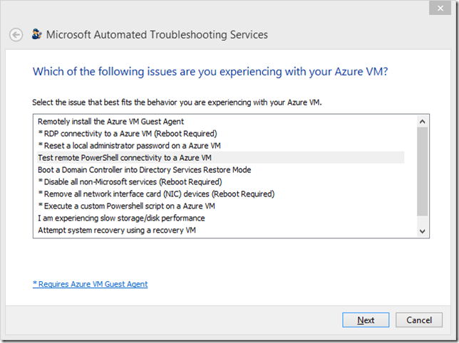
](https://www.verboon.info/wp-content/uploads/2015/04/image12.png)

  Next select the VM that experiences an issue. 

  [
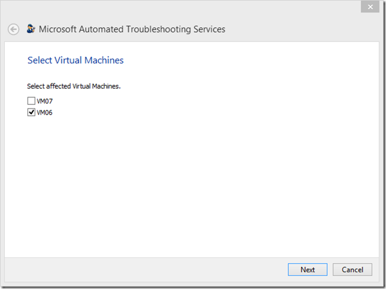
](https://www.verboon.info/wp-content/uploads/2015/04/image13.png)

  When the test / diagnosis is completed, you have the option to view the log files. 

  [
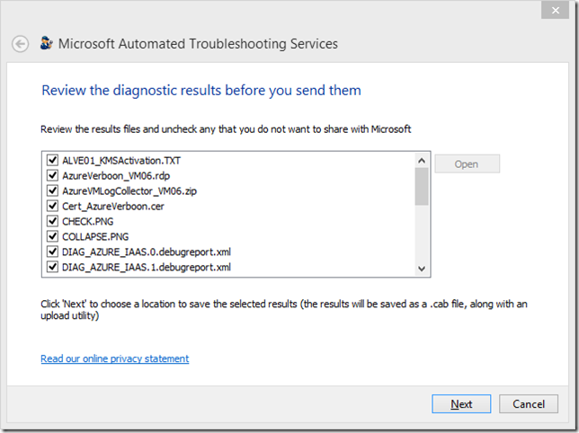
](https://www.verboon.info/wp-content/uploads/2015/04/image14.png)

    Optionally the log files can be saved locally. 

  [
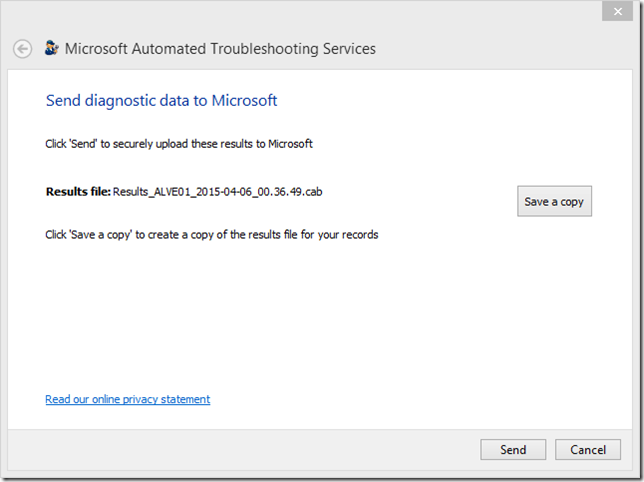
](https://www.verboon.info/wp-content/uploads/2015/04/image15.png)

   

  [
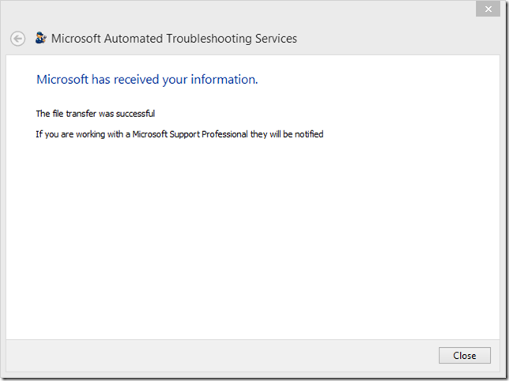
](https://www.verboon.info/wp-content/uploads/2015/04/image16.png)

  In addition to the saved CAB file, the tool also saves an additional file locally. In my case the file name was:

  "C:\WindowsAzure\Logs\AzureVMLogCollector_VM06.zip"

  The ZIP file contains various information such as Windows Event log data, Windows Setup, Networking and other information that might of use when troubleshooting a virtual machine. 

  Let’s hope your Azure virtual machines, just run smoothly, but in case, now you know there’s tools around for troubleshooting.

