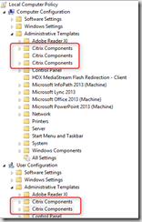
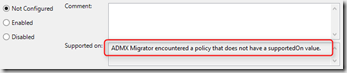

Last night Citrix released Citrix Receiver 4.3 that includes ADMX templates to manage Citrix Receiver Group Policy settings. Microsoft introduced the ADMX templates when Vista/Server 2008 was introduced in 2006, so it was about time for Citrix to come up with template files in that format instead of the old ADM based files. 

 After installing the Citrix Receiver 4.3 that can be downloaded from [here](http://www.citrix.com/downloads/citrix-receiver/windows/receiver-for-windows-43.html) you’ll find the new ADMX/ADML files in the following location:

 "C:\Program Files (x86)\Citrix\ICA Client\Configuration"

 But it looks like whoever was in charge of provding the new ADMX templates did not really care about structures. The files are placed all over the place. . 

 "C:\Program Files (x86)\Citrix\ICA Client\Configuration\HdxFlash-Client.admx"
"C:\Program Files (x86)\Citrix\ICA Client\Configuration\ica-file-signing.admx"
"C:\Program Files (x86)\Citrix\ICA Client\Configuration\receiver.admx"

 "C:\Program Files (x86)\Citrix\ICA Client\Configuration\ica-file-signing.adml"
"C:\Program Files (x86)\Citrix\ICA Client\Configuration\receiver.adml"

 "C:\Program Files (x86)\Citrix\ICA Client\Configuration\en-US\HdxFlash-Client.adml"

 "C:\Program Files (x86)\Citrix\ICA Client\Configuration\en\receiver_usb.adml"
"C:\Program Files (x86)\Citrix\ICA Client\Configuration\en\receiver_usb.admx"

  

 But okay, those familiar with Group Policy templates will know where to place which files.  Now comes the next surprise, when opening the Group Policy editor there are multiple nodes for Citrix Components. 

 

 When opening any setting, the supported on description is as following: *ADMX Migrator encountered a policy that does not have a supportedOn value*.

 

  

 This explains it all, one would assume that by now it should be known that the ADMX migrator is okay for an initial conversion, but that once converted from ADM to ADMX still some manual work is required. To be honest I really like Citrix technology, but I am a bit dissapointed how this was done. I would expect from a Company like Citrix that they would put some effort in getting such things right. 

 This all has a bit of a bad taste and one might hope that the settings itself all work as expected. 

 Dear Citrix consider getting this right the next time please.

