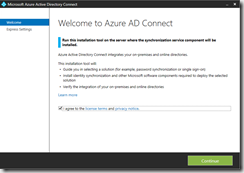
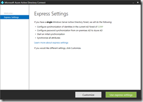
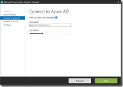
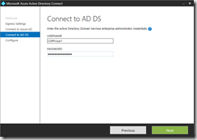
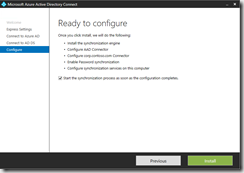
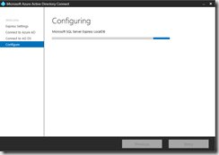
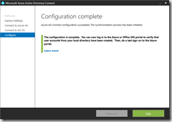
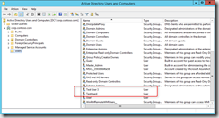
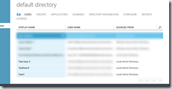
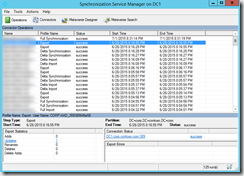

Last week Microsoft anounced GA for Azure AD Connect. To get a better understanding of how this all works, I installed it in my Cloud based lab that is hosted in Azure. 

 I was supposed to demonstrate this to a colleague at work this week, but simply couldn’t find time for it, so here’s a short description on how to get started for him and for anyone else. 

 First I recommend to read through the documentation and also watch the presentation [Extending On-Premises Directories to the Cloud Made Easy with Azure Active Directory Connect](https://channel9.msdn.com/Events/Ignite/2015/BRK3862)

  

  
- Azure AD Connect & Connect Health is now GA!
[http://blogs.technet.com/b/ad/archive/2015/06/23/azure-ad-connect-amp-connect-health-is-now-ga.aspx](http://blogs.technet.com/b/ad/archive/2015/06/23/azure-ad-connect-amp-connect-health-is-now-ga.aspx) 
- Integrating your on-premises identities with Azure Active Directory
[https://azure.microsoft.com/en-us/documentation/articles/active-directory-aadconnect/](https://azure.microsoft.com/en-us/documentation/articles/active-directory-aadconnect/) 
- What is DirectorySyncClientCmd.exe?
[http://www.petervanderwoude.nl/post/what-is-directorysyncclientcmd-exe/](http://www.petervanderwoude.nl/post/what-is-directorysyncclientcmd-exe/)

 The Azure Active Directory Connect Tool can be downloaded from here:
[https://www.microsoft.com/en-us/download/details.aspx?id=47594](https://www.microsoft.com/en-us/download/details.aspx?id=47594)

 To setup this demo you will need to have access to Azure. I used my MSDN subscription to set this up. 

 Next you need a domain controller, mine is running in Azure as well. Use the instructions described in Phase 1 and Phasse 2 as described in the article [Base Configuration Test Environment](https://azure.microsoft.com/en-us/documentation/articles/virtual-machines-base-configuration-test-environment/). 

 Before continuing with the installatino of the Azure Directory Connect Tool, ensure that you have two accounts:

  
- An active directory user that has enterprise admin rights 
- An Azure Directory user that has Global Admin rights

 Logon to the domain controller and launch the Azure Directory Tool installation and follow the steps as described below. 

 

  

 

 

 

 

 

 

 To test the instalaltion open the Active Directory Users and Computers console on the Domain controller and create a test user in the Users OU. 

 

 By default the ADSync runs every 3 hours and is triggered via a scheduled Task. To force the synchronization manually open the scheduled task manager and run the scheduled task or open an elevated powershell prompt and run the following command:

 Get-ScheduledTask -TaskName "Azure AD Sync*" | Start-ScheduledTask

 After a while the test user that was created in the local Active Directory domain should appear in the Azure Directory. 

 

 That’s all it takes to get users synched from Active Directory to Azure Directory. 

 To get an insight of what is exactly happening during the sync process open the Synchronization Service Manager that gets installed when installing Azure Directory Connect. 

 

 That’s it for today, hope you found this useful.

