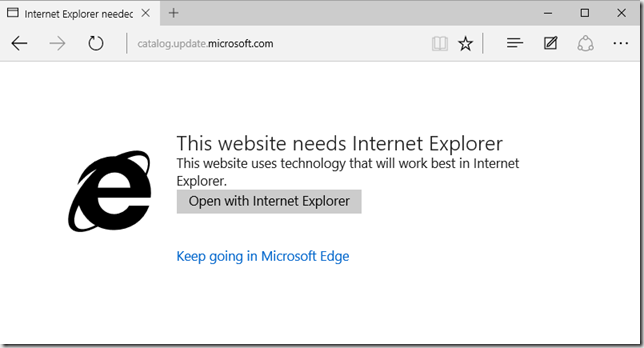

As you probably know by know, Microsoft Edge is now the default Browser on Windows 10, but IE11 can still be used.  While using the Microsoft Edge browser I’ve noticed that now and then when opening a website, the following message is displayed. 

 

   

 So where does this message come from, and how does Microsoft Edge know that the page works best in Internet Explorer? For Enterprise users Microsoft has extended the functiionality of the Enterprise Mode Site list manager.  

  
- [How Microsoft Edge and Internet Explorer 11 on Windows 10 work better together in the Enterprise](https://blogs.windows.com/msedgedev/2015/08/26/how-microsoft-edge-and-internet-explorer-11-on-windows-10-work-better-together-in-the-enterprise/) 
- [Available policies for Microsoft Edge](https://technet.microsoft.com/en-us/library/mt270204.aspx) 
- [Microsoft Edge Now Can Use Enterprise Mode for Legacy Browser Support](https://redmondmag.com/articles/2015/08/26/microsoft-edge-and-enterprise-mode.aspx)

 But when you’re using your personal device, Microsoft Edge uses a compatibility list, just like Internet Explorer (I wrote about this in an earlier [post](https://www.verboon.info/2011/12/the-internet-explorer-compatibility-list/)). Microsoft Edge uses the compatibility list that is hosted [here](http://cvlist.ie.microsoft.com/edge/desktop/1432152749/edgecompatviewlist.xml) and periodically downloads that file and stores it into the following location. 

 "C:\Users\<USERNAME>\AppData\Local\MicrosoftEdge\SharedCacheContainers\MicrosoftEdge_iecompat\IECompatData.xml"

 Unfortunately there is no code you could add to your website that would trigger such a message when opening a site in Microsoft Edge. When running a public site that requires Internet Explorer you will need to submit a request to Microsoft to get your site included into the Edge compatibility view list.  For more information read “[Understanding the Compatibility view list](https://msdn.microsoft.com/en-us/library/gg622935(v=vs.85).aspx)”

